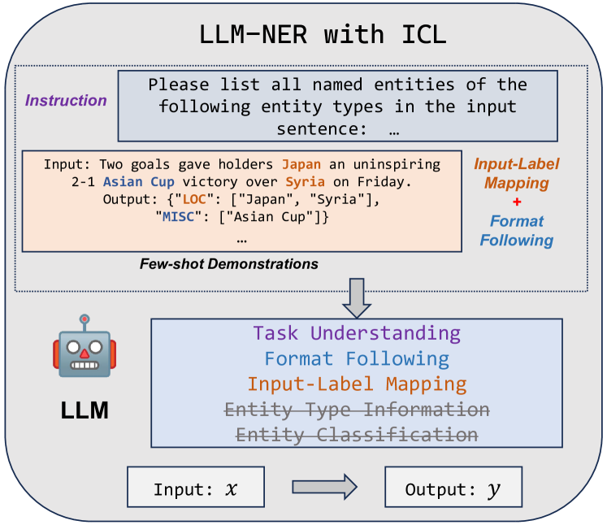
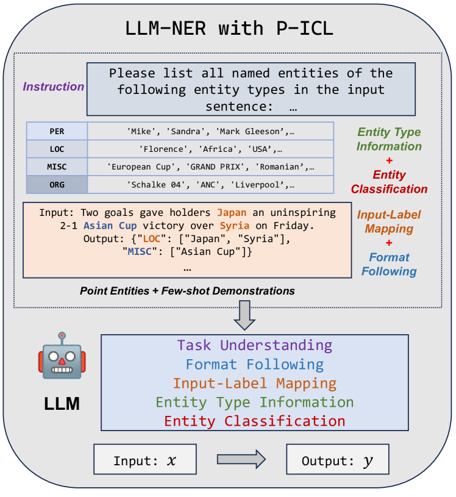
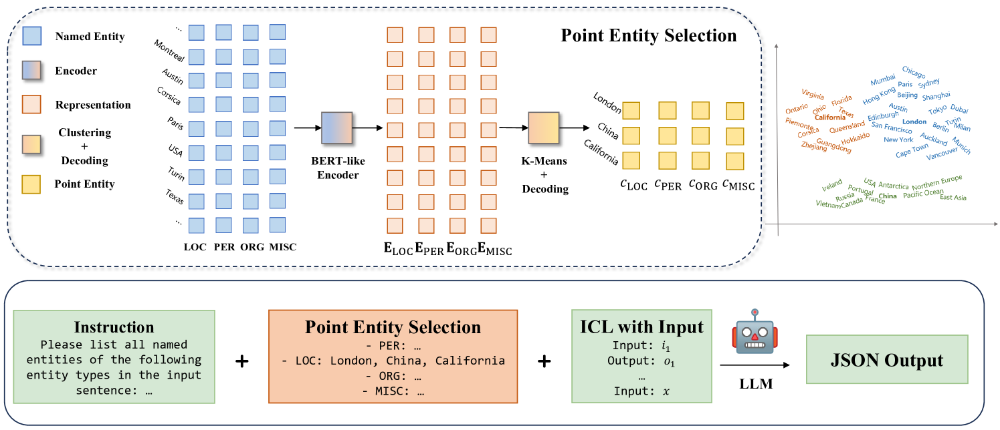
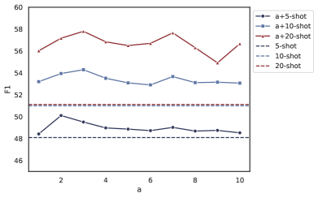
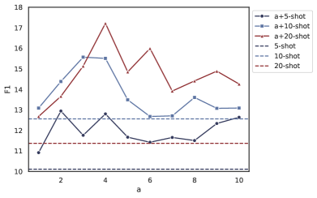

# P-ICL：大型语言模型在命名实体识别中的精准上下文学习在这个翻译中，我采用了“精准”一词来替代“点式”，以使中文表达更加生动和符合中文的表达习惯。同时，“精准上下文学习”也更好地传达了原文中P-ICL方法的特性，即在大型语言模型中针对命名实体识别任务进行精确的上下文信息利用。

发布时间：2024年05月08日

`LLM应用

这篇论文摘要描述了一种针对大型语言模型（LLM）在命名实体识别（NER）任务上的应用改进。提出的P-ICL框架和基于K-Means聚类的点实体筛选法，旨在提高LLM在实体分类上的准确性。这些方法专注于优化LLM在特定任务（即命名实体识别）上的表现，因此属于LLM应用的范畴。虽然这种方法可能涉及到一些理论上的创新，但其主要贡献在于实际应用层面的改进，因此更适合归类为LLM应用。` `命名实体识别`

> P-ICL: Point In-Context Learning for Named Entity Recognition with Large Language Models

# 摘要

> 随着大型语言模型的兴起，我们得以通过上下文学习，仅凭寥寥数例便能精准识别文本中的命名实体。然而，传统上下文学习方法虽能助模型理解任务指令与数据格式，却未能充分挖掘命名实体识别任务的独特之处。为此，我们创新性地提出了P-ICL框架，巧妙地将关键实体作为识别各类实体的辅助线索，使得大型语言模型在实体分类上更加精准。同时，我们还开发了一种基于K-Means聚类的点实体筛选法，以确保模型获得最优的提示信息。经过在多个NER测试集上的严格实验，我们的策略展现出了显著的效果。

> In recent years, the rise of large language models (LLMs) has made it possible to directly achieve named entity recognition (NER) without any demonstration samples or only using a few samples through in-context learning (ICL). However, standard ICL only helps LLMs understand task instructions, format and input-label mapping, but neglects the particularity of the NER task itself. In this paper, we propose a new prompting framework P-ICL to better achieve NER with LLMs, in which some point entities are leveraged as the auxiliary information to recognize each entity type. With such significant information, the LLM can achieve entity classification more precisely. To obtain optimal point entities for prompting LLMs, we also proposed a point entity selection method based on K-Means clustering. Our extensive experiments on some representative NER benchmarks verify the effectiveness of our proposed strategies in P-ICL and point entity selection.

[Arxiv](https://arxiv.org/abs/2405.04960)