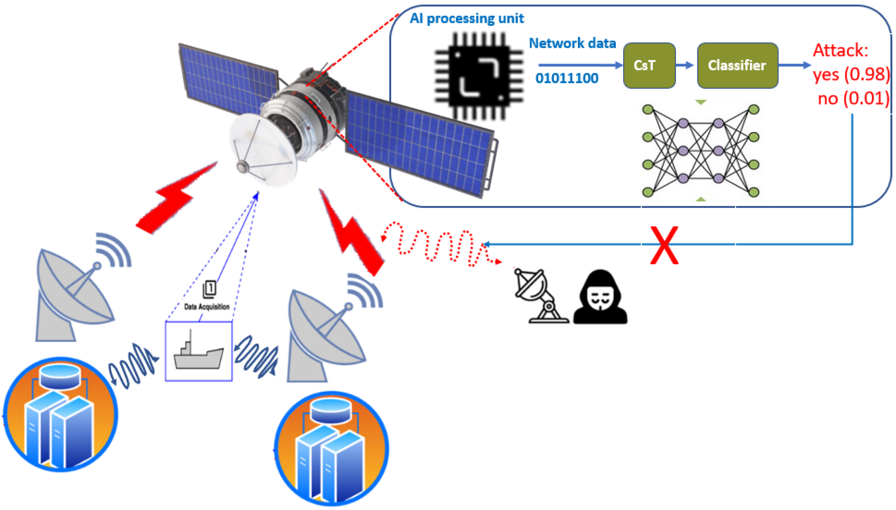
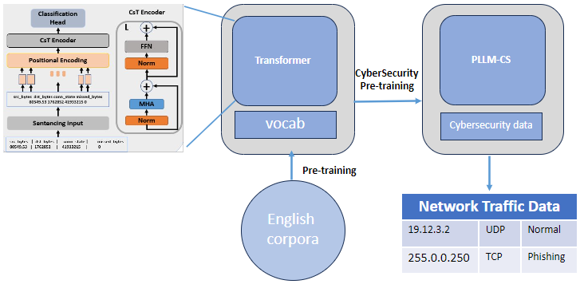
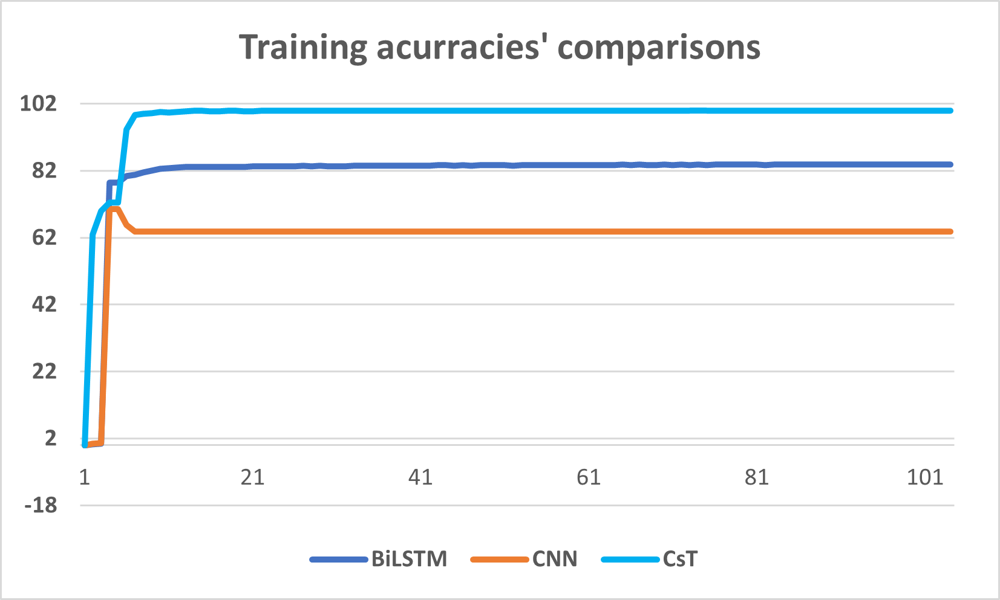
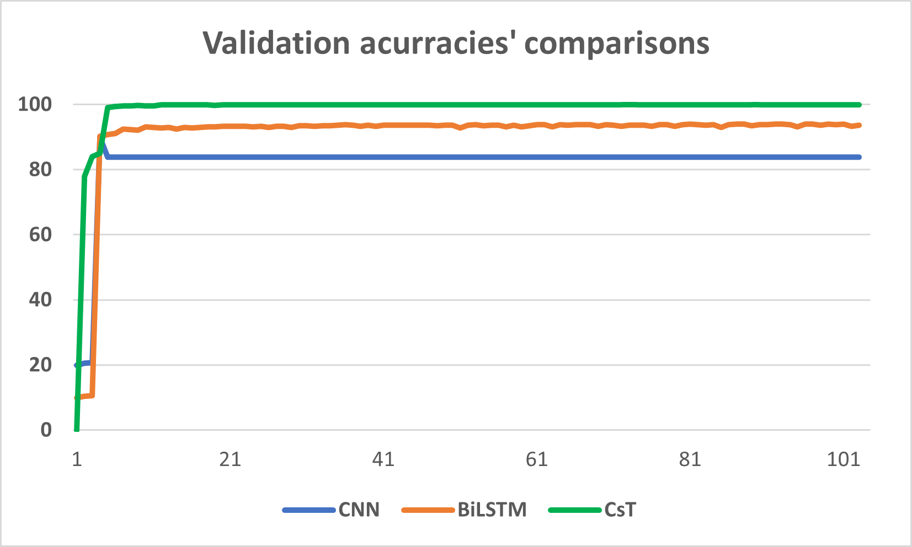
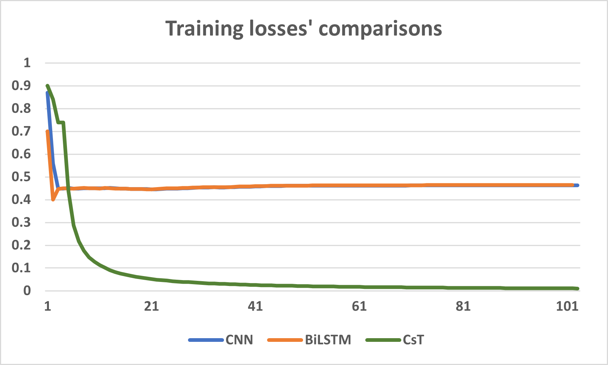
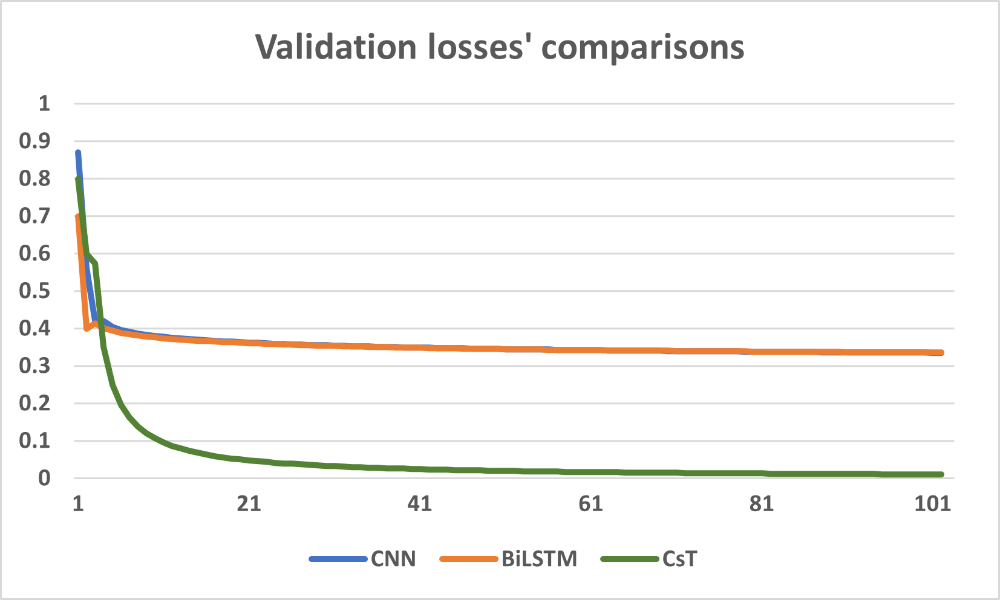
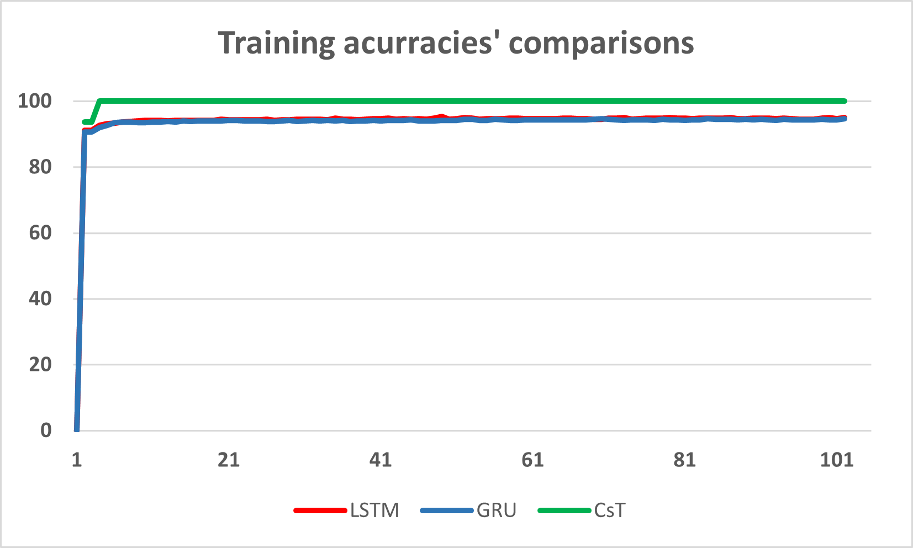
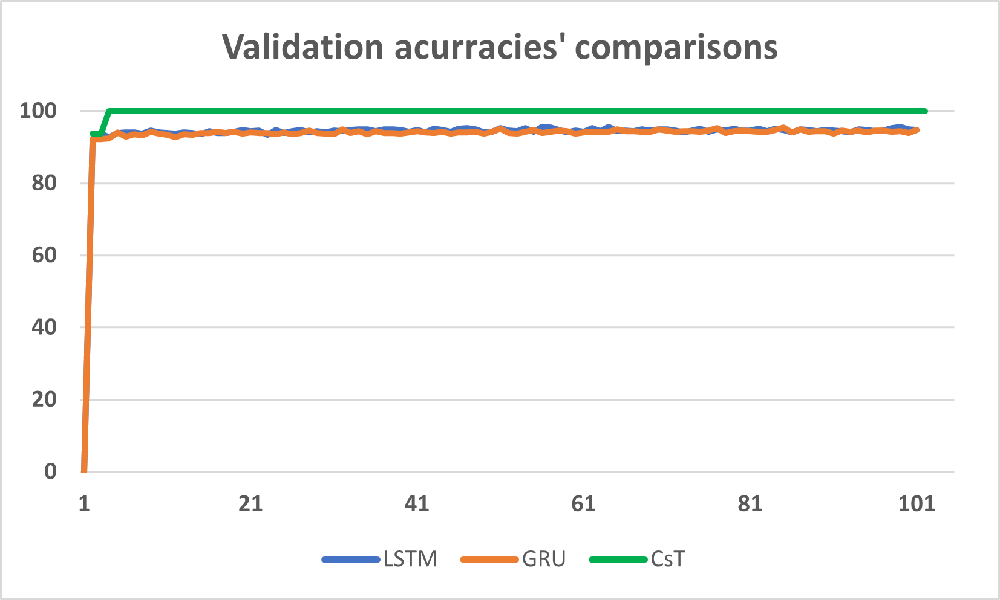
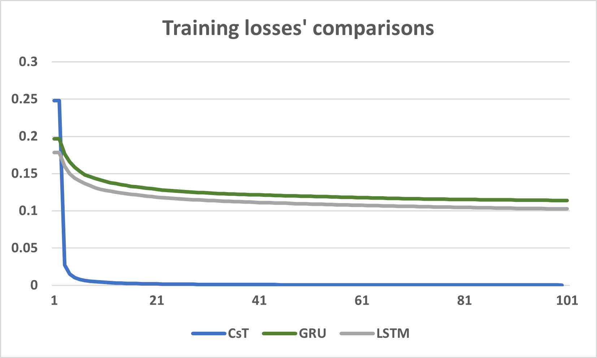
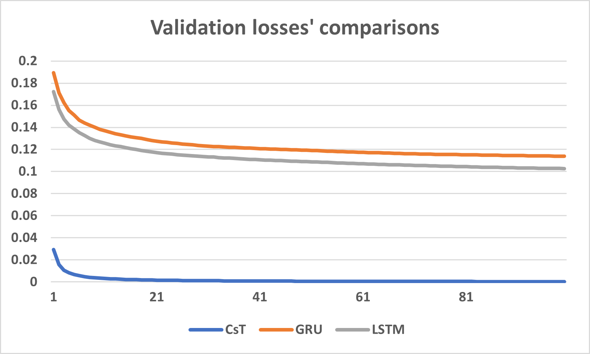

# PLLM-CS：专为卫星网络安全威胁检测而设计的预训练大型语言模型，旨在通过先进的语言处理技术，提升对潜在网络风险的识别与防御能力。

发布时间：2024年05月08日

`LLM应用

这篇论文介绍了一种名为PLLM-CS的预训练大型语言模型，该模型专门设计用于网络数据分析，并用于入侵检测系统。它通过将网络数据转化为富含上下文信息的输入，提高了对网络数据的理解能力。论文通过实验展示了PLLM-CS在物联网流量数据集上的性能，表明其在网络安全领域的应用潜力。因此，这篇论文属于LLM应用分类。` `网络安全` `物联网`

> PLLM-CS: Pre-trained Large Language Model (LLM) for Cyber Threat Detection in Satellite Networks

# 摘要

> 卫星网络是连接关键基础设施通信服务的生命线，它们能与多样化的系统无缝融合。然而，由于缺乏有效的入侵检测系统，一些系统显得脆弱，这主要是因为相关研究不足和高昂的安全维护成本。为此，我们提出了一种名为PLLM-CS的预训练大型语言模型，它是预训练变压器的一个变种，并配备了一个专门模块，能将网络数据转化为富含上下文信息的输入。这一创新让我们的LLM能够深入理解网络数据中的上下文信息。为了证明PLLM-CS的强大能力，我们使用了UNSW_NB 15和TON_IoT这两个公开的物联网流量数据集进行了实验。结果显示，PLLM-CS不仅超越了BiLSTM、GRU和CNN等顶尖技术，更在UNSW_NB 15数据集上实现了完美的100%准确率，为网络安全领域树立了新的性能标杆。

> Satellite networks are vital in facilitating communication services for various critical infrastructures. These networks can seamlessly integrate with a diverse array of systems. However, some of these systems are vulnerable due to the absence of effective intrusion detection systems, which can be attributed to limited research and the high costs associated with deploying, fine-tuning, monitoring, and responding to security breaches. To address these challenges, we propose a pretrained Large Language Model for Cyber Security , for short PLLM-CS, which is a variant of pre-trained Transformers [1], which includes a specialized module for transforming network data into contextually suitable inputs. This transformation enables the proposed LLM to encode contextual information within the cyber data. To validate the efficacy of the proposed method, we conducted empirical experiments using two publicly available network datasets, UNSW_NB 15 and TON_IoT, both providing Internet of Things (IoT)-based traffic data. Our experiments demonstrate that proposed LLM method outperforms state-of-the-art techniques such as BiLSTM, GRU, and CNN. Notably, the PLLM-CS method achieves an outstanding accuracy level of 100% on the UNSW_NB 15 dataset, setting a new standard for benchmark performance in this domain.

[Arxiv](https://arxiv.org/abs/2405.05469)