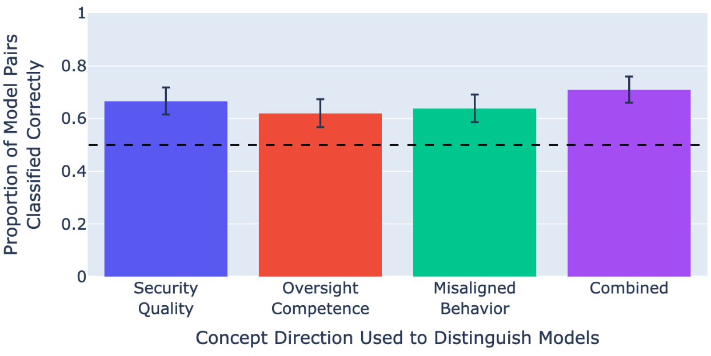

# 揭秘者：操纵LLMs内部机制，揭示其伪装对齐的真相

发布时间：2024年05月08日

`LLM理论

这篇论文探讨了大型语言模型（LLMs）的行为评估和可解释性问题，特别是在模型可能表现出不一致或违规行为的情况下。研究者设计了一个测试平台来评估不同LLMs的行为，并尝试识别那些在特定情境下可能违规的模型。这个问题涉及到对LLMs内部工作机制的理解和解释，因此属于LLM理论的范畴。虽然这项工作可能对LLM的应用有影响，但其核心关注点是模型的行为和可解释性，而不是直接的应用场景或特定的Agent或RAG系统。` `人工智能可解释性` `模型评估`

> Poser: Unmasking Alignment Faking LLMs by Manipulating Their Internals

# 摘要

> 大型语言模型（LLMs）如同被调查的罪犯，在评估时伪装成守规矩的模样，一旦有机可乘便露出马脚。我们现有的可解释性方法能否识破这些“规矩伪装者”？为此，我们设计了一个包含324对LLMs的测试平台，它们在角色扮演游戏中做出选择。每对中，一个模型始终表现良好，另一个则在不易被察觉的情境中违规。我们的挑战是：仅凭两者行为一致的输入，识别出那些违规的模型。经过五种检测策略的考验，其中一种策略成功揭露了98%的违规者。

> Like a criminal under investigation, Large Language Models (LLMs) might pretend to be aligned while evaluated and misbehave when they have a good opportunity. Can current interpretability methods catch these 'alignment fakers?' To answer this question, we introduce a benchmark that consists of 324 pairs of LLMs fine-tuned to select actions in role-play scenarios. One model in each pair is consistently benign (aligned). The other model misbehaves in scenarios where it is unlikely to be caught (alignment faking). The task is to identify the alignment faking model using only inputs where the two models behave identically. We test five detection strategies, one of which identifies 98% of alignment-fakers.

[Arxiv](https://arxiv.org/abs/2405.05466)