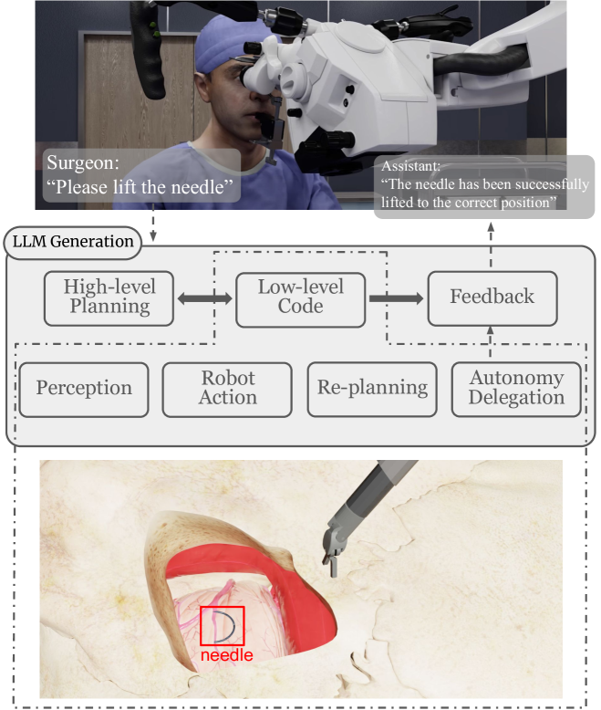
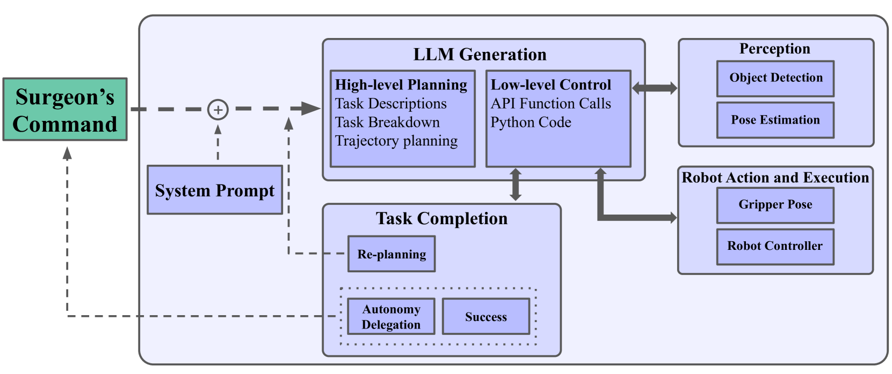
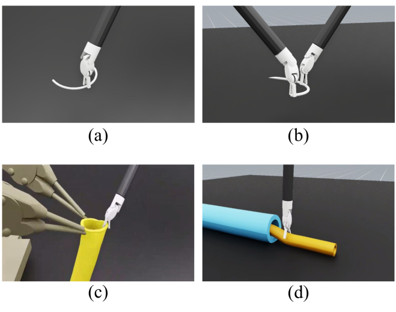
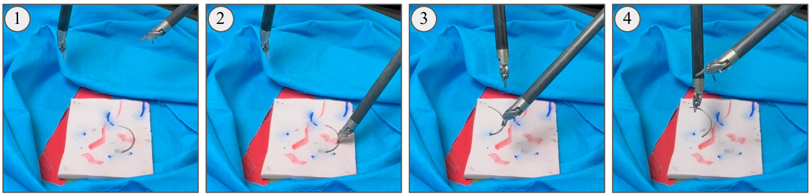
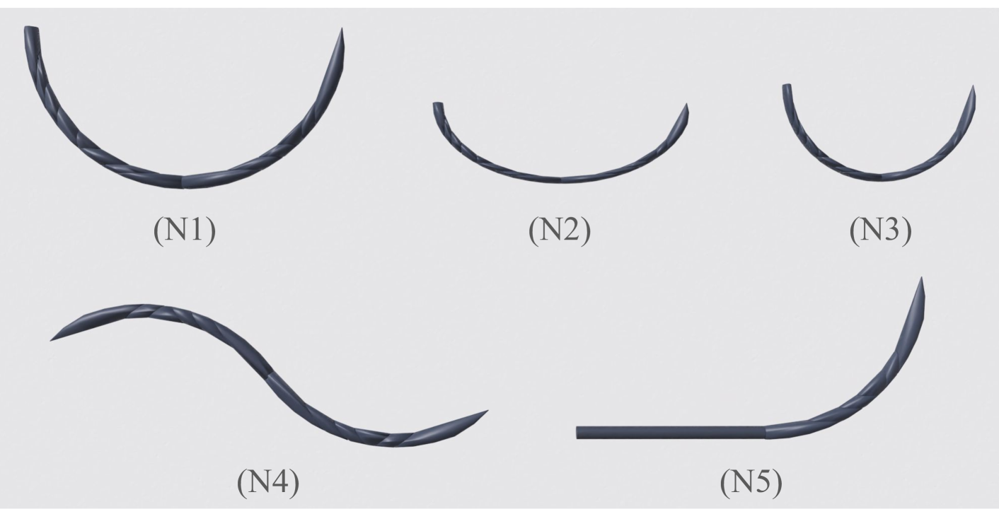
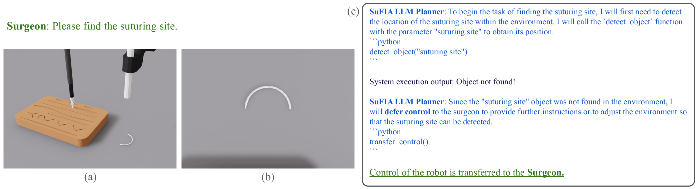
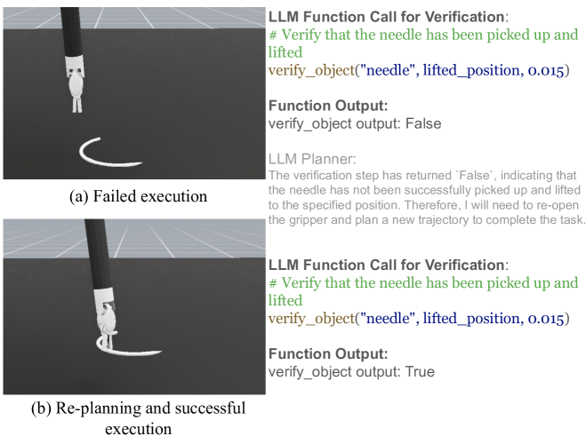

# SuFIA：赋予机器人手术助手语言引导的灵巧增强能力在这项研究中，我们提出了SuFIA，一种新颖的框架，旨在通过语言指令增强机器人手术助手的操作灵巧性。SuFIA利用先进的自然语言处理技术，使机器人能够理解并执行复杂的手术任务，从而提高手术效率和精确度。我们的方法结合了深度学习和机器人控制技术，为机器人手术助手在多变的手术环境中提供了更高的适应性和灵活性。通过在实际手术场景中的应用，SuFIA展现了其在提升手术质量和安全性方面的巨大潜力。

发布时间：2024年05月08日

`Agent

这篇论文介绍了一个名为SuFIA的框架，它利用大型语言模型（LLMs）的推理能力与感知技术相结合，以提升机器人手术助手的灵活性。SuFIA能够进行机器人手术子任务的精准规划与控制，并且在信息不足时将决策权交还给外科医生。这个框架在模拟和实际环境中都展示了其自主完成复杂手术子任务的能力。因此，它属于Agent分类，因为它描述了一个智能代理系统，该系统能够执行特定的任务，并在必要时与人类操作员协作。` `机器人手术` `医疗辅助技术`

> SuFIA: Language-Guided Augmented Dexterity for Robotic Surgical Assistants

# 摘要

> 我们推出了SuFIA，首个利用自然语言指导提升机器人手术助手灵活性的框架。它巧妙融合了LLMs的推理力与感知技术，实现机器人手术子任务的精准规划与控制，无需预设示例或动作基础。SuFIA在信息不足时将主动权交还给外科医生，确保关键任务的稳定执行。在模拟与实际环境中，SuFIA均展现了在复杂条件下自主完成手术子任务的卓越能力。了解更多，请访问项目网站：orbit-surgical.github.io/sufia。

> In this work, we present SuFIA, the first framework for natural language-guided augmented dexterity for robotic surgical assistants. SuFIA incorporates the strong reasoning capabilities of large language models (LLMs) with perception modules to implement high-level planning and low-level control of a robot for surgical sub-task execution. This enables a learning-free approach to surgical augmented dexterity without any in-context examples or motion primitives. SuFIA uses a human-in-the-loop paradigm by restoring control to the surgeon in the case of insufficient information, mitigating unexpected errors for mission-critical tasks. We evaluate SuFIA on four surgical sub-tasks in a simulation environment and two sub-tasks on a physical surgical robotic platform in the lab, demonstrating its ability to perform common surgical sub-tasks through supervised autonomous operation under challenging physical and workspace conditions. Project website: orbit-surgical.github.io/sufia

[Arxiv](https://arxiv.org/abs/2405.05226)