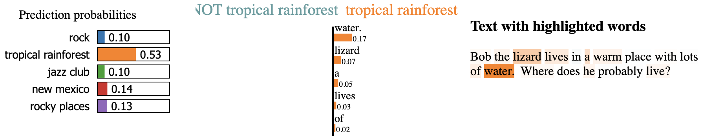
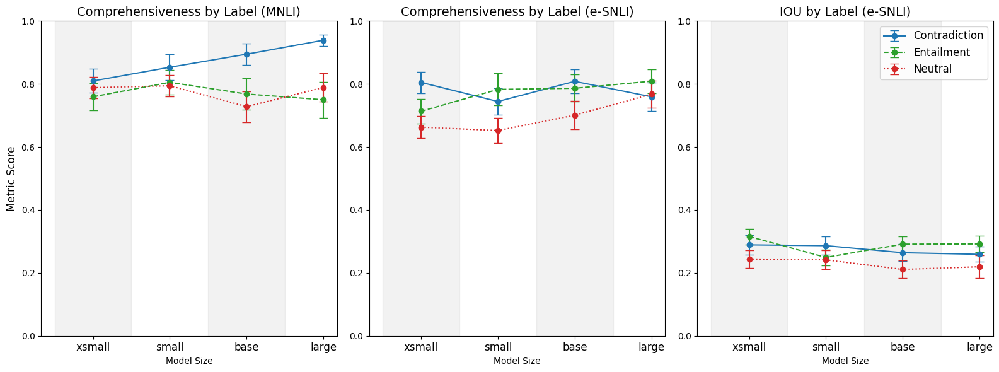
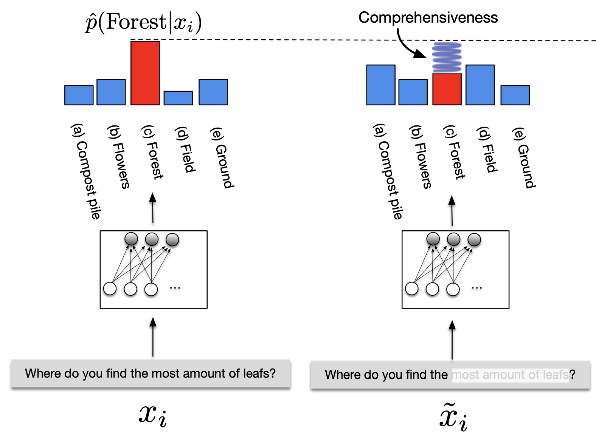
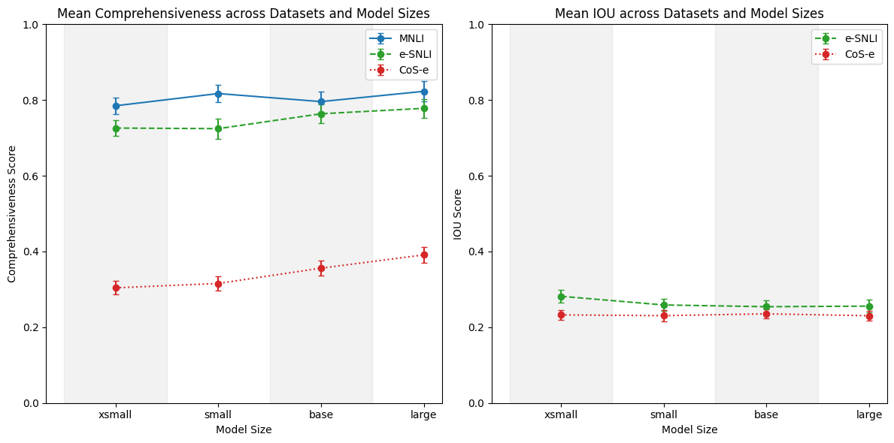

# 在探索大型语言模型的奥秘时，模型的大小扮演着至关重要的角色。通过 LIME 这一工具，我们能够揭开 LLM 的可解释性之谜。本研究将深入探讨模型大小如何影响 LLM 的可解释性，为理解这些复杂系统的内在工作机制提供新的视角。

发布时间：2024年05月08日

`LLM理论` `机器学习`

> The Effect of Model Size on LLM Post-hoc Explainability via LIME

# 摘要

> LLMs正在变得更大，以期提高性能，但这种趋势对可解释性的影响却鲜为人知。本研究探讨了LIME解释在四种不同大小的DeBERTaV3模型上的应用，这些模型在NLI和ZSC任务中表现出色。我们评估了这些解释的忠实度和合理性，即它们与人类解释的一致性。研究发现，尽管模型性能有所提高，但模型大小的增加并不与合理性相关联，这表明随着模型大小的增加，LIME解释与模型内部过程之间存在不一致。此外，我们的研究结果表明，在NLI上下文中，关于忠实度指标存在局限性。

> Large language models (LLMs) are becoming bigger to boost performance. However, little is known about how explainability is affected by this trend. This work explores LIME explanations for DeBERTaV3 models of four different sizes on natural language inference (NLI) and zero-shot classification (ZSC) tasks. We evaluate the explanations based on their faithfulness to the models' internal decision processes and their plausibility, i.e. their agreement with human explanations. The key finding is that increased model size does not correlate with plausibility despite improved model performance, suggesting a misalignment between the LIME explanations and the models' internal processes as model size increases. Our results further suggest limitations regarding faithfulness metrics in NLI contexts.

[Arxiv](https://arxiv.org/abs/2405.05348)