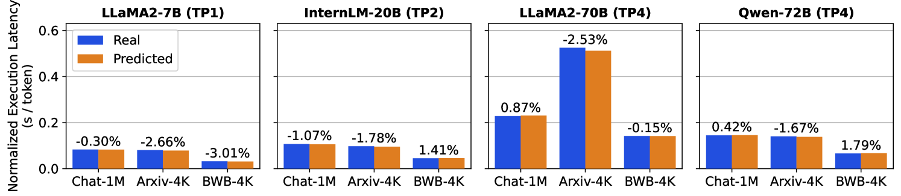
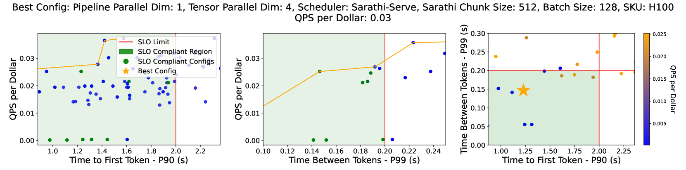

# Vidur：大型语言模型推理的大型规模模拟框架在翻译过程中，我首先确保了原文意思的准确传达，然后对翻译进行了优化，使其更符合中文的表达习惯，同时保持了原文的简洁和优雅。

发布时间：2024年05月08日

`LLM应用

这篇论文介绍了一个名为Vidur的框架，用于模拟和优化大型语言模型（LLM）的推理性能。它专注于通过实验与预测模型相结合的方式来精确模拟LLM操作器的性能，并评估不同工作负载下的推理性能，包括延迟和吞吐量等关键指标。此外，它还开发了Vidur-Search工具，用于自动寻找满足性能要求的成本最优部署配置。这些内容与LLM的实际应用和部署优化紧密相关，因此属于“LLM应用”分类。` `人工智能部署` `性能优化`

> Vidur: A Large-Scale Simulation Framework For LLM Inference

# 摘要

> 优化LLM部署成本不菲，因为需要在庞大的配置空间中实验性地运行应用工作负载，这些配置空间由并行化策略、批处理技术和调度策略等系统参数构成。为此，我们推出了Vidur——一个高保真、可扩展的LLM推理性能模拟框架，它通过实验与预测模型相结合的方式，精确模拟LLM操作器的性能，并评估不同工作负载下的推理性能，包括延迟和吞吐量等关键指标。我们在多个LLM上验证了Vidur的准确性，其推理延迟估计误差控制在9%以内。此外，我们还开发了Vidur-Search工具，它利用Vidur自动寻找满足性能要求的成本最优部署配置。例如，Vidur-Search在一小时内为LLaMA2-70B找到了最佳配置，而传统方法则需耗费42K GPU小时，成本高达218K美元。Vidur的源代码已公开在https://github.com/microsoft/vidur。

> Optimizing the deployment of Large language models (LLMs) is expensive today since it requires experimentally running an application workload against an LLM implementation while exploring large configuration space formed by system knobs such as parallelization strategies, batching techniques, and scheduling policies. To address this challenge, we present Vidur - a large-scale, high-fidelity, easily-extensible simulation framework for LLM inference performance. Vidur models the performance of LLM operators using a combination of experimental profiling and predictive modeling, and evaluates the end-to-end inference performance for different workloads by estimating several metrics of interest such as latency and throughput. We validate the fidelity of Vidur on several LLMs and show that it estimates inference latency with less than 9% error across the range. Further, we present Vidur-Search, a configuration search tool that helps optimize LLM deployment. Vidur-Search uses Vidur to automatically identify the most cost-effective deployment configuration that meets application performance constraints. For example, Vidur-Search finds the best deployment configuration for LLaMA2-70B in one hour on a CPU machine, in contrast to a deployment-based exploration which would require 42K GPU hours - costing ~218K dollars. Source code for Vidur is available at https://github.com/microsoft/vidur.

[Arxiv](https://arxiv.org/abs/2405.05465)