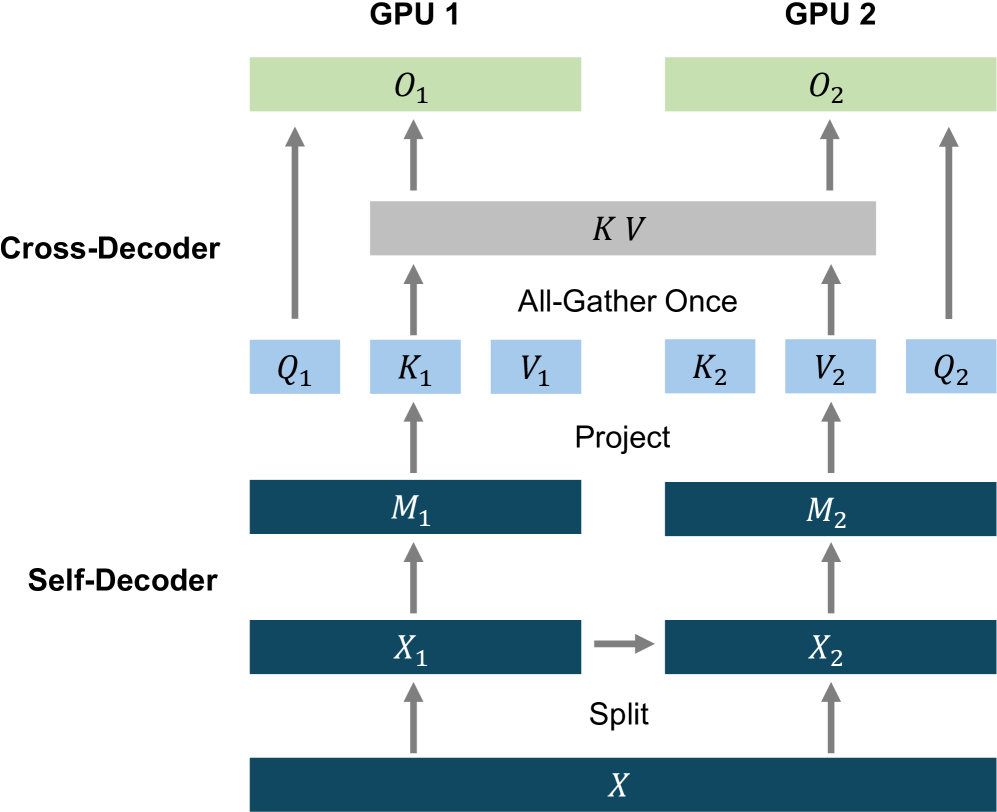

# 一缓存，解码双全：语言模型中的解码器-解码器架构新探在

发布时间：2024年05月08日

`LLM理论

理由：这篇论文介绍了一种名为YOCO的新型解码器-解码器架构，专为大型语言模型设计，并详细讨论了其独特的缓存机制和计算流程。这些内容涉及大型语言模型的理论和架构设计，因此属于LLM理论分类。虽然YOCO的性能优化可能对LLM应用有实际意义，但论文的核心贡献在于提出了一种新的模型架构，这更偏向于理论研究。` `机器学习模型优化`

> You Only Cache Once: Decoder-Decoder Architectures for Language Models

# 摘要

> 我们推出了YOCO，一种创新的解码器-解码器架构，专为大型语言模型设计，其特点是仅对键值对进行一次缓存。YOCO由两个关键部分构成：一个自解码器和一个跨解码器。自解码器负责高效编码全局键值缓存，而跨解码器则通过交叉注意力机制重用这些缓存。尽管YOCO的运作方式类似于仅解码器的Transformer，但其独特的缓存机制大幅降低了GPU内存的消耗，同时保持了全局注意力的强大功能。此外，YOCO的计算流程支持预填充至早期退出，这一特性在不改变最终输出的情况下，大幅提升了预填充阶段的效率。实验数据表明，YOCO在不同规模的模型和训练令牌数量下，均展现出与Transformer相媲美的性能。我们还成功将YOCO扩展至1M的上下文长度，实现了几乎完美的针检索准确性。性能分析显示，YOCO在推理内存、预填充延迟和吞吐量方面，针对不同上下文长度和模型大小，均实现了显著的优化。相关代码已公开，可在https://aka.ms/YOCO获取。

> We introduce a decoder-decoder architecture, YOCO, for large language models, which only caches key-value pairs once. It consists of two components, i.e., a cross-decoder stacked upon a self-decoder. The self-decoder efficiently encodes global key-value (KV) caches that are reused by the cross-decoder via cross-attention. The overall model behaves like a decoder-only Transformer, although YOCO only caches once. The design substantially reduces GPU memory demands, yet retains global attention capability. Additionally, the computation flow enables prefilling to early exit without changing the final output, thereby significantly speeding up the prefill stage. Experimental results demonstrate that YOCO achieves favorable performance compared to Transformer in various settings of scaling up model size and number of training tokens. We also extend YOCO to 1M context length with near-perfect needle retrieval accuracy. The profiling results show that YOCO improves inference memory, prefill latency, and throughput by orders of magnitude across context lengths and model sizes. Code is available at https://aka.ms/YOCO.

[Arxiv](https://arxiv.org/abs/2405.05254)