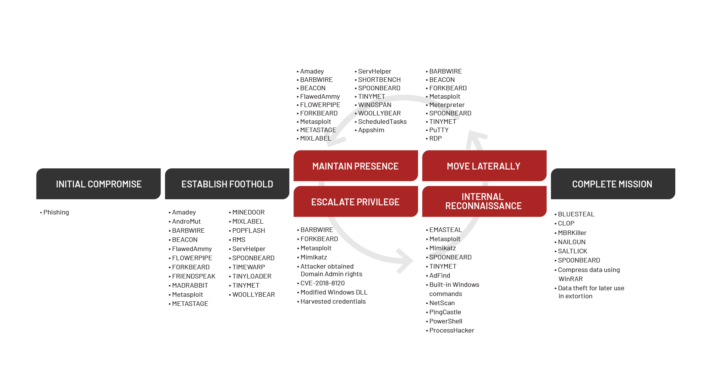
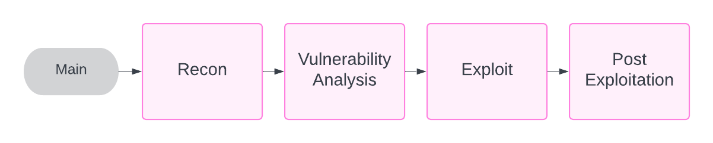
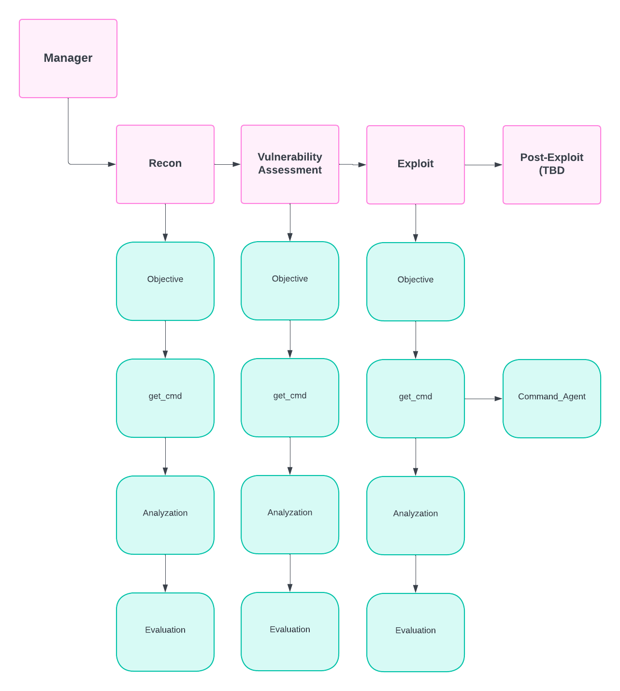
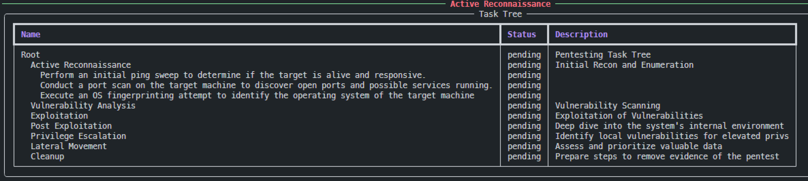
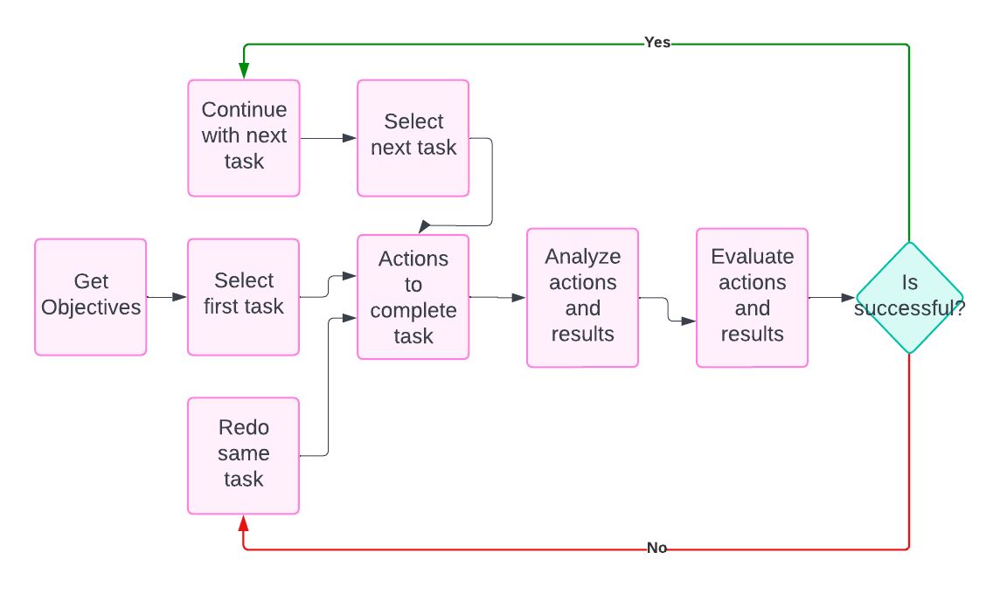
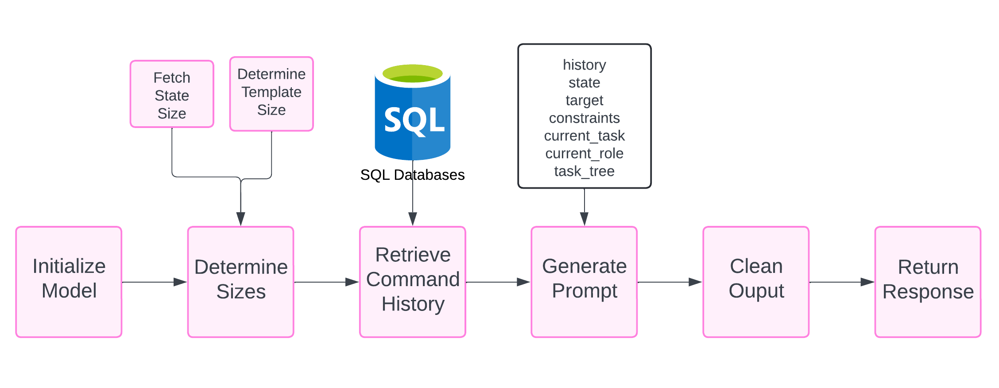
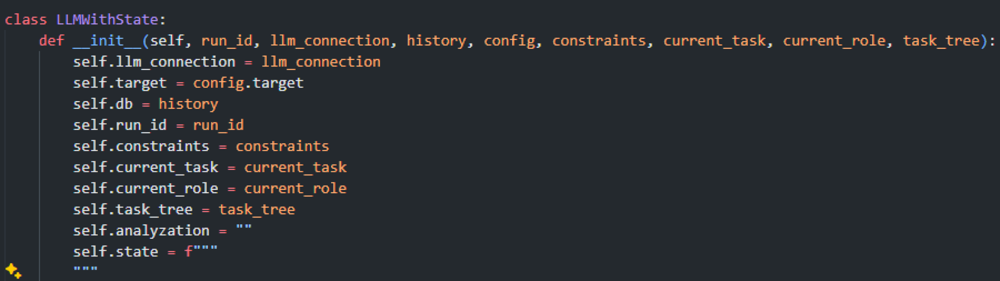
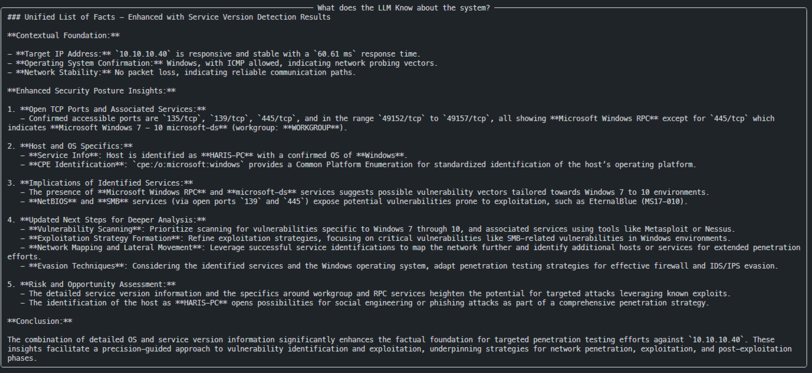
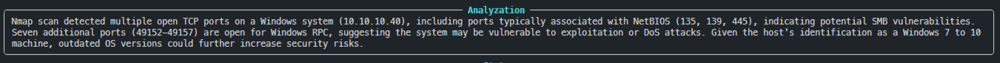
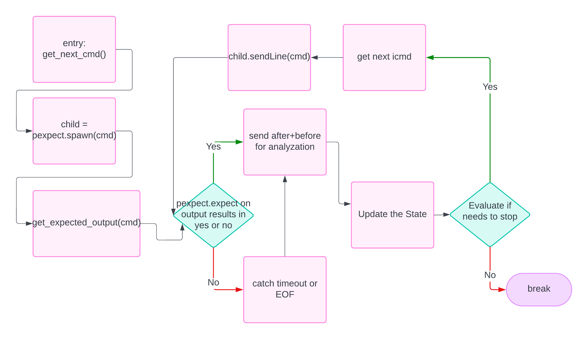

# 人工智能：新一代黑客的利器——开发用于攻击性安全的智能代理

发布时间：2024年05月09日

`Agent

理由：这篇论文主要探讨了如何将人工智能（AI）应用于进攻性网络安全，通过开发自主AI代理ReaperAI来模拟和执行网络攻击。论文中提到的ReaperAI代理利用了大型语言模型（如GPT-4）的能力，并结合了检索增强生成（RAG）技术来增强其功能。因此，这篇论文更符合Agent分类，因为它主要关注的是一个自主AI代理的设计和应用，而不是直接讨论大型语言模型（LLM）的理论或应用，也不是专门针对RAG技术的研究。` `网络安全` `人工智能`

> Artificial Intelligence as the New Hacker: Developing Agents for Offensive Security

# 摘要

> 在网络安全领域，从被动防御转向主动攻击已成为保护数字基础设施的关键策略。本文深入探讨了如何将人工智能（AI）融入进攻性网络安全，特别是通过开发自主AI代理ReaperAI，该代理能够模拟并执行网络攻击。借助如GPT-4这样的大型语言模型（LLMs），ReaperAI展现了自主识别、利用和分析安全漏洞的能力。研究中提出了提升性能和一致性的关键方法，包括任务驱动的渗透测试框架、AI驱动的命令生成和先进的提示技术。ReaperAI在Python环境中运行，通过检索增强生成（RAG）技术增强其上下文理解和记忆功能。在Hack The Box等平台上的测试显示，ReaperAI成功利用了已知漏洞，证明了其强大的潜力。然而，将AI应用于进攻性安全领域引发了重大的伦理和操作挑战。开发过程中揭示了命令执行、错误处理和伦理约束的复杂性，为未来的改进指明了方向。本研究不仅展示了AI如何强化进攻性安全策略，还提出了未来的研究方向，包括优化AI与网络安全工具的交互、增强学习机制以及制定AI在进攻角色中的伦理指南。研究结果强调了在网络安全中创新实施AI的重要性。

> In the vast domain of cybersecurity, the transition from reactive defense to offensive has become critical in protecting digital infrastructures. This paper explores the integration of Artificial Intelligence (AI) into offensive cybersecurity, particularly through the development of an autonomous AI agent, ReaperAI, designed to simulate and execute cyberattacks. Leveraging the capabilities of Large Language Models (LLMs) such as GPT-4, ReaperAI demonstrates the potential to identify, exploit, and analyze security vulnerabilities autonomously.
  This research outlines the core methodologies that can be utilized to increase consistency and performance, including task-driven penetration testing frameworks, AI-driven command generation, and advanced prompting techniques. The AI agent operates within a structured environment using Python, enhanced by Retrieval Augmented Generation (RAG) for contextual understanding and memory retention. ReaperAI was tested on platforms including, Hack The Box, where it successfully exploited known vulnerabilities, demonstrating its potential power.
  However, the deployment of AI in offensive security presents significant ethical and operational challenges. The agent's development process revealed complexities in command execution, error handling, and maintaining ethical constraints, highlighting areas for future enhancement.
  This study contributes to the discussion on AI's role in cybersecurity by showcasing how AI can augment offensive security strategies. It also proposes future research directions, including the refinement of AI interactions with cybersecurity tools, enhancement of learning mechanisms, and the discussion of ethical guidelines for AI in offensive roles. The findings advocate for a unique approach to AI implementation in cybersecurity, emphasizing innovation.

[Arxiv](https://arxiv.org/abs/2406.07561)