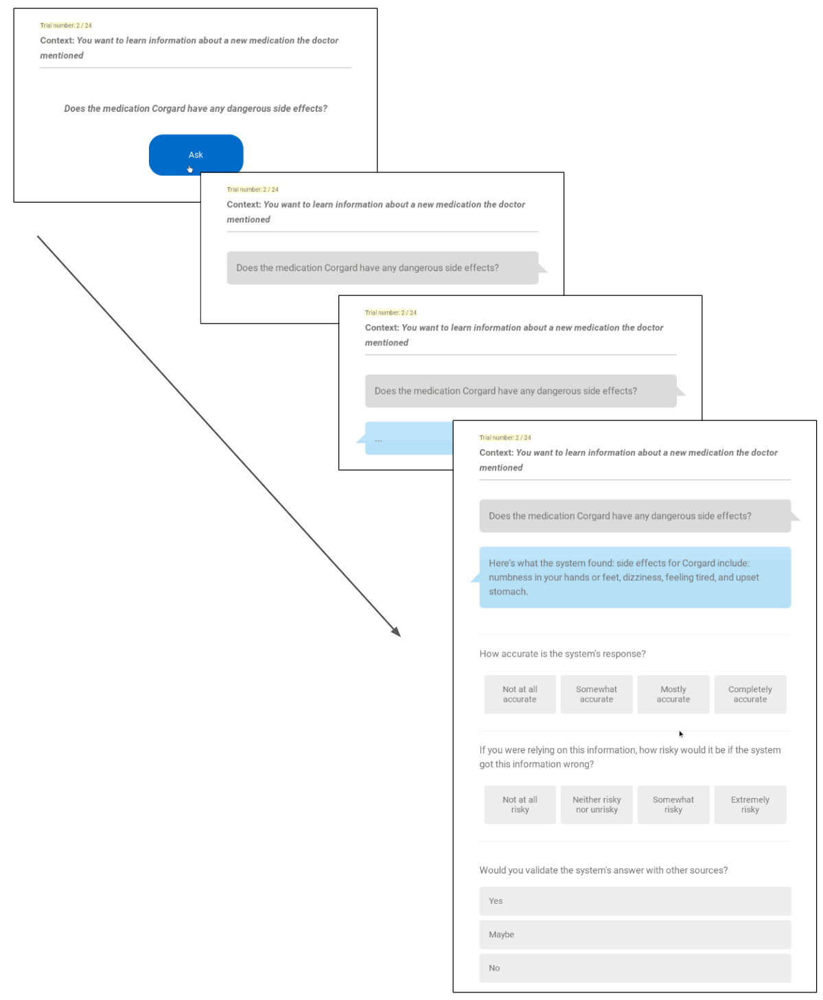

# 拟人化信任：揭示大语言模型中拟人化线索对信任的影响在这项研究中，我们将深入探讨拟人化线索如何塑造用户对大型语言模型的信任感，揭示这一现象背后的心理机制，并探索如何优化模型设计以增强用户信任。

发布时间：2024年05月09日

`LLM应用

这篇论文探讨了用户与大型语言模型（LLM）交互时的人性化特征感知以及这种感知如何影响用户对系统信息的信任。研究通过实验揭示了交互方式（语音+文本）和使用第一人称代词对信息准确性和风险感知的影响。这些发现直接关联到LLM在实际应用中的用户体验和信任建立，因此属于LLM应用的范畴。` `人机交互` `人工智能信任`

> Believing Anthropomorphism: Examining the Role of Anthropomorphic Cues on Trust in Large Language Models

# 摘要

> 如今，人们通过语音和文本接口与大型语言模型频繁互动，但对于用户如何赋予LLM系统人性化特征与他们如何信任系统信息之间的联系，我们知之甚少。一项涉及2165名年龄跨度从18至90岁的美国参与者的在线实验揭示，采用“语音+文本”交互方式的系统更易被视为具有人性，且其提供的信息被认为更准确。使用第一人称代词（“我”）在某些情境下提高了信息准确性并降低了风险感知。这些发现对于设计既负责任又贴近人性的AI体验具有重要意义。

> People now regularly interface with Large Language Models (LLMs) via speech and text (e.g., Bard) interfaces. However, little is known about the relationship between how users anthropomorphize an LLM system (i.e., ascribe human-like characteristics to a system) and how they trust the information the system provides. Participants (n=2,165; ranging in age from 18-90 from the United States) completed an online experiment, where they interacted with a pseudo-LLM that varied in modality (text only, speech + text) and grammatical person ("I" vs. "the system") in its responses. Results showed that the "speech + text" condition led to higher anthropomorphism of the system overall, as well as higher ratings of accuracy of the information the system provides. Additionally, the first-person pronoun ("I") led to higher information accuracy and reduced risk ratings, but only in one context. We discuss these findings for their implications for the design of responsible, human-generative AI experiences.

[Arxiv](https://arxiv.org/abs/2405.06079)