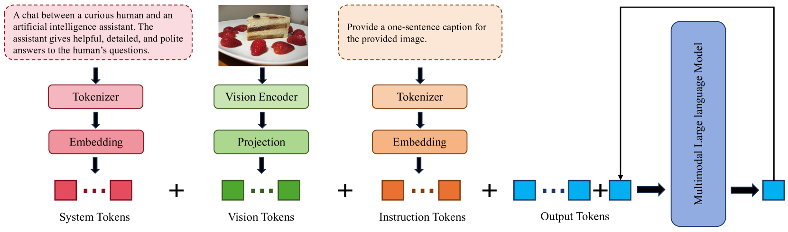

# 借助视觉令牌的巧妙撤回，多模态大型语言模型得以加速推理，如同智慧之光在瞬间闪耀。

发布时间：2024年05月09日

`LLM应用

这篇论文探讨了多模态大型语言模型（MLLMs）的推理效率问题，并提出了一种名为视觉令牌撤退（VTW）的模块来加速推理过程。该研究关注的是LLM在实际应用中的性能优化，特别是通过减少计算需求来提高推理速度，这是LLM应用领域的一个重要议题。虽然研究中可能涉及一些理论分析，如注意力陷阱现象和信息迁移现象的观察，但其核心贡献在于提出并验证了一种实际可行的加速方法，这使得它更适合归类于LLM应用类别。` `人工智能加速` `多模态学习`

> Boosting Multimodal Large Language Models with Visual Tokens Withdrawal for Rapid Inference

# 摘要

> 多模态大型语言模型（MLLMs）因庞大的参数和视觉信息所需的额外输入令牌，推理时计算需求巨大。我们提出的视觉令牌撤退（VTW）模块，如同即插即用的加速器，旨在提升MLLMs的推理速度。我们的灵感源自两个观察：一是注意力陷阱现象，在MLLMs中，初始与近邻令牌吸聚大部分注意力，而深层中的视觉令牌则被忽视；二是信息迁移现象，视觉信息在前几层便转移到文本令牌。基于此，我们认为深层MLLMs无需视觉令牌，故策略性地在特定层级撤除它们，仅留文本令牌继续参与。为找到撤退的最佳层级，我们分析小型数据集，依据Kullback-Leibler散度标准选择首个符合条件的层级。VTW方法在保持性能的同时，能将计算开销削减逾40%，适用于各类多模态任务。我们的代码已公开于https://github.com/lzhxmu/VTW。

> Multimodal large language models (MLLMs) demand considerable computations for inference due to the extensive parameters and the additional input tokens needed for visual information representation. Herein, we introduce Visual Tokens Withdrawal (VTW), a plug-and-play module to boost MLLMs for rapid inference. Our approach is inspired by two intriguing phenomena we have observed: (1) the attention sink phenomenon that is prevalent in LLMs also persists in MLLMs, suggesting that initial tokens and nearest tokens receive the majority of attention, while middle vision tokens garner minimal attention in deep layers; (2) the presence of information migration, which implies that visual information is transferred to subsequent text tokens within the first few layers of MLLMs. As per our findings, we conclude that vision tokens are not necessary in the deep layers of MLLMs. Thus, we strategically withdraw them at a certain layer, enabling only text tokens to engage in subsequent layers. To pinpoint the ideal layer for vision tokens withdrawal, we initially analyze a limited set of tiny datasets and choose the first layer that meets the Kullback-Leibler divergence criterion. Our VTW approach can cut computational overhead by over 40\% across diverse multimodal tasks while maintaining performance. Our code is released at https://github.com/lzhxmu/VTW.

[Arxiv](https://arxiv.org/abs/2405.05803)