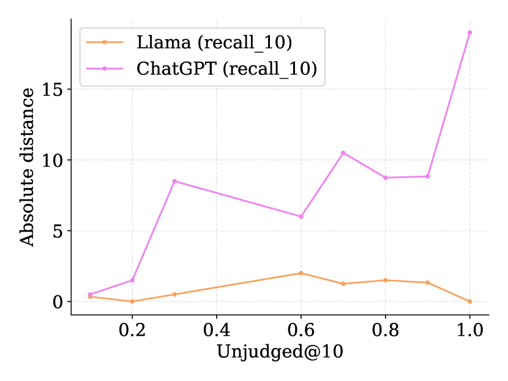

# 大型语言模型能否填补相关性判断的空白？这一问题引发了我们对人工智能在信息检索领域潜力的深思。

发布时间：2024年05月09日

`LLM应用

这篇论文探讨了大型语言模型（LLM）在对话式搜索环境中填补测试集合中未评估文档“漏洞”的应用。它讨论了LLM在自动判断和结合人类判断时的表现，以及LLM选择对新系统评价的影响。论文强调了通过提示工程和LLM微调来更好地反映人类判断的重要性，以确保模型更符合其设计目的。这与LLM在特定应用场景中的实际应用和改进相关，因此归类为LLM应用。` `对话式搜索` `测试评估`

> Can We Use Large Language Models to Fill Relevance Judgment Holes?

# 摘要

> 不完整的关联判断影响了测试集合的再利用，新系统在与旧系统比较时往往处于劣势，因为测试集合中存在未评估文档的“漏洞”。本文探讨了如何利用大型语言模型（LLM）来填补这些漏洞，特别是在对话式搜索的动态环境中。虽然LLM的自动判断能产生高度相关的排名，但结合人类判断时，相关性显著下降。我们还发现，LLM的选择会影响新系统的评价，漏洞越大，影响越显著。为了获得更一致的排名，应在整个文档池上应用LLM注释。未来的研究需要集中在如何通过提示工程和LLM微调来更好地反映人类判断，以确保模型更符合其设计目的。

> Incomplete relevance judgments limit the re-usability of test collections. When new systems are compared against previous systems used to build the pool of judged documents, they often do so at a disadvantage due to the ``holes'' in test collection (i.e., pockets of un-assessed documents returned by the new system). In this paper, we take initial steps towards extending existing test collections by employing Large Language Models (LLM) to fill the holes by leveraging and grounding the method using existing human judgments. We explore this problem in the context of Conversational Search using TREC iKAT, where information needs are highly dynamic and the responses (and, the results retrieved) are much more varied (leaving bigger holes). While previous work has shown that automatic judgments from LLMs result in highly correlated rankings, we find substantially lower correlates when human plus automatic judgments are used (regardless of LLM, one/two/few shot, or fine-tuned). We further find that, depending on the LLM employed, new runs will be highly favored (or penalized), and this effect is magnified proportionally to the size of the holes. Instead, one should generate the LLM annotations on the whole document pool to achieve more consistent rankings with human-generated labels. Future work is required to prompt engineering and fine-tuning LLMs to reflect and represent the human annotations, in order to ground and align the models, such that they are more fit for purpose.

[Arxiv](https://arxiv.org/abs/2405.05600)