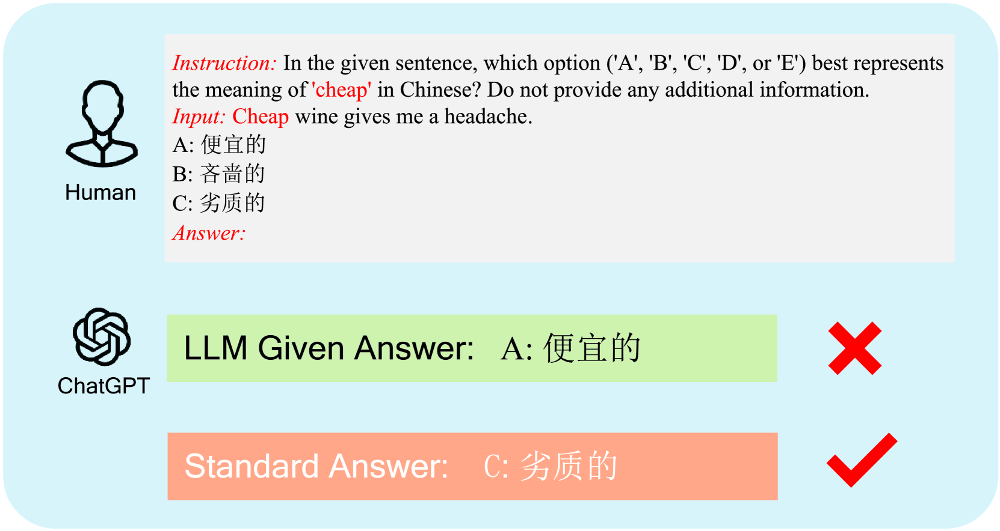
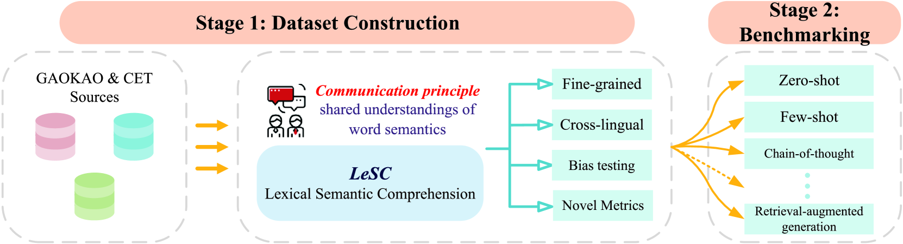
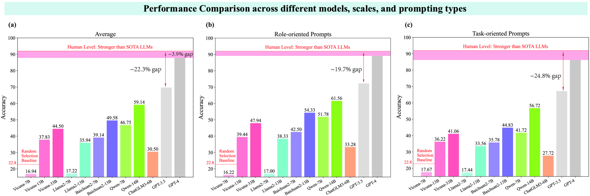
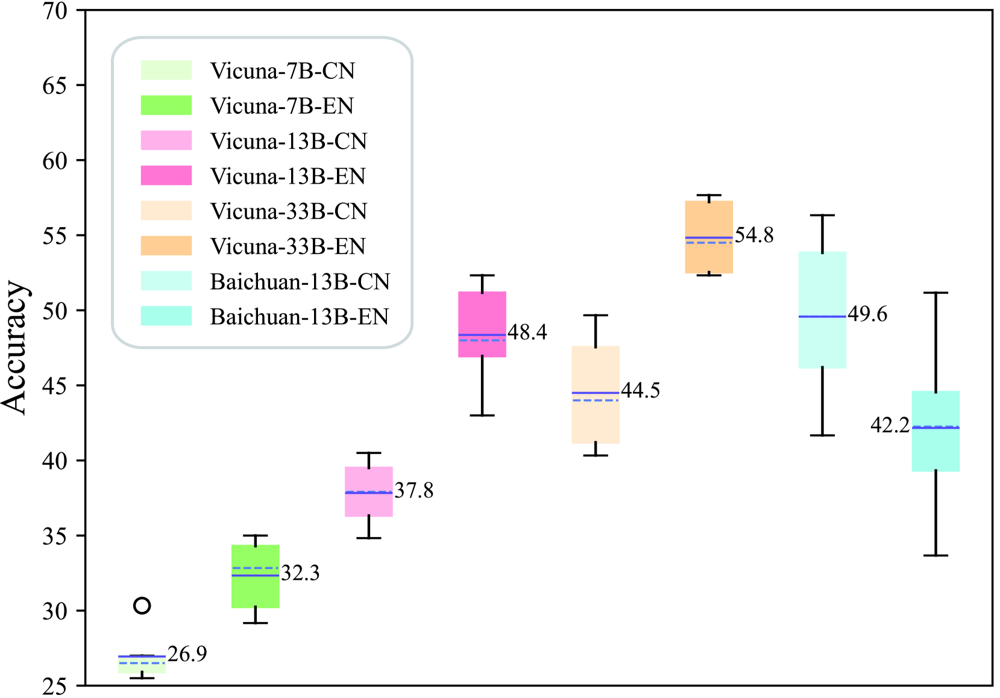
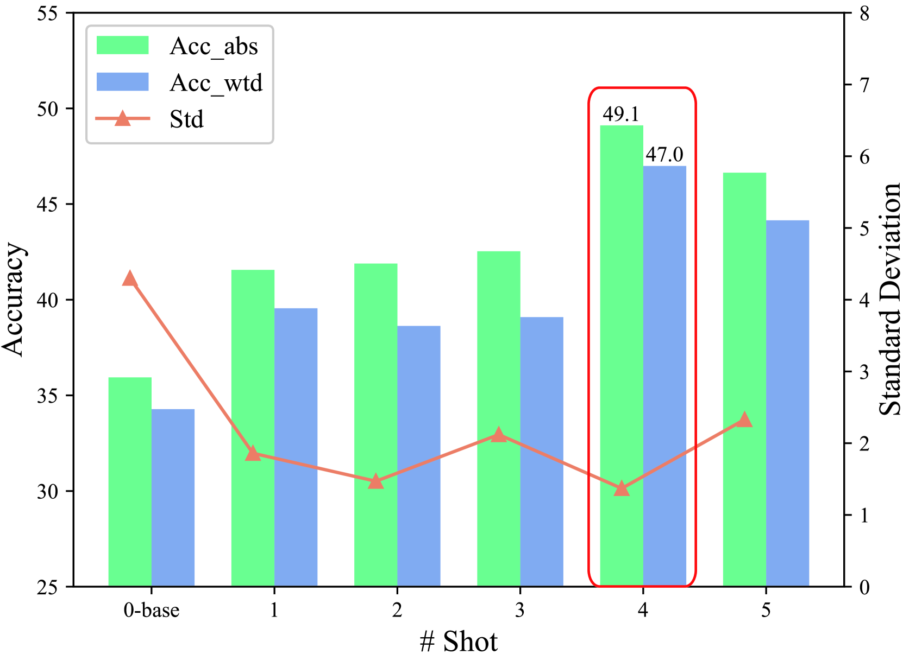
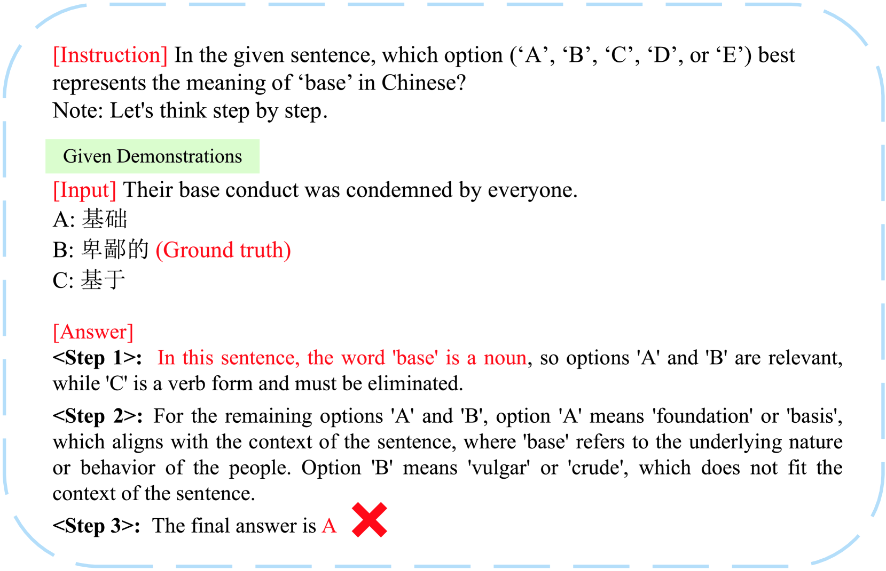
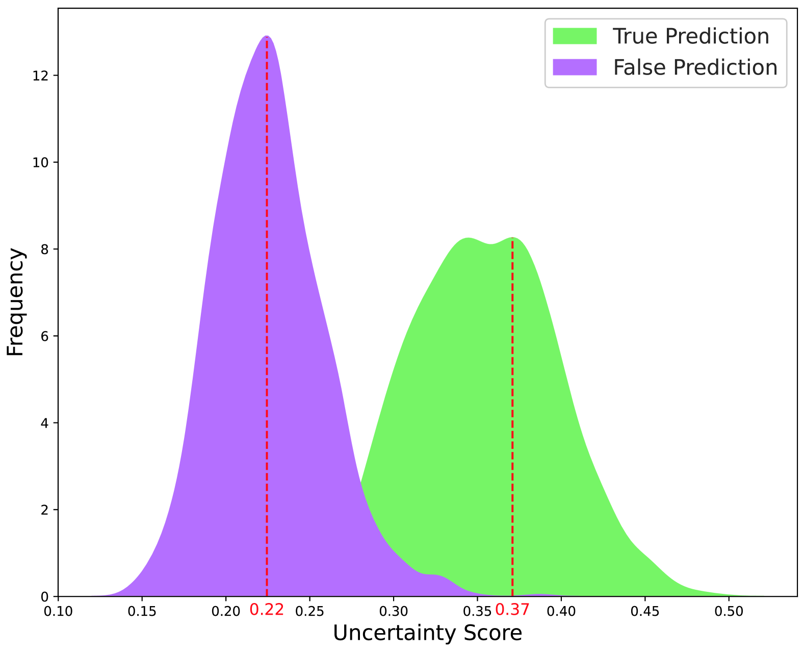

# 大型语言模型是否能洞察常见词汇的隐秘含义？

发布时间：2024年05月09日

`LLM理论

这篇论文关注的是大型语言模型（LLMs）在语义理解方面的机制和局限性，特别是对于常用词的不常见意义的理解。它通过构建一个新的数据集LeSC来评估模型的理解能力，并指出即使是当前最先进的模型也存在理解上的不足。这表明了LLMs在理论层面上的挑战和需要进一步研究的问题，因此属于LLM理论分类。` `人工智能`

> Can large language models understand uncommon meanings of common words?

# 摘要

> ChatGPT等大型语言模型在智能对话和自主代理等NLU任务中取得了显著进步，但缺乏公认的测试机制，使得“LLMs是否真正理解世界”这一问题仍悬而未决，引发广泛研究和激烈讨论。现有研究多停留在表面理解，忽视了深入探索的重要性。为了深入理解LLMs的语义理解机制，我们的研究聚焦于常用词的不常见意义，这源于心理学中对词语准确共享理解的基本原则。我们构建了首个涵盖精细化和跨语言维度的Lexical Semantic Comprehension（LeSC）数据集，并通过广泛实验揭示了现有模型在基本词汇理解上的不足，即使是顶尖的GPT-4和GPT-3.5也分别落后于16岁人类3.9%和22.3%。尽管引入了先进的提示技术和检索增强生成，但问题依旧存在。本研究强调了这些关键缺陷，为开发更智能的LLMs提供了新的研究方向。

> Large language models (LLMs) like ChatGPT have shown significant advancements across diverse natural language understanding (NLU) tasks, including intelligent dialogue and autonomous agents. Yet, lacking widely acknowledged testing mechanisms, answering `whether LLMs are stochastic parrots or genuinely comprehend the world' remains unclear, fostering numerous studies and sparking heated debates. Prevailing research mainly focuses on surface-level NLU, neglecting fine-grained explorations. However, such explorations are crucial for understanding their unique comprehension mechanisms, aligning with human cognition, and finally enhancing LLMs' general NLU capacities. To address this gap, our study delves into LLMs' nuanced semantic comprehension capabilities, particularly regarding common words with uncommon meanings. The idea stems from foundational principles of human communication within psychology, which underscore accurate shared understandings of word semantics. Specifically, this paper presents the innovative construction of a Lexical Semantic Comprehension (LeSC) dataset with novel evaluation metrics, the first benchmark encompassing both fine-grained and cross-lingual dimensions. Introducing models of both open-source and closed-source, varied scales and architectures, our extensive empirical experiments demonstrate the inferior performance of existing models in this basic lexical-meaning understanding task. Notably, even the state-of-the-art LLMs GPT-4 and GPT-3.5 lag behind 16-year-old humans by 3.9% and 22.3%, respectively. Additionally, multiple advanced prompting techniques and retrieval-augmented generation are also introduced to help alleviate this trouble, yet limitations persist. By highlighting the above critical shortcomings, this research motivates further investigation and offers novel insights for developing more intelligent LLMs.

[Arxiv](https://arxiv.org/abs/2405.05741)