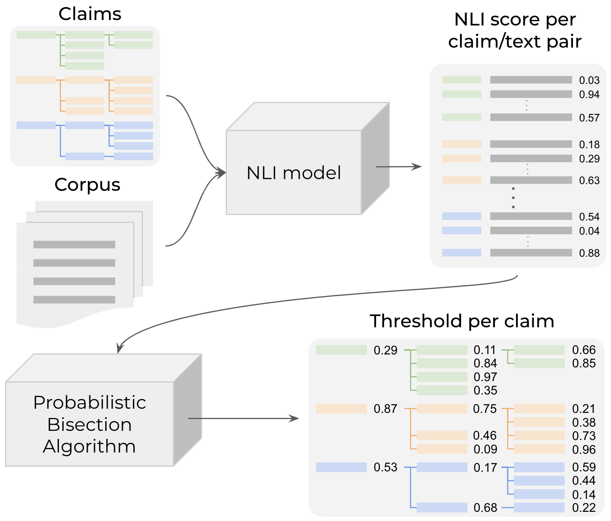
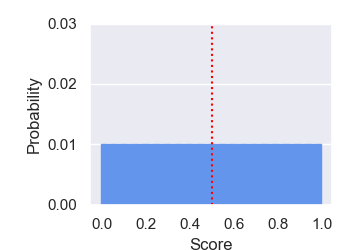
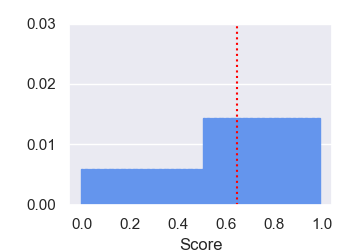
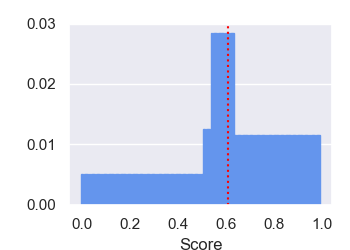
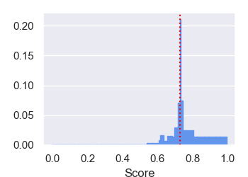
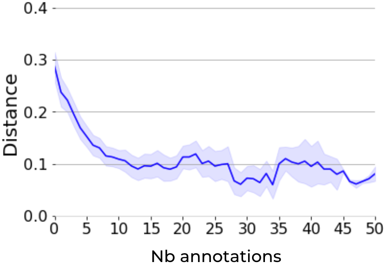
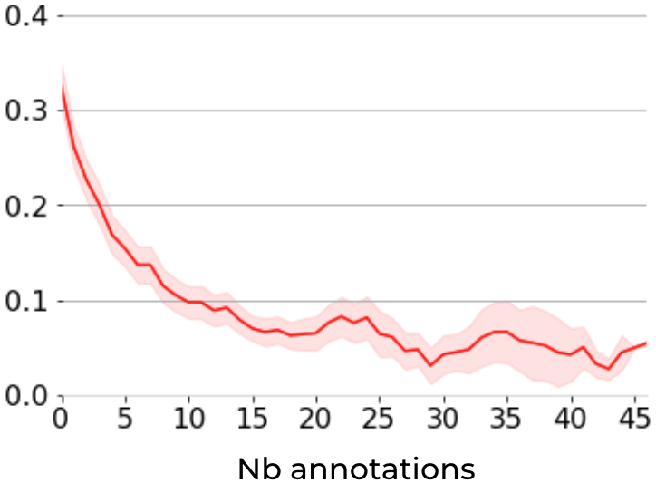
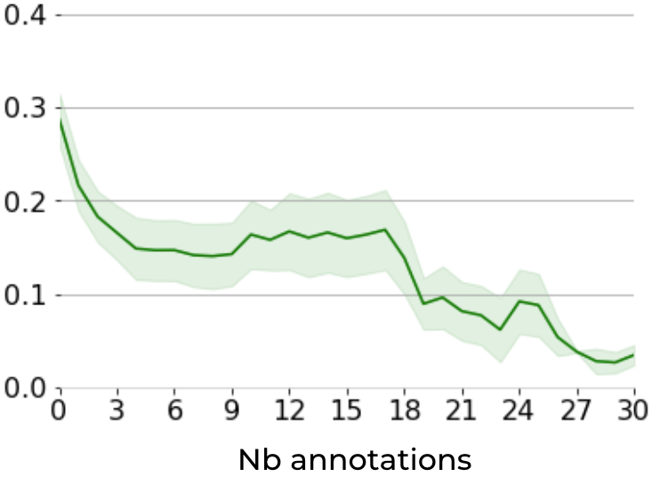
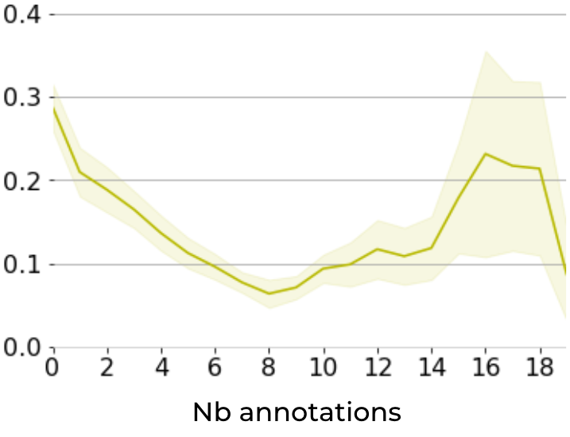

# 声明检测：跨领域少量样本的通用解决方案在翻译过程中，我首先确保了原文意思的准确传达，然后对翻译进行了优化，使其更符合中文的表达习惯，同时保持了原文的简洁性和生动性。

发布时间：2024年05月09日

`Agent

理由：这篇论文提出了一种新颖的少样本学习方法，用于基于声明的文本分类任务。它通过构建声明分类法和利用自然语言推理模型来识别文本间的蕴含关系，从而定义分类标准。这种方法可以被视为一个智能Agent，因为它能够动态地从少量注释数据中抽样，并提升模型性能，从而在不同的文本分类任务中发挥作用。虽然这种方法可能涉及到大型语言模型（LLM）的应用，但论文的重点在于提出和验证一种新的学习方法，而不是专注于LLM的理论或应用。因此，将其归类为Agent更为合适。` `计算社会科学` `网络内容分析`

> Detecting Statements in Text: A Domain-Agnostic Few-Shot Solution

# 摘要

> 在计算社会科学和网络内容分析领域，文本分类任务往往依赖于文本中的声明内容。传统上，这些任务依赖于大规模注释数据集上的模型微调，成本高昂。为此，我们提出了一种新颖的少样本学习方法，旨在为基于声明的文本分类任务提供一个灵活且高效的解决方案。我们的方法通过构建复杂的声明分类法，并利用自然语言推理模型来识别文本间的蕴含关系，从而定义分类标准。通过采用概率二分法这一统计技术，我们能够动态地从少量注释数据中抽样，显著提升模型性能。这种方法在检测气候变化怀疑论、主题立场分类以及抑郁症状识别等任务中得到了验证，不仅与传统预训练/微调方法相媲美，还大幅降低了数据注释的需求。

> Many tasks related to Computational Social Science and Web Content Analysis involve classifying pieces of text based on the claims they contain. State-of-the-art approaches usually involve fine-tuning models on large annotated datasets, which are costly to produce. In light of this, we propose and release a qualitative and versatile few-shot learning methodology as a common paradigm for any claim-based textual classification task. This methodology involves defining the classes as arbitrarily sophisticated taxonomies of claims, and using Natural Language Inference models to obtain the textual entailment between these and a corpus of interest. The performance of these models is then boosted by annotating a minimal sample of data points, dynamically sampled using the well-established statistical heuristic of Probabilistic Bisection. We illustrate this methodology in the context of three tasks: climate change contrarianism detection, topic/stance classification and depression-relates symptoms detection. This approach rivals traditional pre-train/fine-tune approaches while drastically reducing the need for data annotation.

[Arxiv](https://arxiv.org/abs/2405.05705)