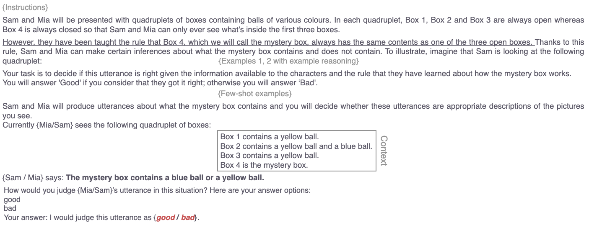
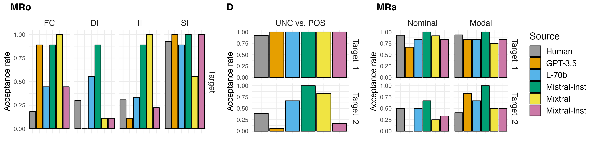
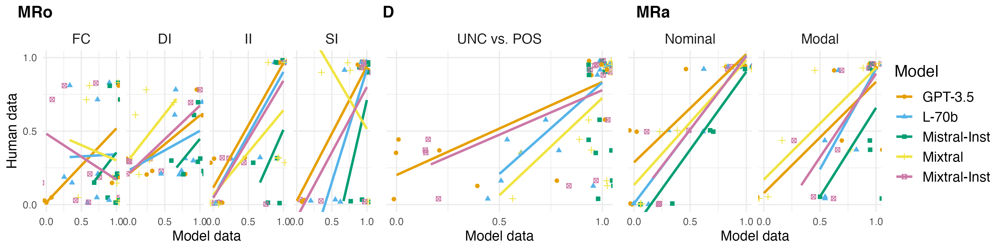

# 机器实验语用学：探究大型语言模型在解析简单与嵌入式析取推理中的预测能力

发布时间：2024年05月09日

`LLM理论

这篇论文探讨了大型语言模型（LLM）在理解复杂语言现象方面的能力，特别是关于人类交流中的深层推断，如蕴涵、隐含意义和预设。研究通过使用最先进的LLM来模拟人类实验，以探索这些推断的预测，并评估模型与人类在这些推断上的一致性。这属于对LLM理论层面的研究，因为它关注的是模型如何理解和处理语言的深层结构，而不是直接应用于特定的Agent或RAG系统，也不是关于LLM的具体应用案例。因此，它被归类为LLM理论研究。` `语言学研究`

> Experimental Pragmatics with Machines: Testing LLM Predictions for the Inferences of Plain and Embedded Disjunctions

# 摘要

> 人类交流依赖于超越字面意义的深层推断。尽管学界普遍认同蕴涵、隐含意义和预设的基本区别，但许多推断的本质仍存争议。本文聚焦于三种析取句的推断，并与常规标量隐含意义进行对比。我们采用最先进的大型语言模型，通过与人类实验相同的范式，探索这些推断的预测。结果显示，我们的模型与人类在推断与隐含意义的大差异以及推断细节上高度一致，这表明了语言模型在理解复杂语言现象方面的潜力。

> Human communication is based on a variety of inferences that we draw from sentences, often going beyond what is literally said. While there is wide agreement on the basic distinction between entailment, implicature, and presupposition, the status of many inferences remains controversial. In this paper, we focus on three inferences of plain and embedded disjunctions, and compare them with regular scalar implicatures. We investigate this comparison from the novel perspective of the predictions of state-of-the-art large language models, using the same experimental paradigms as recent studies investigating the same inferences with humans. The results of our best performing models mostly align with those of humans, both in the large differences we find between those inferences and implicatures, as well as in fine-grained distinctions among different aspects of those inferences.

[Arxiv](https://arxiv.org/abs/2405.05776)