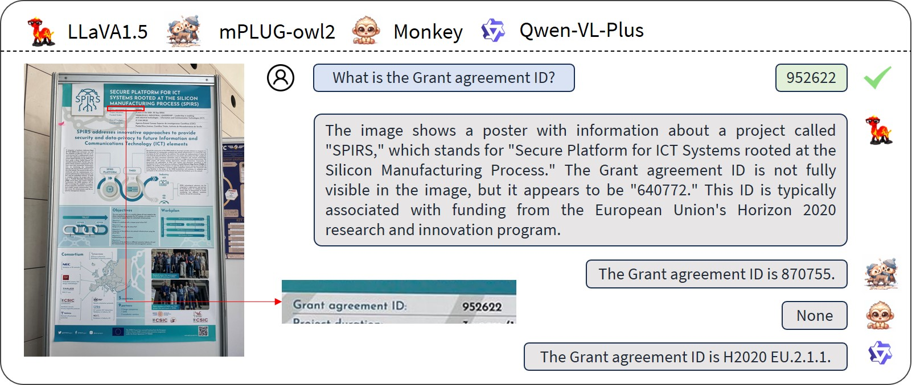
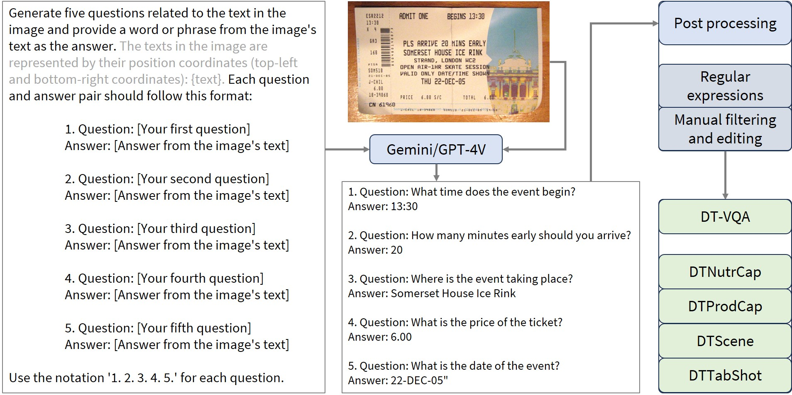
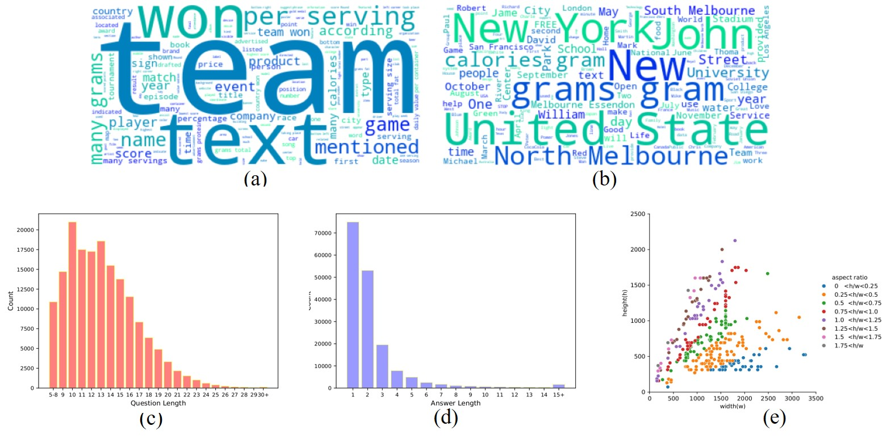
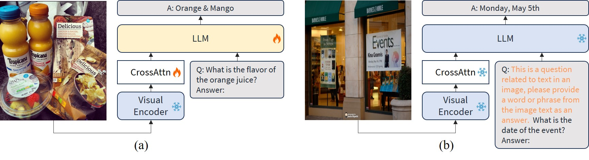
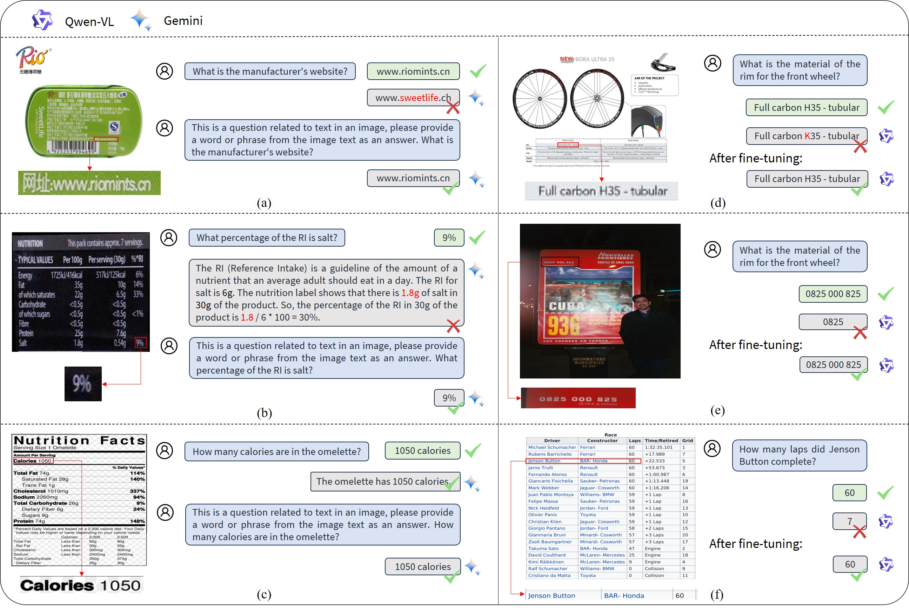
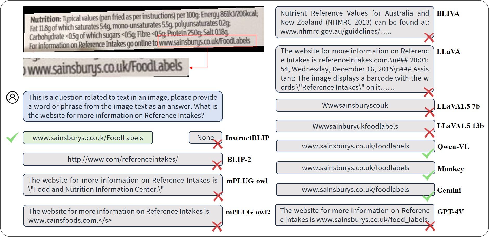

# 探究大型多模态模型在处理密集文本时的潜能

发布时间：2024年05月09日

`LLM应用

这篇论文关注的是大型多模态模型（LMM）在处理密集文本内容方面的应用，特别是通过引入DT-VQA数据集来评估和提升LMM在复杂文本任务中的表现。论文中提到了对GPT4V、Gemini等模型的评估，以及提示工程和下游微调对模型性能的影响。这些内容更偏向于大型语言模型（LLM）的实际应用，而不是Agent或RAG的特定研究，也不是LLM的理论探讨。因此，将其归类为LLM应用是合适的。` `文档理解` `问答系统`

> Exploring the Capabilities of Large Multimodal Models on Dense Text

# 摘要

> 大型多模态模型（LMM）在多模态任务中表现出色，但在处理密集文本内容方面仍有巨大潜力待挖掘。密集文本蕴含关键信息，常见于各类文档中。深入理解这类文本，有助于我们获取精准信息，从而做出更明智的决策。为此，我们推出了包含17万问答对的DT-VQA数据集，旨在深入探究LMM在复杂文本任务中的表现。本文对GPT4V、Gemini及多款开源LMMs进行了详尽评估，揭示了各自的优势与短板。同时，我们探讨了提示工程与下游微调两种策略对LMM性能的影响，发现即便使用自动标注数据集，模型性能亦能大幅提升。我们期待这项研究能够激发更多关于LMM在密集文本任务上的探索。相关代码将在https://github.com/Yuliang-Liu/MultimodalOCR公开。

> While large multi-modal models (LMM) have shown notable progress in multi-modal tasks, their capabilities in tasks involving dense textual content remains to be fully explored. Dense text, which carries important information, is often found in documents, tables, and product descriptions. Understanding dense text enables us to obtain more accurate information, assisting in making better decisions. To further explore the capabilities of LMM in complex text tasks, we propose the DT-VQA dataset, with 170k question-answer pairs. In this paper, we conduct a comprehensive evaluation of GPT4V, Gemini, and various open-source LMMs on our dataset, revealing their strengths and weaknesses. Furthermore, we evaluate the effectiveness of two strategies for LMM: prompt engineering and downstream fine-tuning. We find that even with automatically labeled training datasets, significant improvements in model performance can be achieved. We hope that this research will promote the study of LMM in dense text tasks. Code will be released at https://github.com/Yuliang-Liu/MultimodalOCR.

[Arxiv](https://arxiv.org/abs/2405.06706)