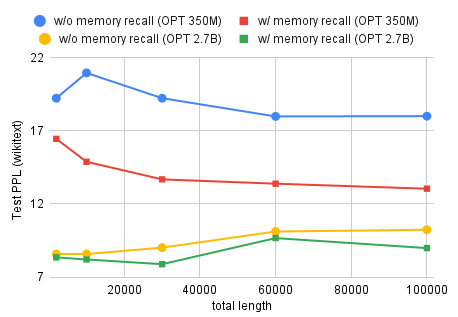

# 层次记忆变压器（HMT）：专为长篇语言处理而设计在这篇文章中，我们将探讨层次记忆变压器（HMT），这是一种创新的技术，旨在处理长篇语言上下文，以提升自然语言处理任务的性能。HMT通过其独特的层次结构记忆机制，能够捕捉和处理更广泛的语言上下文信息，从而在处理复杂语言任务时展现出卓越的能力。

发布时间：2024年05月09日

`LLM理论

这篇论文探讨了大型语言模型（LLM）在处理长篇上下文时的局限性，并提出了一种新的模型架构——分层记忆Transformer（HMT），旨在模仿人类记忆机制以提高模型对长篇上下文的处理能力。这一研究不仅涉及模型的应用层面，更深入到了模型设计和理论层面，因此将其归类为LLM理论。论文中提出的HMT框架是对现有LLM的一种理论上的改进和扩展，其研究成果对于理解LLM的工作原理和提升其性能具有重要的理论意义。` `机器学习`

> HMT: Hierarchical Memory Transformer for Long Context Language Processing

# 摘要

> 基于Transformer的大型语言模型（LLM）在语言处理领域大放异彩，但多数模型受限于上下文窗口，无法全面关注输入的每个细节。相比之下，循环模型通过记忆过往信息实现了无限上下文，但其“扁平”的内存结构在信息筛选上存在短板。鉴于人类学习与自我调整的天赋，我们推测模仿大脑的记忆层次或许能为模型记忆带来新思路。因此，我们推出了分层记忆Transformer（HMT），这一创新框架通过模拟人类记忆机制，显著提升了模型对长篇上下文的处理能力。HMT通过记忆增强的段级循环，巧妙地保留早期输入信息，沿序列传递记忆嵌入，并从历史中提取关键信息，构建起层次分明的记忆体系。在Wikitext-103、PG-19的语言建模测试及PubMedQA的问答任务中，HMT展现了其在长上下文处理上的稳健进步，仅需增加0.5%至2%的参数，便能为未来的LLM注入处理长篇内容的强大能力。我们的实现代码已在Github上公开，欢迎探索：https://github.com/OswaldHe/HMT-pytorch。

> Transformer-based large language models (LLM) have been widely used in language processing applications. However, most of them restrict the context window that permits the model to attend to every token in the inputs. Previous works in recurrent models can memorize past tokens to enable unlimited context and maintain effectiveness. However, they have "flat" memory architectures, which have limitations in selecting and filtering information. Since humans are good at learning and self-adjustment, we speculate that imitating brain memory hierarchy is beneficial for model memorization. We propose the Hierarchical Memory Transformer (HMT), a novel framework that enables and improves models' long-context processing ability by imitating human memorization behavior. Leveraging memory-augmented segment-level recurrence, we organize the memory hierarchy by preserving tokens from early input token segments, passing memory embeddings along the sequence, and recalling relevant information from history. Evaluating general language modeling (Wikitext-103, PG-19) and question-answering tasks (PubMedQA), we show that HMT steadily improves the long-context processing ability of context-constrained and long-context models. With an additional 0.5% - 2% of parameters, HMT can easily plug in and augment future LLMs to handle long context effectively. Our code is open-sourced on Github: https://github.com/OswaldHe/HMT-pytorch.

[Arxiv](https://arxiv.org/abs/2405.06067)