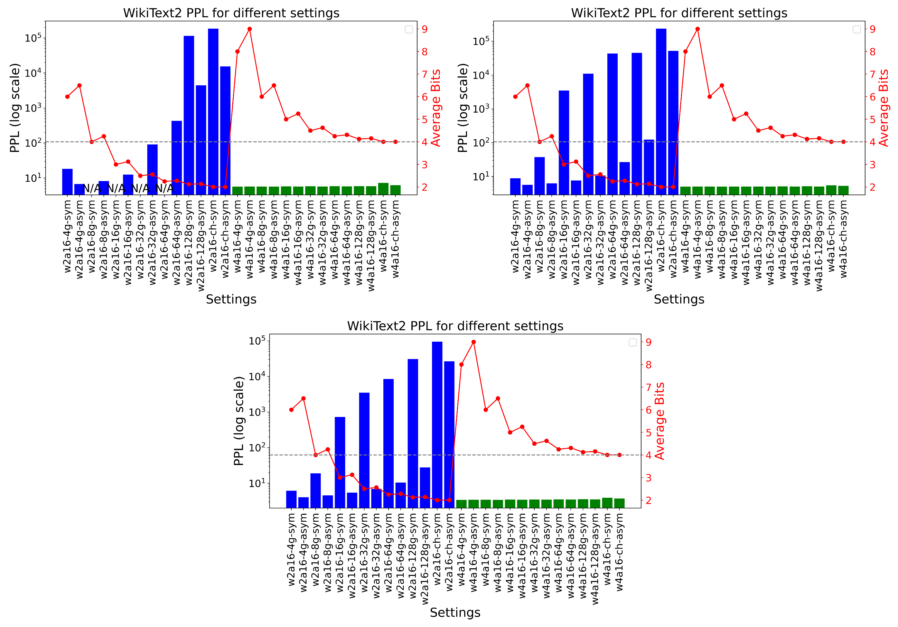

# LLM-QBench：大型语言模型后训练量化实践的标杆在这项研究中，我们提出了 LLM-QBench，这是一个旨在为大型语言模型的后训练量化提供最佳实践的基准。通过 LLM-QBench，我们旨在探索和评估不同量化策略对模型性能的影响，从而为实际应用中的模型优化提供指导。

发布时间：2024年05月09日

`LLM理论

这篇论文主要探讨了大型语言模型（LLMs）的量化技术，这是一种压缩和加速模型的方法，旨在平衡性能与计算效率。论文开发了量化工具包LLMC，并提出了量化实践的关键原则，通过大量实验总结了量化过程中的关键点，并构建了一个最佳实践的LLM PTQ流程。这些内容更偏向于LLM的理论研究和优化实践，因此归类为LLM理论。` `人工智能` `模型压缩`

> LLM-QBench: A Benchmark Towards the Best Practice for Post-training Quantization of Large Language Models

# 摘要

> 大型语言模型（LLMs）的最新进展正推动我们迈向人工通用智能，这得益于其卓越的涌现能力和推理能力。然而，LLMs的巨大计算和内存需求限制了其广泛应用。量化作为一种关键的压缩技术，通过压缩和加速LLMs，为缓解这些需求提供了可行方案，尽管可能会牺牲模型精度。许多研究致力于最小化量化带来的精度损失，但这些研究中的量化配置各异，可能未针对硬件兼容性进行优化。本文旨在确定量化LLMs的最有效实践，以平衡性能与计算效率。为此，我们开发了量化工具包LLMC，并制定了四个关键原则，涵盖推理效率、量化精度、校准成本和模块化。通过在多个模型和数据集上进行超过500次实验，我们总结了三个关键点，涉及校准数据、量化算法和量化方案。最终，我们构建了一个最佳实践的LLM PTQ流程。所有基准测试结果和工具包均可在https://github.com/ModelTC/llmc获取。

> Recent advancements in large language models (LLMs) are propelling us toward artificial general intelligence, thanks to their remarkable emergent abilities and reasoning capabilities. However, the substantial computational and memory requirements of LLMs limit their widespread adoption. Quan- tization, a key compression technique, offers a viable solution to mitigate these demands by compressing and accelerating LLMs, albeit with poten- tial risks to model accuracy. Numerous studies have aimed to minimize the accuracy loss associated with quantization. However, the quantization configurations in these studies vary and may not be optimized for hard- ware compatibility. In this paper, we focus on identifying the most effective practices for quantizing LLMs, with the goal of balancing performance with computational efficiency. For a fair analysis, we develop a quantization toolkit LLMC, and design four crucial principles considering the inference efficiency, quantized accuracy, calibration cost, and modularization. By benchmarking on various models and datasets with over 500 experiments, three takeaways corresponding to calibration data, quantization algorithm, and quantization schemes are derived. Finally, a best practice of LLM PTQ pipeline is constructed. All the benchmark results and the toolkit can be found at https://github.com/ModelTC/llmc.

[Arxiv](https://arxiv.org/abs/2405.06001)