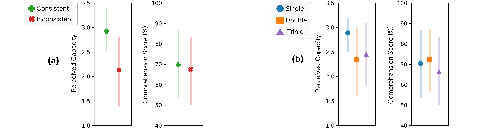

# 辨真伪于众说纷纭：从错综复杂的人工智能生成中提炼真知在众多人工智能生成的信息中，我们面临着辨别真伪的挑战。这些信息可能充满错误，且相互之间存在不一致。本研究旨在探索如何在这样复杂的环境中，准确地提取和理解信息，确保我们能够从人工智能的众多声音中，捕捉到最真实、最可靠的知识。

发布时间：2024年05月09日

`LLM理论

这篇论文探讨了大型语言模型（LLMs）的非确定性及其对用户理解和使用AI模型的影响。它研究了用户在面对多个可能不一致的LLM输出时的行为和感知，并通过实验来分析输出不一致性对信息理解的影响。这项研究关注的是LLM的内部机制和用户交互，而不是具体的应用场景或Agent的设计，因此它更符合LLM理论的范畴。同时，它也不直接涉及Agent的行为或RAG（Retrieval-Augmented Generation）框架，因此不属于Agent或RAG分类。` `人工智能交互` `用户体验研究`

> One vs. Many: Comprehending Accurate Information from Multiple Erroneous and Inconsistent AI Generations

# 摘要

> 大型语言模型（LLMs）的非确定性意味着同一输入可能产生不同输出，包括错误或幻觉。若再次尝试，模型可能自我修正并给出正确答案。然而，多数基于LLM的系统仅提供单一结果，用户只能接受。提供多个输出有助于揭示分歧或备选方案，但用户如何处理这些不一致性尚不明确。我们的研究探索了用户在面对多个可能不一致的LLM输出时，如何理解AI模型及其信息。初步研究揭示了五种输出不一致类型，并据此进行了涉及252名参与者的实验，他们需通过LLM生成的段落来解答信息查询问题。结果显示，输出不一致性虽降低了AI能力的感知，却增强了信息理解。特别是，阅读两个段落的参与者受益最大。因此，我们建议设计时应考虑揭示LLM的不一致性，以此作为模型局限性的透明指示，并鼓励用户批判性地使用LLM。

> As Large Language Models (LLMs) are nondeterministic, the same input can generate different outputs, some of which may be incorrect or hallucinated. If run again, the LLM may correct itself and produce the correct answer. Unfortunately, most LLM-powered systems resort to single results which, correct or not, users accept. Having the LLM produce multiple outputs may help identify disagreements or alternatives. However, it is not obvious how the user will interpret conflicts or inconsistencies. To this end, we investigate how users perceive the AI model and comprehend the generated information when they receive multiple, potentially inconsistent, outputs. Through a preliminary study, we identified five types of output inconsistencies. Based on these categories, we conducted a study (N=252) in which participants were given one or more LLM-generated passages to an information-seeking question. We found that inconsistency within multiple LLM-generated outputs lowered the participants' perceived AI capacity, while also increasing their comprehension of the given information. Specifically, we observed that this positive effect of inconsistencies was most significant for participants who read two passages, compared to those who read three. Based on these findings, we present design implications that, instead of regarding LLM output inconsistencies as a drawback, we can reveal the potential inconsistencies to transparently indicate the limitations of these models and promote critical LLM usage.

[Arxiv](https://arxiv.org/abs/2405.05581)