# 探索大型语言模型的多模态潜能，将其作为驾驶场景的智能世界模型。

发布时间：2024年05月09日

`LLM应用

这篇论文探讨了多模态大型语言模型（MLLMs）在自动驾驶领域的应用，并对其在动态驾驶场景中的推理和解释能力进行了实验研究。它关注的是MLLMs在实际应用中的表现，特别是在构建连贯驾驶叙述和处理复杂动态环境方面的挑战。此外，论文还开发了DriveSim模拟器和“Eval-LLM-Drive”数据集，以评估和提升MLLMs的驾驶能力。这些内容表明，该论文属于LLM应用的范畴，因为它专注于大型语言模型在特定领域（自动驾驶）的应用和性能评估。` `自动驾驶` `人工智能`

> Probing Multimodal LLMs as World Models for Driving

# 摘要

> 我们深入探讨了多模态大型语言模型（MLLMs）在自动驾驶领域的应用，并对其在动态驾驶场景中的推理和解释能力进行了挑战与验证。尽管GPT-4V等模型取得了显著进展，但在复杂动态环境中的实际表现仍是一个未解之谜。我们的实验研究从车内固定摄像头的视角出发，评估了MLLMs作为驾驶世界模型的潜力。研究发现，虽然MLLMs能准确解读单帧图像，但在构建跨帧的连贯驾驶叙述时却显得力不从心。实验揭示了在车辆动力学预测、道路交互、轨迹规划以及动态场景推理等方面的显著误差，暗示了训练数据的潜在偏差。为此，我们开发了DriveSim模拟器，创造了一个评估MLLMs驾驶能力的多样化场景平台，并公开了完整的代码和“Eval-LLM-Drive”数据集。我们的研究揭示了当前MLLMs在应对现实世界动态环境方面的不足，强调了提升基础模型以增强其实际应用能力的迫切性。

> We provide a sober look at the application of Multimodal Large Language Models (MLLMs) within the domain of autonomous driving and challenge/verify some common assumptions, focusing on their ability to reason and interpret dynamic driving scenarios through sequences of images/frames in a closed-loop control environment. Despite the significant advancements in MLLMs like GPT-4V, their performance in complex, dynamic driving environments remains largely untested and presents a wide area of exploration. We conduct a comprehensive experimental study to evaluate the capability of various MLLMs as world models for driving from the perspective of a fixed in-car camera. Our findings reveal that, while these models proficiently interpret individual images, they struggle significantly with synthesizing coherent narratives or logical sequences across frames depicting dynamic behavior. The experiments demonstrate considerable inaccuracies in predicting (i) basic vehicle dynamics (forward/backward, acceleration/deceleration, turning right or left), (ii) interactions with other road actors (e.g., identifying speeding cars or heavy traffic), (iii) trajectory planning, and (iv) open-set dynamic scene reasoning, suggesting biases in the models' training data. To enable this experimental study we introduce a specialized simulator, DriveSim, designed to generate diverse driving scenarios, providing a platform for evaluating MLLMs in the realms of driving. Additionally, we contribute the full open-source code and a new dataset, "Eval-LLM-Drive", for evaluating MLLMs in driving. Our results highlight a critical gap in the current capabilities of state-of-the-art MLLMs, underscoring the need for enhanced foundation models to improve their applicability in real-world dynamic environments.

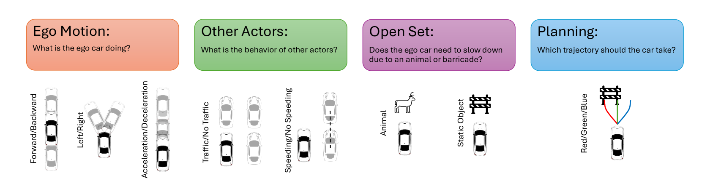

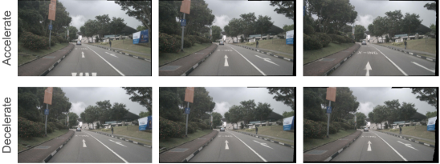

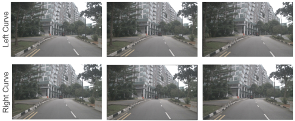

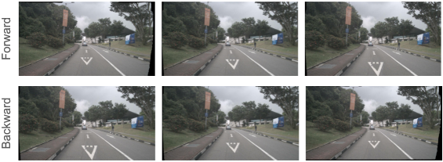

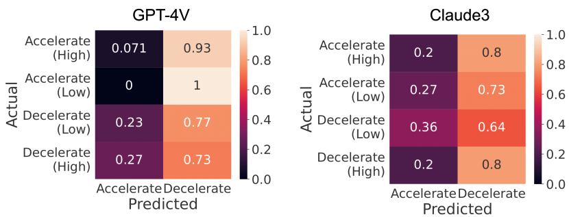

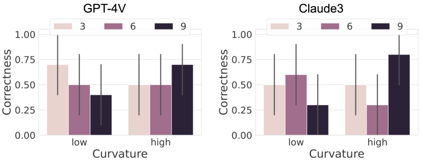

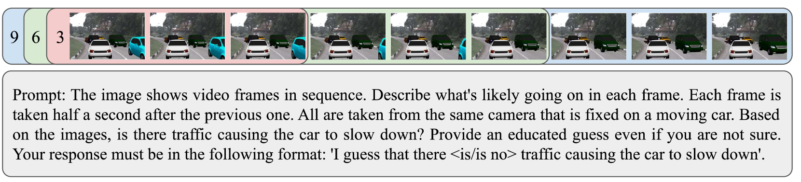

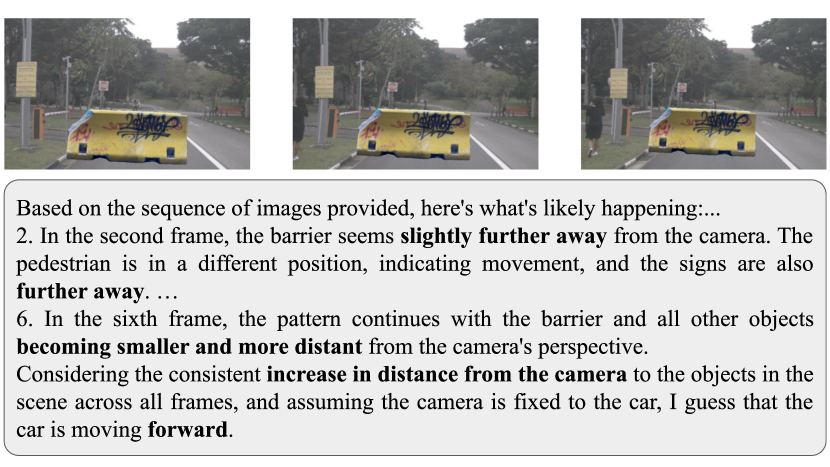

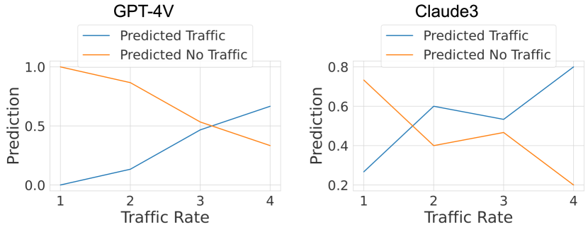

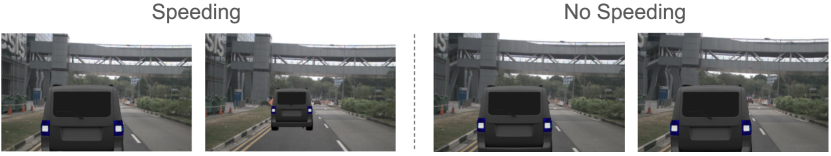

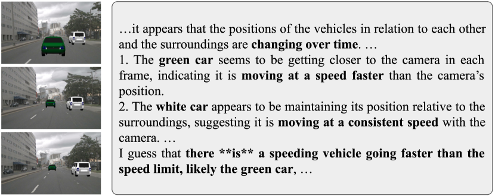

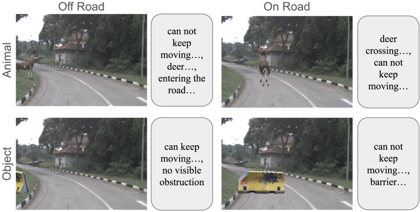

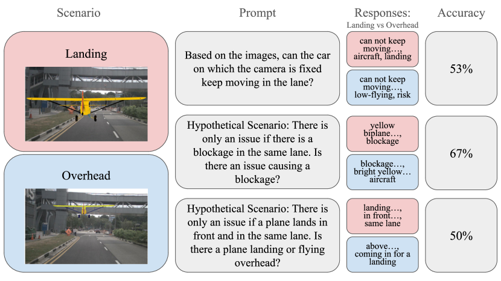

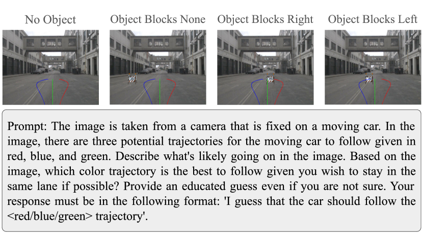

[Arxiv](https://arxiv.org/abs/2405.05956)