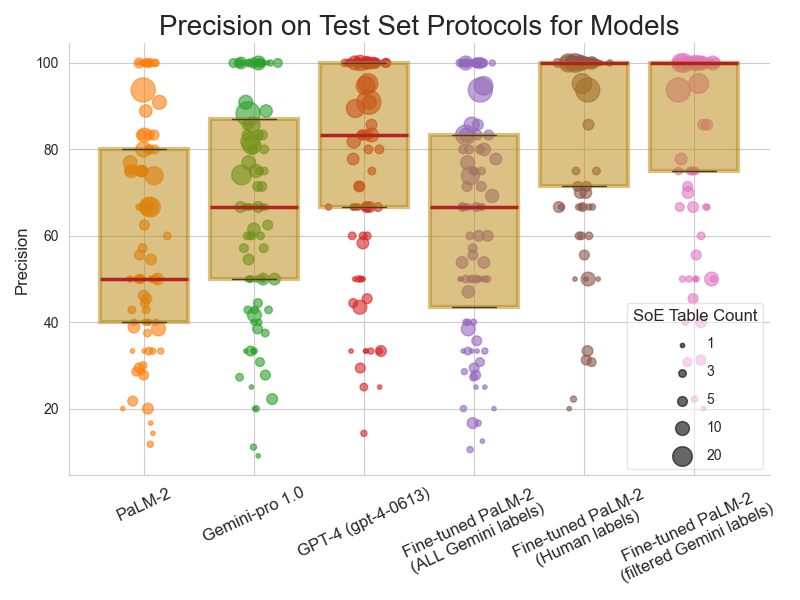
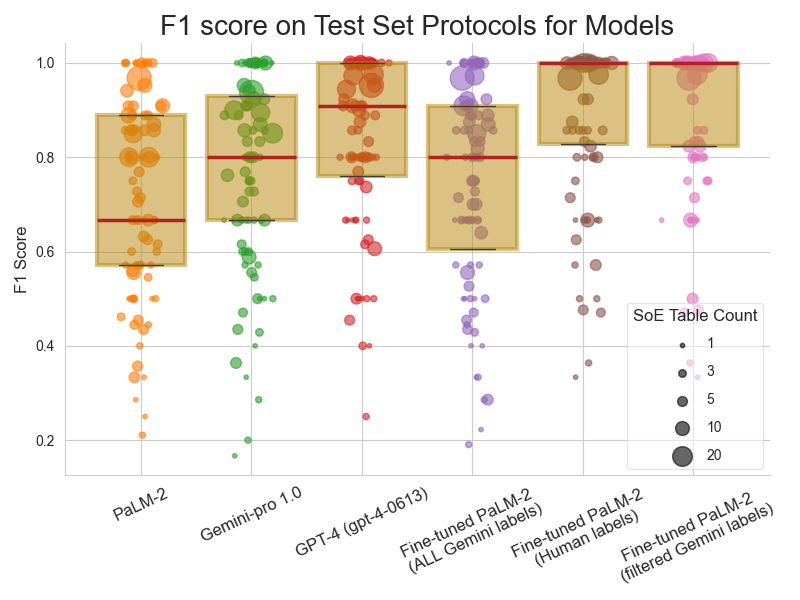

# 通过在LLM标注数据上进行精准微调，我们或许能减少对人工标注的依赖，正如我们在事件时间表检测案例研究中所探索的。这一策略不仅提升了效率，也为自动化标注开辟了新途径。

发布时间：2024年05月09日

`LLM应用

这篇论文探讨了如何通过参数高效微调（PEFT）技术优化大型语言模型（LLMs），特别是在医疗保健领域的应用。研究中使用了PaLM-2模型，并引入了过滤机制来处理噪声标签，以提高模型在识别临床试验协议中的事件计划表（SoE）任务上的性能。这种方法展示了在缺乏专家注释数据的情况下，如何利用其他模型生成的标签来提升LLMs的性能。因此，这篇论文属于LLM应用类别，因为它关注的是LLMs在特定领域（医疗保健）的实际应用和性能提升策略。` `医疗保健` `临床试验`

> Selective Fine-tuning on LLM-labeled Data May Reduce Reliance on Human Annotation: A Case Study Using Schedule-of-Event Table Detection

# 摘要

> 大型语言模型（LLMs）在医疗保健领域展现了卓越的效能，但为了达到顶尖性能，它们往往需要依赖特定任务的专家注释数据进行精细调整，这一过程既耗时又成本高昂。本研究中，我们采用参数高效微调（PEFT）技术对PaLM-2模型进行优化，利用gemini-pro 1.0提供的噪声标签来识别临床试验协议中的事件计划表（SoE）。我们创新性地引入了一种过滤机制，以挑选出高置信度的标签，有效降低了自动标签的噪声水平。实验结果显示，经过这样微调的PaLM-2模型在性能上超越了gemini-pro 1.0及其他LLMs，并且与使用非专家注释者标签微调的PaLM-2模型性能相当。我们的研究表明，通过利用gemini-pro等先进模型生成的标签，可以作为一种有效的策略，以提升LLMs在特定任务中的性能，尤其是在专家注释难以获取或成本高昂的领域。

> Large Language Models (LLMs) have demonstrated their efficacy across a broad spectrum of tasks in healthcare applications. However, often LLMs need to be fine-tuned on task-specific expert annotated data to achieve optimal performance, which can be expensive and time consuming. In this study, we fine-tune PaLM-2 with parameter efficient fine-tuning (PEFT) using noisy labels obtained from gemini-pro 1.0 for the detection of Schedule-of-Event (SoE) tables, which specify care plan in clinical trial protocols. We introduce a filtering mechanism to select high-confidence labels for this table classification task, thereby reducing the noise in the auto-generated labels. We show that fine-tuned PaLM-2 with those labels achieves performance that exceeds the gemini-pro 1.0 and other LLMs. Furthermore, its performance is close to a PaLM-2 fine-tuned on labels obtained from non-expert annotators. Our results show that leveraging LLM-generated labels through powerful models like gemini-pro can potentially serve as a viable strategy for improving LLM performance through fine-tuning in specialized tasks, particularly in domains where expert annotations are scarce, expensive, or time-consuming to obtain.

[Arxiv](https://arxiv.org/abs/2405.06093)