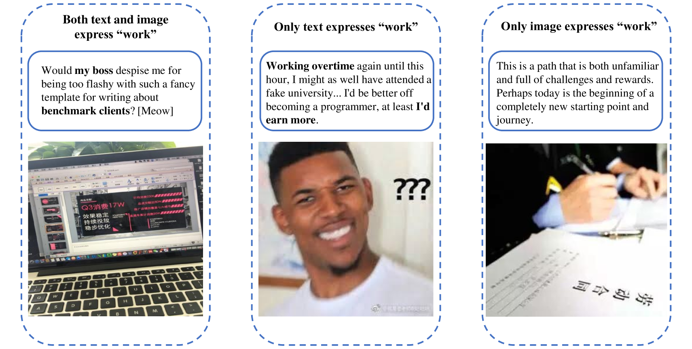
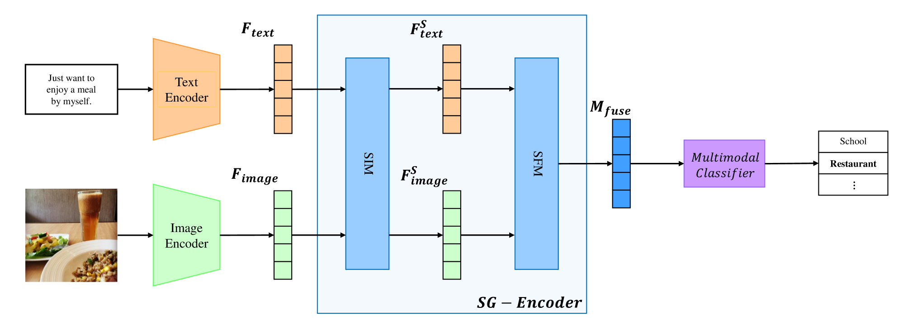
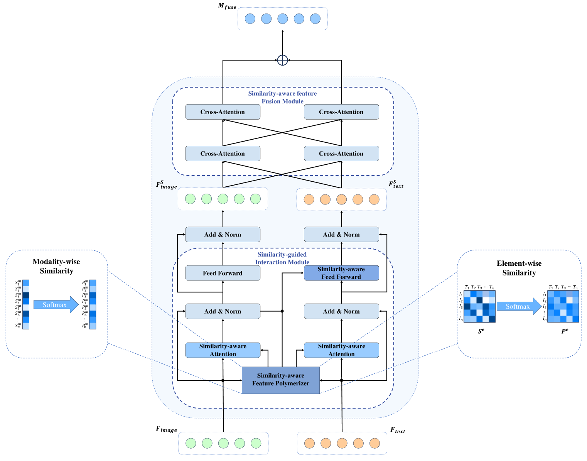
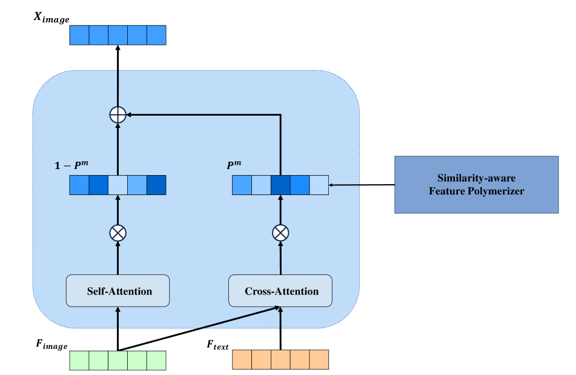
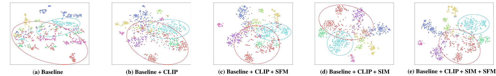
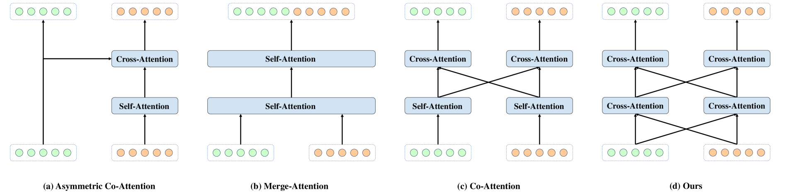
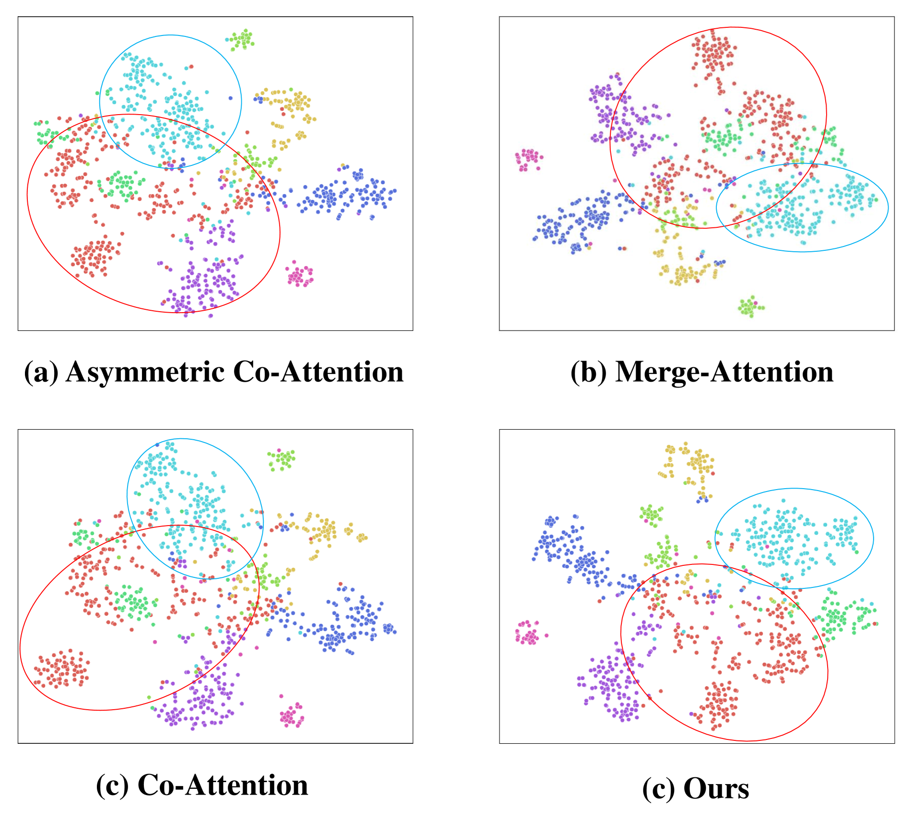
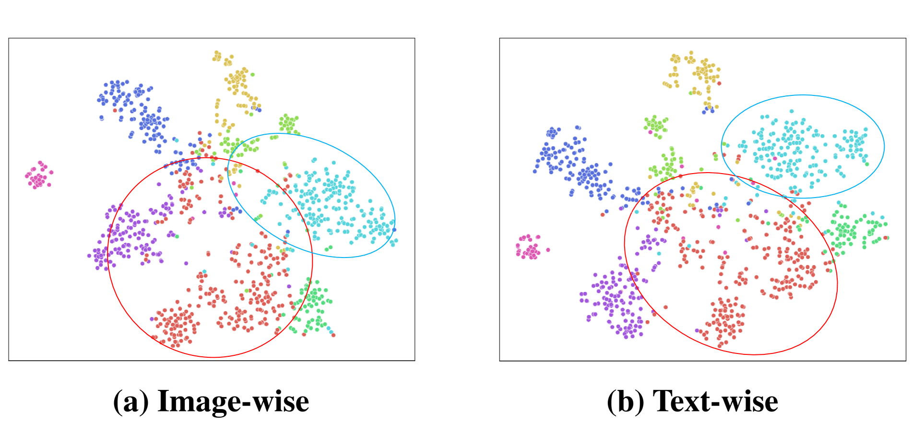

# 基于相似性引导的多模态融合变压器，用于社交媒体中语义位置的精准预测。

发布时间：2024年05月09日

`RAG

这篇论文主要探讨了如何从多模态社交媒体内容中提取语义位置信息，并提出了一个名为相似性引导的多模态融合变压器（SG-MFT）的新方法。该方法通过预训练的视觉-语言模型提取特征，并设计了相似性引导的交互模块（SIM）来处理模态间的异质性和噪声问题。这与RAG（Retrieval-Augmented Generation）的概念相符，因为RAG模型通常用于结合检索（retrieval）和生成（generation）来处理多模态数据，以提高语言模型的性能。因此，这篇论文更适合归类为RAG。` `社交媒体分析` `位置预测`

> Similarity Guided Multimodal Fusion Transformer for Semantic Location Prediction in Social Media

# 摘要

> 语义位置预测旨在从多模态社交媒体内容中提炼出富含上下文的语义位置信息，以超越单纯的GPS坐标，更深刻地理解人们的日常活动。然而，这项任务因“文本-图像”对中的噪声和无关信息而变得复杂。现有方法在特征提取上力不从心，且未能全面整合不同层次的相似性，导致难以剔除干扰信息。为此，我们创新性地提出了相似性引导的多模态融合变压器（SG-MFT），旨在精准预测社交用户的语义位置。我们首先借助预训练的视觉-语言模型，从社交媒体帖子中提炼出高质量的特征。接着，我们设计了一个相似性引导的交互模块（SIM），通过粗细粒度的相似性引导，有效缓解模态间的异质性和噪声问题。在粗粒度层面，我们引入了新颖的相似性感知特征插值注意力机制，以模态间的相似性为锚点，减轻异质性并净化噪声。在细粒度层面，我们运用相似性感知的馈送前向块，通过元素间的相似性进一步调和模态差异。最后，我们构建了相似性感知的特征融合模块（SFM），通过交叉注意力机制巧妙融合两种模态。实验证明，我们的方法在处理模态不平衡的同时，保持了融合的高效性，展现了卓越的性能。

> The purpose of semantic location prediction is to extract relevant semantic location information from multimodal social media posts, offering a more contextual understanding of daily activities compared to GPS coordinates. However, this task becomes challenging due to the presence of noise and irrelevant information in "text-image" pairs. Existing methods suffer from insufficient feature representations and fail to consider the comprehensive integration of similarity at different granularities, making it difficult to filter out noise and irrelevant information. To address these challenges, we propose a Similarity-Guided Multimodal Fusion Transformer (SG-MFT) for predicting social users' semantic locations. First, we utilize a pre-trained large-scale vision-language model to extract high-quality feature representations from social media posts. Then, we introduce a Similarity-Guided Interaction Module (SIM) to alleviate modality heterogeneity and noise interference by incorporating coarse-grained and fine-grained similarity guidance for modality interactions. Specifically, we propose a novel similarity-aware feature interpolation attention mechanism at the coarse level, leveraging modality-wise similarity to mitigate heterogeneity and reduce noise within each modality. Meanwhile, we employ a similarity-aware feed-forward block at the fine level, utilizing element-wise similarity to further mitigate the impact of modality heterogeneity. Building upon pre-processed features with minimal noise and modal interference, we propose a Similarity-aware Feature Fusion Module (SFM) to fuse two modalities with cross-attention mechanism. Comprehensive experimental results demonstrate the superior performance of our proposed method in handling modality imbalance while maintaining efficient fusion effectiveness.

[Arxiv](https://arxiv.org/abs/2405.05760)