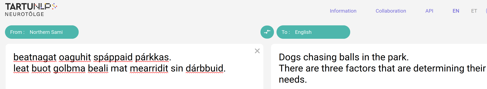

# 迈向包容性AI：大型语言模型训练中萨米语的进展与展望

发布时间：2024年05月09日

`LLM应用

这篇论文关注的是超低资源语言（如萨米语）的语言建模挑战，并探讨了如何利用现代大型语言模型来提升这些语言的技术参与度。它涉及了数据集的构建、模型的训练和多语言训练对超低资源语言的影响，这些都是大型语言模型在实际应用中的具体问题和解决方案。因此，它属于LLM应用类别。` `原住民语言保护`

> Towards a More Inclusive AI: Progress and Perspectives in Large Language Model Training for the Sámi Language

# 摘要

> 萨米语，这一原住民语言群体因缺乏数据和专门针对其语言复杂性的高级语言模型而面临数字边缘化。我们的工作旨在提升萨米语的技术参与度，并呼吁机器学习社区关注超低资源语言的语言建模挑战。这些语言资源稀缺，使用者寥寥无几，且未被主流大型语言模型如ChatGPT所涵盖，使得人工训练数据的收集尤为艰难。主流AI基础模型开发对这类语言的忽视，使得这些语言的使用者难以寻觅。然而，为这些超低资源语言构建基础模型，对于推动包容性和大型语言模型的实际应用至关重要。为此，我们整合了网络上的萨米语资源，打造了一个用于训练语言模型的纯净数据集。我们通过实验不同规模的现代大型语言模型，探究了它们与萨米语的互动，特别是在约七亿参数的模型上。此外，我们还研究了多语言训练对超低资源语言的影响，发现顺序多语言训练下的解码器模型优于联合训练，而高语义重叠的多语言训练通常胜过从零开始的训练。这是首次针对萨米语的研究，旨在利用自然语言处理领域的最新进展，适应非统计语言模型。

> Sámi, an indigenous language group comprising multiple languages, faces digital marginalization due to the limited availability of data and sophisticated language models designed for its linguistic intricacies. This work focuses on increasing technological participation for the Sámi language. We draw the attention of the ML community towards the language modeling problem of Ultra Low Resource (ULR) languages. ULR languages are those for which the amount of available textual resources is very low, and the speaker count for them is also very low. ULRLs are also not supported by mainstream Large Language Models (LLMs) like ChatGPT, due to which gathering artificial training data for them becomes even more challenging. Mainstream AI foundational model development has given less attention to this category of languages. Generally, these languages have very few speakers, making it hard to find them. However, it is important to develop foundational models for these ULR languages to promote inclusion and the tangible abilities and impact of LLMs. To this end, we have compiled the available Sámi language resources from the web to create a clean dataset for training language models. In order to study the behavior of modern LLM models with ULR languages (Sámi), we have experimented with different kinds of LLMs, mainly at the order of $\sim$ seven billion parameters. We have also explored the effect of multilingual LLM training for ULRLs. We found that the decoder-only models under a sequential multilingual training scenario perform better than joint multilingual training, whereas multilingual training with high semantic overlap, in general, performs better than training from scratch.This is the first study on the Sámi language for adapting non-statistical language models that use the latest developments in the field of natural language processing (NLP).

[Arxiv](https://arxiv.org/abs/2405.05777)