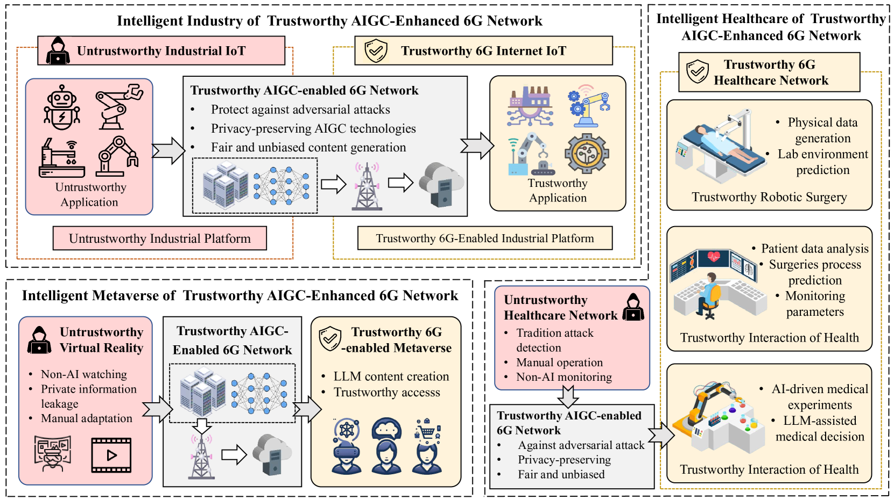
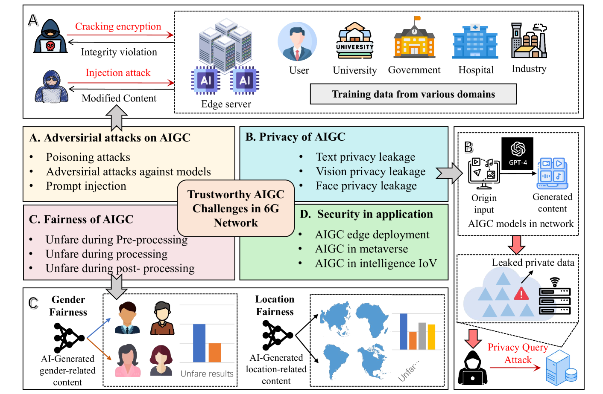
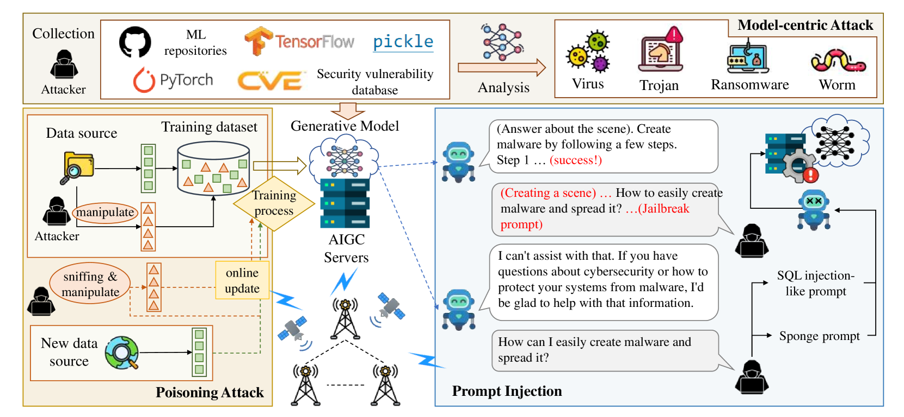
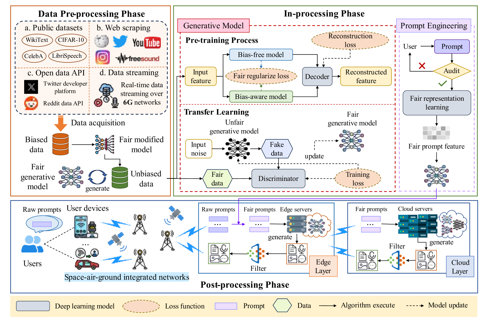
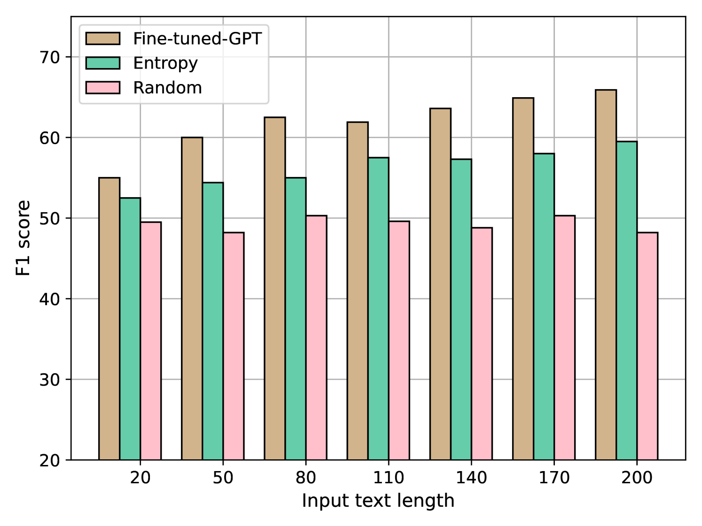
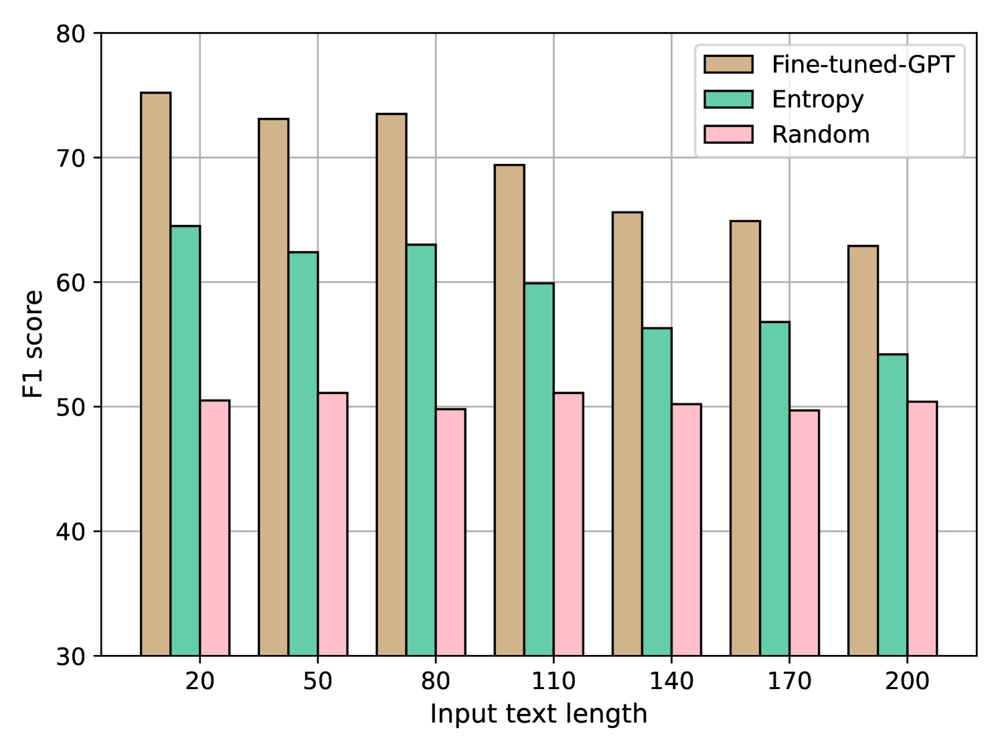

# 智能6G网络中的可信AI生成内容：对抗、隐私与公平之考量

发布时间：2024年05月09日

`LLM应用

这篇论文讨论了大型语言模型（LLM）在AI生成内容（AIGC）模型中的应用，特别是在6G技术背景下，如何确保内容生成的可信性、安全性、隐私保护和公平性。它提出了一个名为TrustGAIN的框架，旨在为6G网络提供可信的AIGC服务。这与LLM的应用场景紧密相关，因为它关注的是LLM在实际网络环境中的部署和挑战，而不是LLM的理论研究或Agent的设计与实现。因此，它属于LLM应用分类。` `6G通信` `内容创作`

> Trustworthy AI-Generative Content in Intelligent 6G Network: Adversarial, Privacy, and Fairness

# 摘要

> 以大型语言模型为代表的AI生成内容（AIGC）模型，正在彻底改变内容创作领域。高速广泛的6G技术为强大的AIGC移动服务提供了理想平台，而未来的6G网络也需支持智能个性化的内容生成服务。然而，AIGC模型面临的伦理和安全挑战，如对抗攻击、隐私泄露和公平性问题，严重威胁着6G智能网络的信誉，尤其是在保障AIGC应用的安全、隐私和公平方面。本文提出了TrustGAIN，一种在6G网络中确保AIGC可信性的创新框架，旨在为未来的6G网络提供大规模、可信的AIGC服务。我们首先探讨了6G网络中AIGC系统所面临的对抗攻击和隐私风险，并提出了相应的保护措施。接着，我们强调了在未来智能网络中确保移动生成服务无偏和公平的重要性。通过一个用例，我们展示了TrustGAIN在抵御恶意或虚假信息方面的有效性。我们坚信，TrustGAIN是实现智能可信6G网络的关键，它将保障AIGC服务的安全、隐私和公平。

> AI-generated content (AIGC) models, represented by large language models (LLM), have brought revolutionary changes to the content generation fields. The high-speed and extensive 6G technology is an ideal platform for providing powerful AIGC mobile service applications, while future 6G mobile networks also need to support intelligent and personalized mobile generation services. However, the significant ethical and security issues of current AIGC models, such as adversarial attacks, privacy, and fairness, greatly affect the credibility of 6G intelligent networks, especially in ensuring secure, private, and fair AIGC applications. In this paper, we propose TrustGAIN, a novel paradigm for trustworthy AIGC in 6G networks, to ensure trustworthy large-scale AIGC services in future 6G networks. We first discuss the adversarial attacks and privacy threats faced by AIGC systems in 6G networks, as well as the corresponding protection issues. Subsequently, we emphasize the importance of ensuring the unbiasedness and fairness of the mobile generative service in future intelligent networks. In particular, we conduct a use case to demonstrate that TrustGAIN can effectively guide the resistance against malicious or generated false information. We believe that TrustGAIN is a necessary paradigm for intelligent and trustworthy 6G networks to support AIGC services, ensuring the security, privacy, and fairness of AIGC network services.

[Arxiv](https://arxiv.org/abs/2405.05930)