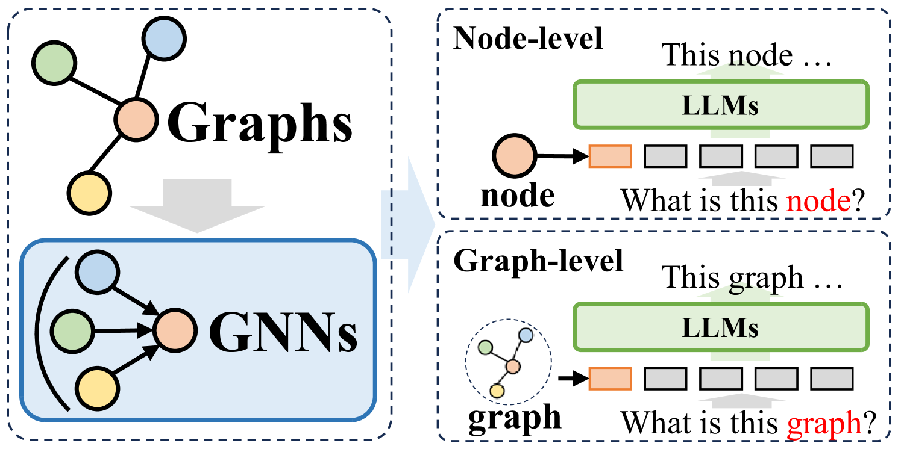
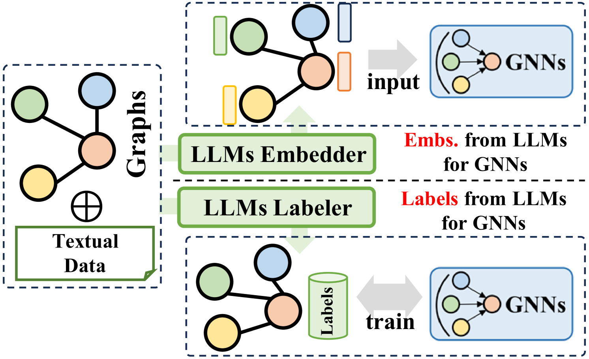
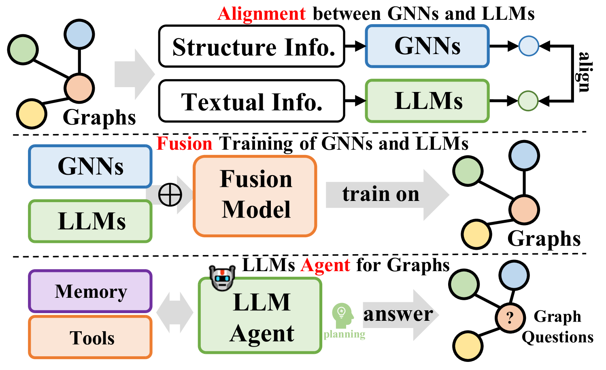
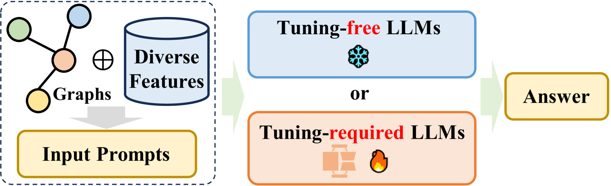

# 大型语言模型在图领域的综述

发布时间：2024年05月10日

`LLM应用

这篇论文摘要讨论了将大型语言模型（LLMs）与图神经网络（GNNs）结合以提升图学习任务性能的潜力。它深入探讨了应用于图学习的最新LLMs，并提出了一种新颖的分类法，根据框架设计对现有方法进行分类。这表明论文关注的是LLMs在实际应用中的使用，特别是在图学习领域的应用，因此属于LLM应用分类。` `图学习`

> A Survey of Large Language Models for Graphs

# 摘要

> 图作为一种基本数据结构，用于描绘现实世界中的关系网络。图神经网络（GNNs）在链接预测和节点分类等任务中取得了显著成就，但数据稀疏性和泛化能力有限等问题依旧存在。大型语言模型（LLMs）在自然语言处理领域崭露头角，尤其在语言理解和摘要方面表现卓越。将LLMs与图学习技术结合，为提升图学习任务性能开辟了新途径。本综述深入探讨了应用于图学习的最新LLMs，并提出了一种新颖的分类法，根据框架设计对现有方法进行分类。我们详细分析了四种独特的设计：GNNs与LLMs的前缀结合、LLMs与图的集成、以及仅使用LLMs的方法，并探讨了各自的优劣。我们强调了未来研究的方向，包括解决LLMs与图学习技术集成的现有挑战，以及探索新的应用领域。本综述旨在为图学习领域的研究者和实践者提供指导，并推动这一领域的持续创新。我们维护的相关开源资源可在\url{https://github.com/HKUDS/Awesome-LLM4Graph-Papers}获取。

> Graphs are an essential data structure utilized to represent relationships in real-world scenarios. Prior research has established that Graph Neural Networks (GNNs) deliver impressive outcomes in graph-centric tasks, such as link prediction and node classification. Despite these advancements, challenges like data sparsity and limited generalization capabilities continue to persist. Recently, Large Language Models (LLMs) have gained attention in natural language processing. They excel in language comprehension and summarization. Integrating LLMs with graph learning techniques has attracted interest as a way to enhance performance in graph learning tasks. In this survey, we conduct an in-depth review of the latest state-of-the-art LLMs applied in graph learning and introduce a novel taxonomy to categorize existing methods based on their framework design. We detail four unique designs: i) GNNs as Prefix, ii) LLMs as Prefix, iii) LLMs-Graphs Integration, and iv) LLMs-Only, highlighting key methodologies within each category. We explore the strengths and limitations of each framework, and emphasize potential avenues for future research, including overcoming current integration challenges between LLMs and graph learning techniques, and venturing into new application areas. This survey aims to serve as a valuable resource for researchers and practitioners eager to leverage large language models in graph learning, and to inspire continued progress in this dynamic field. We consistently maintain the related open-source materials at \url{https://github.com/HKUDS/Awesome-LLM4Graph-Papers}.

[Arxiv](https://arxiv.org/abs/2405.08011)