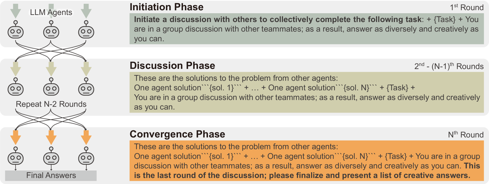

# 大型语言模型创造力提升：探讨框架与角色扮演的融合之道

发布时间：2024年05月10日

`Agent

这篇论文探讨了如何通过设计一个讨论框架和引入角色扮演策略来激发大型语言模型（LLMs）的创造潜能。这种方法涉及创建多个代理（Agent），每个代理扮演不同的角色，并通过讨论来产生创造性的答案。这与Agent的分类相符，因为Agent在这里指的是能够执行特定任务或模拟特定角色的智能实体，特别是在这个案例中，Agent被用来增强LLM的创造性表现。` `人工智能`

> LLM Discussion: Enhancing the Creativity of Large Language Models via Discussion Framework and Role-Play

# 摘要

> 大型语言模型（LLMs）在自然语言处理领域表现卓越，但在应对开放式问题时，其创造性和原创性回答往往不尽人意。为了激发LLM的创造潜能，我们借鉴人类集体创造力的激发方式，即通过多元背景和视角的参与者之间的深入讨论。为此，我们设计了LLM讨论框架，该框架分为三个阶段，旨在促进思想碰撞，最终汇聚成富有创意的答案。我们还引入了角色扮演策略，赋予LLMs不同角色，以打破其同质性。通过替代用途测试、相似性测试、实例测试和科学创造力测试，我们不仅在LLM层面，也在人类研究中验证了该框架的有效性。结果显示，我们的框架在多个创造力评估维度上超越了单一LLM方法和现有多LLM框架。

> Large language models (LLMs) have shown exceptional proficiency in natural language processing but often fall short of generating creative and original responses to open-ended questions. To enhance LLM creativity, our key insight is to emulate the human process of inducing collective creativity through engaging discussions with participants from diverse backgrounds and perspectives. To this end, we propose LLM Discussion, a three-phase discussion framework that facilitates vigorous and diverging idea exchanges and ensures convergence to creative answers. Moreover, we adopt a role-playing technique by assigning distinct roles to LLMs to combat the homogeneity of LLMs. We evaluate the efficacy of the proposed framework with the Alternative Uses Test, Similarities Test, Instances Test, and Scientific Creativity Test through both LLM evaluation and human study. Our proposed framework outperforms single-LLM approaches and existing multi-LLM frameworks across various creativity metrics.

[Arxiv](https://arxiv.org/abs/2405.06373)