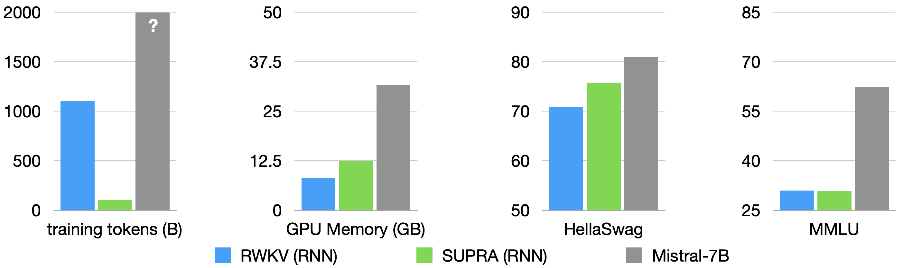
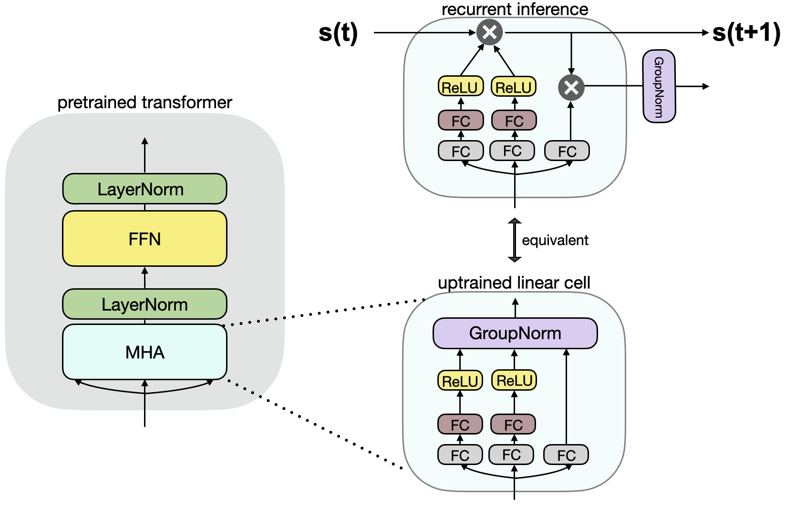
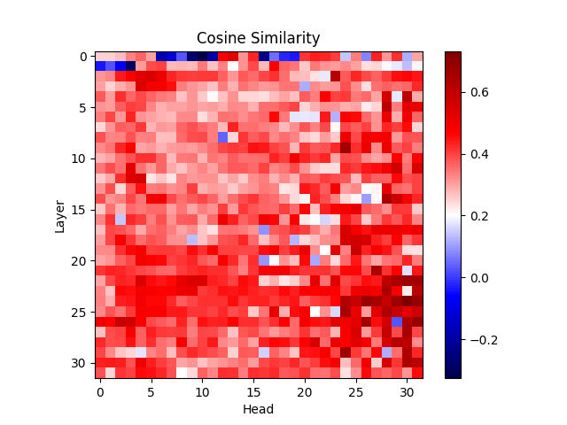
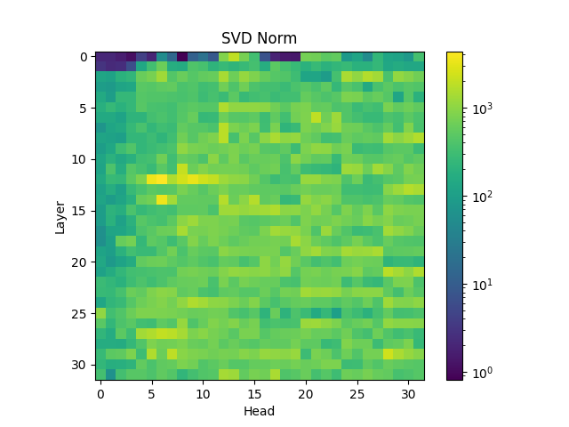
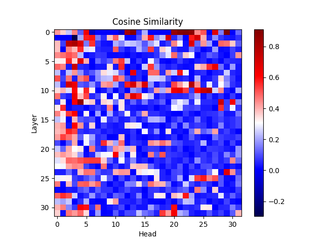
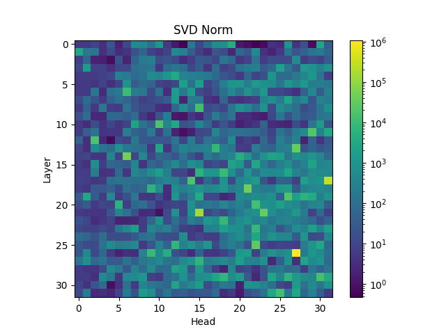

# 大型语言模型的线性化

发布时间：2024年05月10日

`LLM理论

这篇论文探讨了大型语言模型（LLM）的理论方面，特别是关于线性变换器的改进和训练方法。SUPRA方法旨在提高现有大型预训练变换器的效率，同时保持其性能，这属于对LLM架构和训练技术的理论研究。因此，它被归类为LLM理论。` `机器学习`

> Linearizing Large Language Models

# 摘要

> 线性变换器因其固定大小的循环状态降低了推理成本，成为亚二次时间复杂度的softmax注意力替代方案，备受瞩目。然而，其原始设计在扩展性和性能上存在缺陷。RWKV和Mamba等模型试图通过创新的时间混合和门控机制来弥补这些不足，但预训练大型语言模型仍需巨额数据和计算资源。因此，探索亚二次架构受限于计算资源和高质量数据集的可用性。我们提出SUPRA，一种经济高效的循环注意力升级训练方法，将现有大型预训练变换器转化为RNN，仅需5%的训练成本，同时保留了变换器LLMs的强大预训练优势。我们的线性化技术在标准测试中表现出色，但我们也注意到，即使在最大的线性模型中，上下文学习和长上下文建模仍存在挑战。我们的代码和模型可在https://github.com/TRI-ML/linear_open_lm获取。

> Linear transformers have emerged as a subquadratic-time alternative to softmax attention and have garnered significant interest due to their fixed-size recurrent state that lowers inference cost. However, their original formulation suffers from poor scaling and underperforms compute-matched transformers. Recent linear models such as RWKV and Mamba have attempted to address these shortcomings by proposing novel time-mixing and gating architectures, but pre-training large language models requires significant data and compute investments. Thus, the search for subquadratic architectures is limited by the availability of compute and quality pre-training datasets. As a cost-effective alternative to pre-training linear transformers, we propose Scalable UPtraining for Recurrent Attention (SUPRA). We present a method to uptrain existing large pre-trained transformers into Recurrent Neural Networks (RNNs) with a modest compute budget. This allows us to leverage the strong pre-training data and performance of existing transformer LLMs, while requiring 5% of the training cost. We find that our linearization technique leads to competitive performance on standard benchmarks, but we identify persistent in-context learning and long-context modeling shortfalls for even the largest linear models. Our code and models can be found at https://github.com/TRI-ML/linear_open_lm.

[Arxiv](https://arxiv.org/abs/2405.06640)