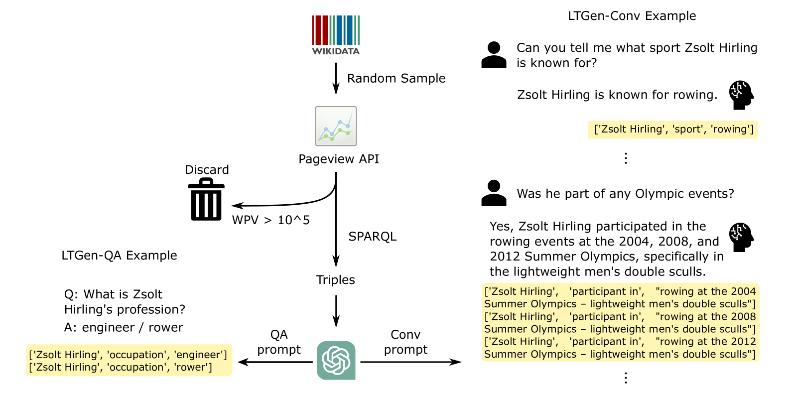
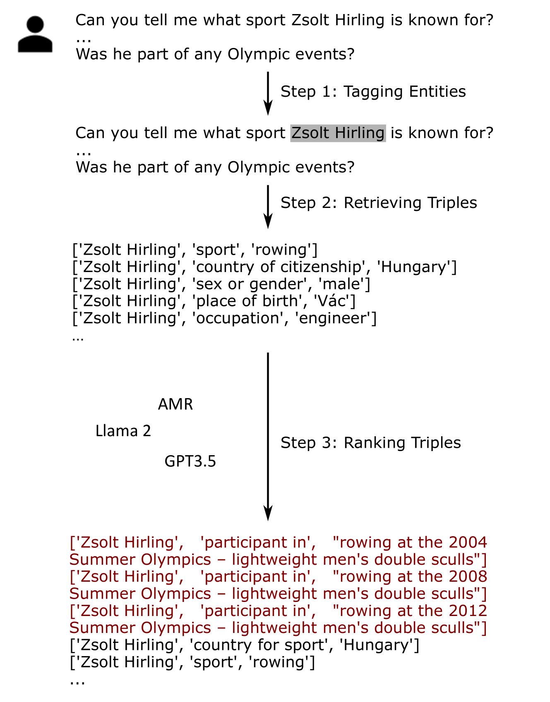
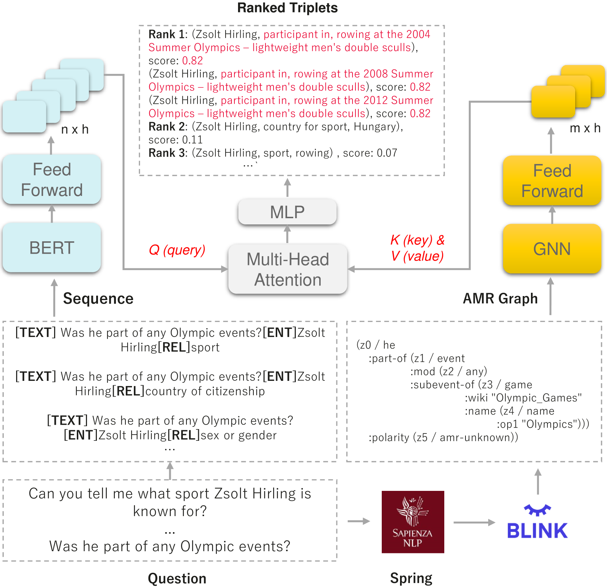
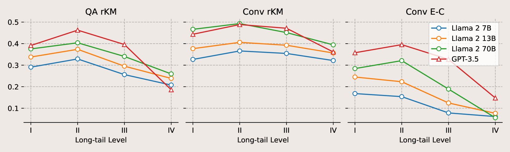
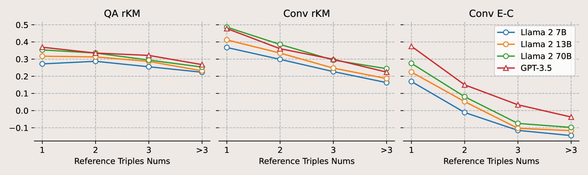
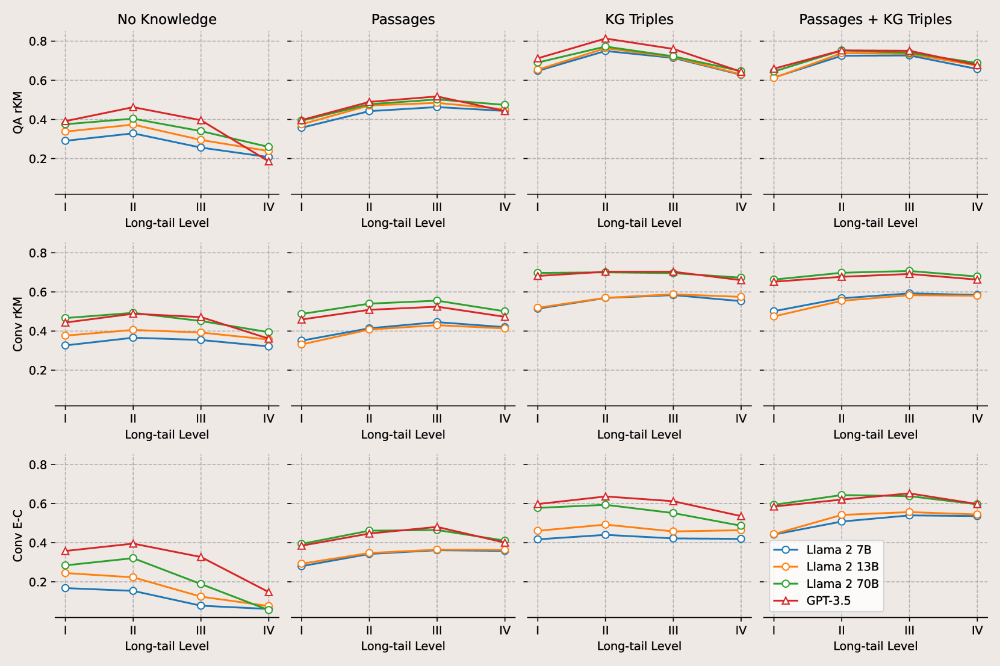

# 借助知识图谱，激发大型语言模型解答长尾事实相关问题

发布时间：2024年05月10日

`LLM理论

这篇论文探讨了大型语言模型（LLMs）在处理需要深厚现实世界知识的长尾事实任务时的局限性，并研究了非参数知识（如文本段落和知识图谱）对LLMs性能的影响。它提出了一种构建基准的方法，并通过实验评估了不同知识配置下的LLMs性能。这属于对LLMs理论层面的研究，因为它关注的是模型如何利用外部知识来提高性能，而不是特定的应用场景或代理（Agent）的设计。因此，它更符合LLM理论分类。` `知识增强`

> Prompting Large Language Models with Knowledge Graphs for Question Answering Involving Long-tail Facts

# 摘要

> 大型语言模型（LLMs）虽在多种自然语言处理任务中表现卓越，但在处理需要深厚现实世界知识的长尾事实任务时仍显力不从心。这表明，LLMs需要非参数知识的加持。为此，我们探讨了文本段落和知识图谱（KGs）等非参数知识对LLMs的影响。鉴于LLMs可能已接触过众多事实问答数据集，我们设计了一套全自动流程，用以构建一个依赖长尾事实知识的基准——LTGen。通过此基准，我们评估了在不同知识配置下的顶尖LLMs。实验结果显示，LLMs在面对高长尾级别或知识密集型问题时，表现不佳。然而，一旦引入非参数知识，模型的性能便大幅提升。我们发现，在多数情况下，使用KG三元组提示LLMs的效果优于基于段落的提示。同时，尽管结合KG三元组和文档的提示方式未能持续扩大知识覆盖面，但它显著减少了生成内容中的错误信息。

> Although Large Language Models (LLMs) are effective in performing various NLP tasks, they still struggle to handle tasks that require extensive, real-world knowledge, especially when dealing with long-tail facts (facts related to long-tail entities). This limitation highlights the need to supplement LLMs with non-parametric knowledge. To address this issue, we analysed the effects of different types of non-parametric knowledge, including textual passage and knowledge graphs (KGs). Since LLMs have probably seen the majority of factual question-answering datasets already, to facilitate our analysis, we proposed a fully automatic pipeline for creating a benchmark that requires knowledge of long-tail facts for answering the involved questions. Using this pipeline, we introduce the LTGen benchmark. We evaluate state-of-the-art LLMs in different knowledge settings using the proposed benchmark. Our experiments show that LLMs alone struggle with answering these questions, especially when the long-tail level is high or rich knowledge is required. Nonetheless, the performance of the same models improved significantly when they were prompted with non-parametric knowledge. We observed that, in most cases, prompting LLMs with KG triples surpasses passage-based prompting using a state-of-the-art retriever. In addition, while prompting LLMs with both KG triples and documents does not consistently improve knowledge coverage, it can dramatically reduce hallucinations in the generated content.

[Arxiv](https://arxiv.org/abs/2405.06524)