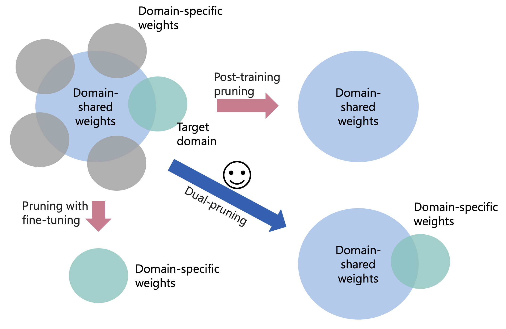
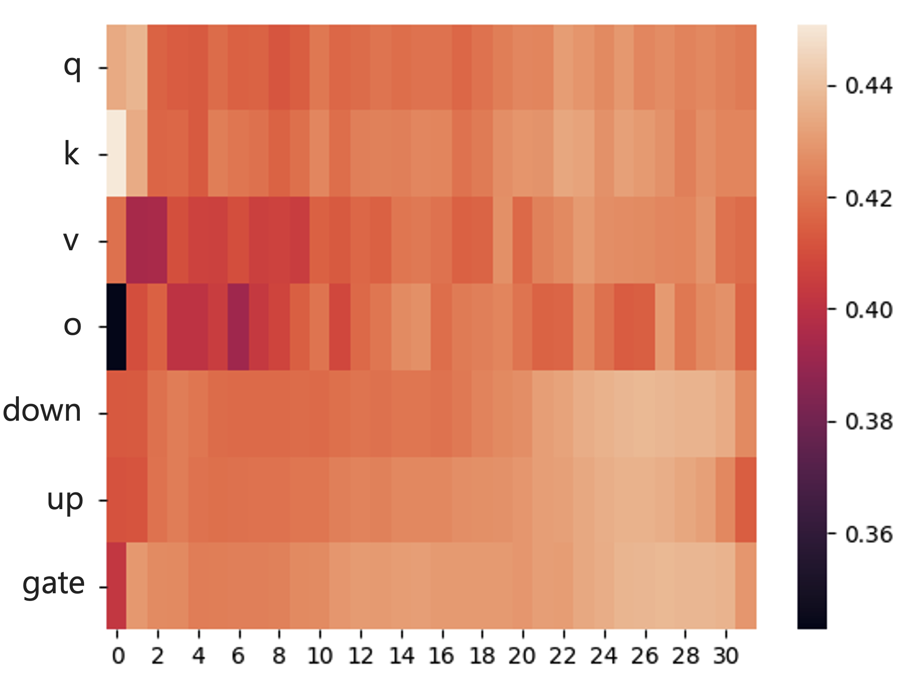
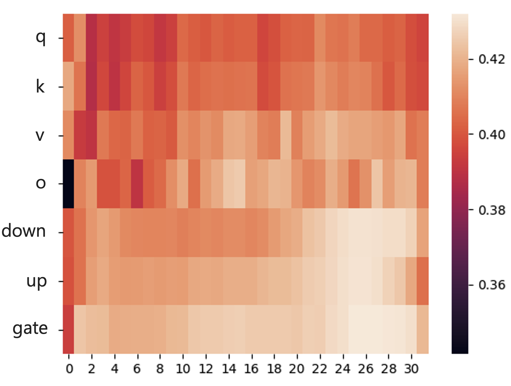

# 修剪技术：特定领域的大型语言模型精炼者

发布时间：2024年05月10日

`LLM应用

这篇论文探讨了大型语言模型（LLMs）在特定领域应用时的模型压缩问题，提出了一种名为D-Pruner的新颖无结构双剪枝方法。这种方法旨在通过识别对语言能力、多任务解决以及特定领域知识至关重要的权重，来生成一个既紧凑又专注于特定领域的LLM。研究结果表明，D-Pruner在医疗和法律领域的多项任务中展现了其在特定领域压缩方面的有效性。因此，这篇论文属于LLM应用类别，因为它专注于LLMs在特定领域的实际应用和优化。`

> Pruning as a Domain-specific LLM Extractor

# 摘要

> 大型语言模型（LLMs）在众多NLP任务中表现出色，但模型规模的扩大也带来了高昂的部署成本。尽管有研究尝试通过模型剪枝技术来缩小LLMs的规模，但这些方法多聚焦于通用或特定任务的权重，导致在特定领域应用时性能不尽人意。本研究提出了一种新颖的无结构双剪枝方法——D-Pruner，专为LLM的特定领域压缩设计。D-Pruner通过识别对语言能力、多任务解决以及特定领域知识至关重要的权重，生成一个既紧凑又专注于特定领域的LLM。具体而言，我们首先利用开放领域数据集评估通用权重的重要性，然后调整训练损失以在特定领域适应时保持通用性。通过在特定领域数据集上高效估算权重重要性，我们得到了一个既通用又特异的剪枝模型。在医疗和法律领域的多项任务中，D-Pruner展现了其在特定领域压缩方面的有效性。相关代码已公开于https://github.com/psunlpgroup/D-Pruner。

> Large Language Models (LLMs) have exhibited remarkable proficiency across a wide array of NLP tasks. However, the escalation in model size also engenders substantial deployment costs. While few efforts have explored model pruning techniques to reduce the size of LLMs, they mainly center on general or task-specific weights. This leads to suboptimal performance due to lacking specificity on the target domain or generality on different tasks when applied to domain-specific challenges. This work introduces an innovative unstructured dual-pruning methodology, D-Pruner, for domain-specific compression on LLM. It extracts a compressed, domain-specific, and task-agnostic LLM by identifying LLM weights that are pivotal for general capabilities, like linguistic capability and multi-task solving, and domain-specific knowledge. More specifically, we first assess general weight importance by quantifying the error incurred upon their removal with the help of an open-domain calibration dataset. Then, we utilize this general weight importance to refine the training loss, so that it preserves generality when fitting into a specific domain. Moreover, by efficiently approximating weight importance with the refined training loss on a domain-specific calibration dataset, we obtain a pruned model emphasizing generality and specificity. Our comprehensive experiments across various tasks in healthcare and legal domains show the effectiveness of D-Pruner in domain-specific compression. Our code is available at https://github.com/psunlpgroup/D-Pruner.

[Arxiv](https://arxiv.org/abs/2405.06275)