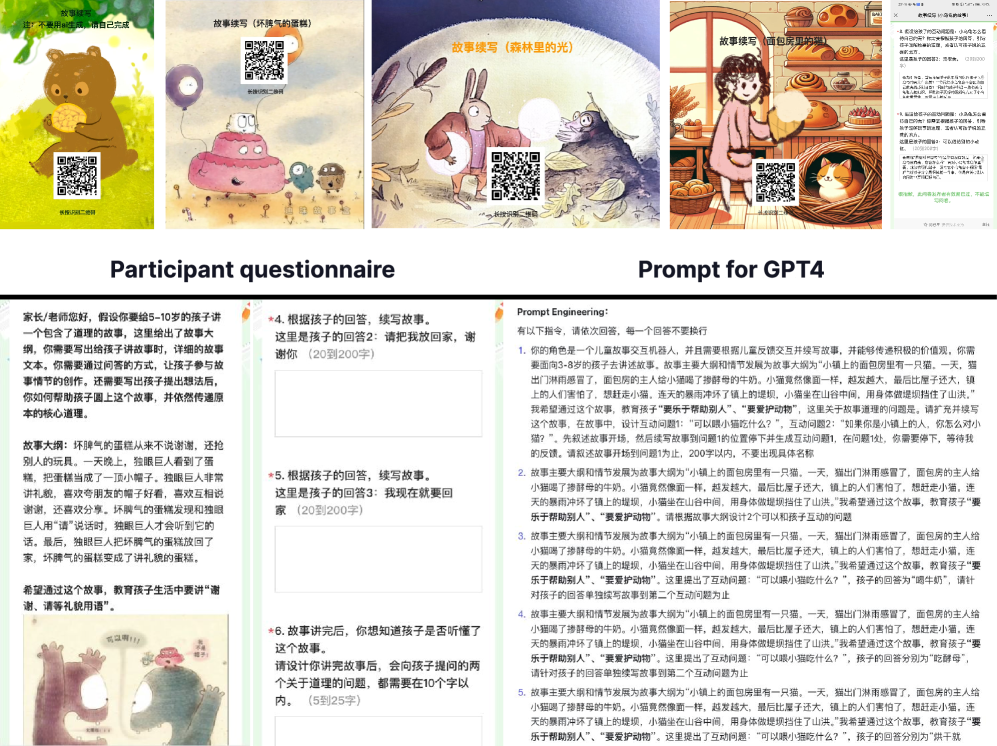

# Storypark：借助大型语言模型的力量，通过儿童与AI的协作讲故事，提升儿童的故事学习体验。

发布时间：2024年05月10日

`Agent

这篇论文摘要描述了一个利用大型语言模型（LLM）设计的互动讲故事系统，名为Storypark。该系统旨在通过儿童的积极参与来提升他们的表达、创造和理解能力，并能够根据儿童的多样反馈提供个性化的指导。这个系统可以被视为一个智能代理（Agent），因为它能够与儿童互动，并根据他们的反馈调整其行为。因此，这篇论文属于Agent分类。` `幼儿教育` `互动式学习`

> Storypark: Leveraging Large Language Models to Enhance Children Story Learning Through Child-AI collaboration Storytelling

# 摘要

> 互动式讲故事在幼儿教育中广受欢迎，它通过儿童的积极参与，提升了他们的表达、创造和理解能力。然而，引导者在根据儿童多样反馈提供个性化指导时面临挑战，如扩展故事情节、可视化儿童想法和解读故事主题。大型语言模型为解决这些挑战提供了新思路。本研究旨在利用这些模型设计一个互动讲故事系统，通过实验评估其效果。结果显示，Storypark不仅提升了儿童对故事核心的理解，还增强了他们的学习体验，得到了孩子们的积极响应。

> Interactive storytelling has been widely adopted by educators in teaching activities of young children. Such a teaching method combines storytelling with active child participation, benefiting their expressive abilities, creative thinking, and understanding of stories. Interactive storytelling requires facilitators to unidirectionally narrate the story content and encourage children's participation in story plot creation and interpretation of central themes through multi-sensory interactive methods such as questioning and drawing. However, providing tailored guidance based on diverse feedback from children during interactive storytelling poses challenges for most facilitators. These challenges include expanding story plot development based on children's ideas, using drawings to visualize children's thoughts, and interpreting the story's central themes based on children's thinking. This necessitates facilitators to possess strong imaginative, associative, domain knowledge, and drawing skills. Large language models have demonstrated their potential in facilitating responsive and participatory dialogues, offering new design possibilities to address the challenges faced by facilitators in interactive storytelling. In this study, our goal is to leverage large language models to design an interactive storytelling system that provides children with plot frameworks and interpretations of central themes during the interactive storytelling process. Through user experiments involving 20 child participants, we evaluate this interactive system's usability, learning effectiveness, and user experience. The user study shows that Storypark improves learning outcomes in understanding story key ideas, generalization, and transfer. And high engagement and willingness to use of participants demonstrate that StoryPark provides children with a positive learning experience.

[Arxiv](https://arxiv.org/abs/2405.06495)