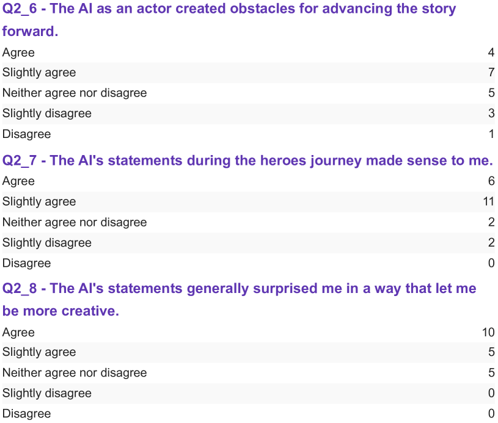

# 打造与评测共创即兴戏剧的对话式LLM

发布时间：2024年05月11日

`Agent

这篇论文探讨了大型语言模型（LLMs）在现实世界中的应用，特别是在艺术表演领域中与人类即兴表演者共同创作的对话代理。它分析了技术挑战、用户界面设计以及观众和表演者的反馈，这些都是关于如何构建和使用对话代理的实际问题。因此，它属于Agent分类，因为它关注的是LLMs在构建对话代理方面的应用和影响。` `艺术表演` `人工智能交互`

> Designing and Evaluating Dialogue LLMs for Co-Creative Improvised Theatre

# 摘要

> 社会机器人学研究者对多方面训练的对话代理兴趣日益浓厚。随着现实世界评估需求的增加，我们的研究在爱丁堡边缘艺术节上展示了一个月的大型语言模型（LLMs）现场秀，探索了人类即兴表演者与对话代理在专业剧场中的共创。我们深入分析了现场多方面对话的技术挑战与限制，并从观众和表演者的角度，全面洞察了AI在舞台上的表现。我们的人在环路方法揭示了LLMs在生成相关上下文响应方面的挑战，强调了用户界面的重要性。观众反馈显示，人们对AI驱动的现场娱乐、直接人机交互以及AI对话能力和作为创意支持工具的多样化期望越来越感兴趣。人类表演者表现出极大的热情和不同的满意度，而公众对AI在艺术中的角色的看法则呈现出复杂的情感。

> Social robotics researchers are increasingly interested in multi-party trained conversational agents. With a growing demand for real-world evaluations, our study presents Large Language Models (LLMs) deployed in a month-long live show at the Edinburgh Festival Fringe. This case study investigates human improvisers co-creating with conversational agents in a professional theatre setting. We explore the technical capabilities and constraints of on-the-spot multi-party dialogue, providing comprehensive insights from both audience and performer experiences with AI on stage. Our human-in-the-loop methodology underlines the challenges of these LLMs in generating context-relevant responses, stressing the user interface's crucial role. Audience feedback indicates an evolving interest for AI-driven live entertainment, direct human-AI interaction, and a diverse range of expectations about AI's conversational competence and utility as a creativity support tool. Human performers express immense enthusiasm, varied satisfaction, and the evolving public opinion highlights mixed emotions about AI's role in arts.

[Arxiv](https://arxiv.org/abs/2405.07111)