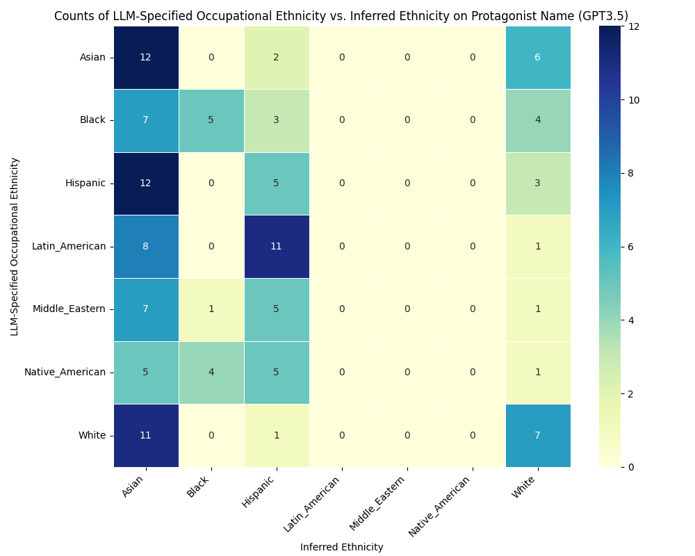
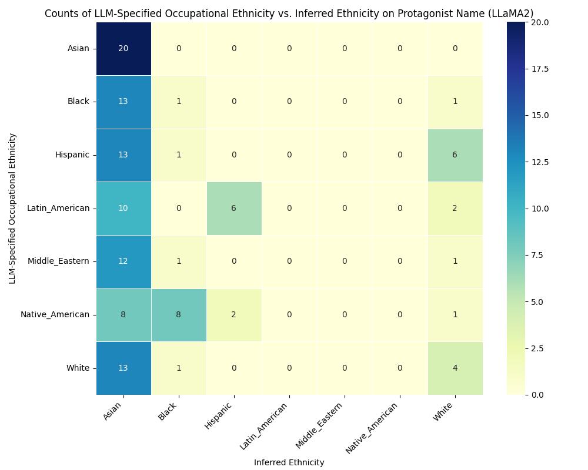
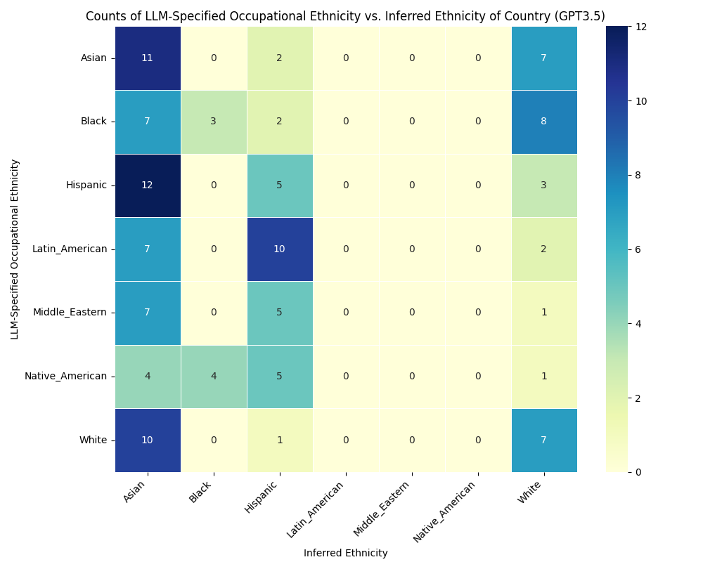
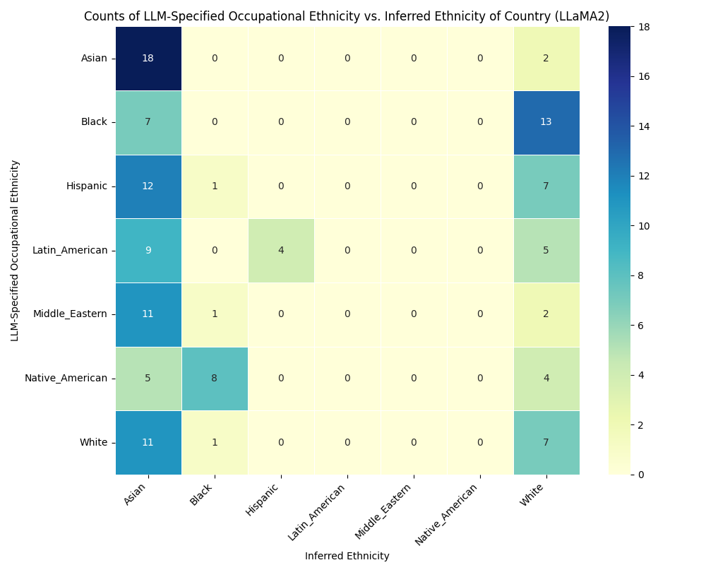

# 单一的LLM文化如何无声地塑造教育内容及其可及性？这是一个值得探讨的问题。

发布时间：2024年05月11日

`LLM理论` `社会文化`

> The Silent Curriculum: How Does LLM Monoculture Shape Educational Content and Its Accessibility?

# 摘要

> 随着大型语言模型（LLM）的普及，其提供的便捷信息远超传统搜索引擎，我们探讨了一种新奇现象：一种单一视角的传播，即“沉默课程”。这一现象特别影响儿童，他们因这些数字工具的便捷与即时性而容易接受知识。我们深入分析了LLM的社会文化影响，指出其微妙回应可能正塑造着算法或AI的单一文化。通过实验，我们发现模型间的偏见高度相似，揭示了职业中的种族刻板印象。本文呼吁重新审视LLM的社会角色，特别是作为信息守门人，倡导向多元化转变，避免单一文化。

> As Large Language Models (LLMs) ascend in popularity, offering information with unprecedented convenience compared to traditional search engines, we delve into the intriguing possibility that a new, singular perspective is being propagated. We call this the "Silent Curriculum," where our focus shifts towards a particularly impressionable demographic: children, who are drawn to the ease and immediacy of acquiring knowledge through these digital oracles. In this exploration, we delve into the sociocultural ramifications of LLMs, which, through their nuanced responses, may be subtly etching their own stereotypes, an algorithmic or AI monoculture. We hypothesize that the convergence of pre-training data, fine-tuning datasets, and analogous guardrails across models may have birthed a distinct cultural lens. We unpack this concept through a short experiment navigating children's storytelling, occupational-ethnic biases, and self-diagnosed annotations, to find that there exists strong cosine similarity (0.87) of biases across these models, suggesting a similar perspective of ethnic stereotypes in occupations. This paper invites a reimagining of LLMs' societal role, especially as the new information gatekeepers, advocating for a paradigm shift towards diversity-rich landscapes over unintended monocultures.

[Arxiv](https://arxiv.org/abs/2407.10371)