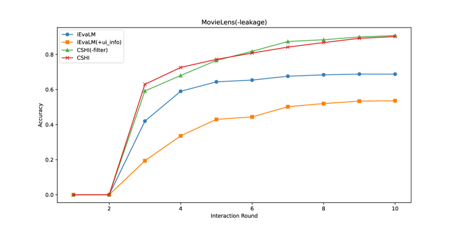
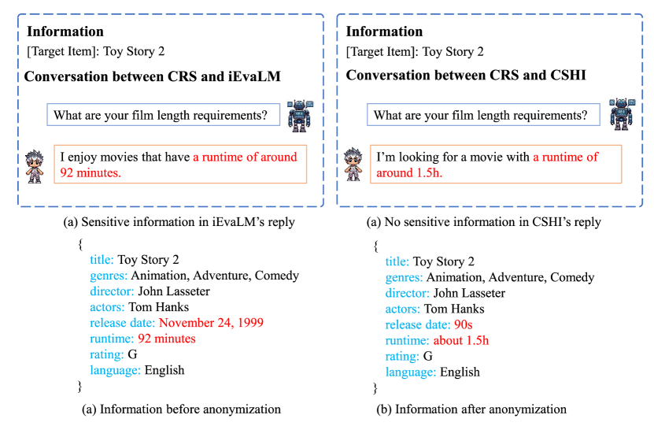

# 大型语言模型驱动的对话推荐系统用户模拟器框架：可控、可扩展且融入人类智慧在

发布时间：2024年05月12日

`Agent

这篇论文主要讨论了对话推荐系统（CRS）中用户模拟器的构建，特别是提出了一个可控、可扩展、人机交互（CSHI）模拟器框架。这个框架旨在通过模拟用户行为来提升对话推荐系统的性能，并且能够适应多种对话推荐场景。虽然它涉及到了大型语言模型（LLMs）的应用，但重点在于创建一个能够模拟用户行为的Agent，用于研究和评估对话推荐系统，而不是专注于LLM的理论研究或应用开发。因此，这篇论文更适合归类到Agent分类中。` `对话推荐系统` `用户模拟器`

> A LLM-based Controllable, Scalable, Human-Involved User Simulator Framework for Conversational Recommender Systems

# 摘要

> 对话推荐系统（CRS）通过实时反馈动态捕捉用户偏好，提供个性化推荐，提升用户体验。随着大型语言模型（LLMs）的兴起，研究人员正致力于打造更逼真、可信的用户模拟器。我们提出的可控、可扩展、人机交互（CSHI）模拟器框架，通过插件管理器精细调控用户模拟行为，模拟出更真实、引人入胜的用户交互。实验证明，我们的框架能灵活适应多种对话推荐场景，精准模拟用户偏好，生成的反馈贴近真实用户，为CRS研究提供了可靠的评估工具，并推动了高质量对话推荐数据集的开发。

> Conversational Recommender System (CRS) leverages real-time feedback from users to dynamically model their preferences, thereby enhancing the system's ability to provide personalized recommendations and improving the overall user experience. CRS has demonstrated significant promise, prompting researchers to concentrate their efforts on developing user simulators that are both more realistic and trustworthy. The emergence of Large Language Models (LLMs) has marked the onset of a new epoch in computational capabilities, exhibiting human-level intelligence in various tasks. Research efforts have been made to utilize LLMs for building user simulators to evaluate the performance of CRS. Although these efforts showcase innovation, they are accompanied by certain limitations. In this work, we introduce a Controllable, Scalable, and Human-Involved (CSHI) simulator framework that manages the behavior of user simulators across various stages via a plugin manager. CSHI customizes the simulation of user behavior and interactions to provide a more lifelike and convincing user interaction experience. Through experiments and case studies in two conversational recommendation scenarios, we show that our framework can adapt to a variety of conversational recommendation settings and effectively simulate users' personalized preferences. Consequently, our simulator is able to generate feedback that closely mirrors that of real users. This facilitates a reliable assessment of existing CRS studies and promotes the creation of high-quality conversational recommendation datasets.

[Arxiv](https://arxiv.org/abs/2405.08035)