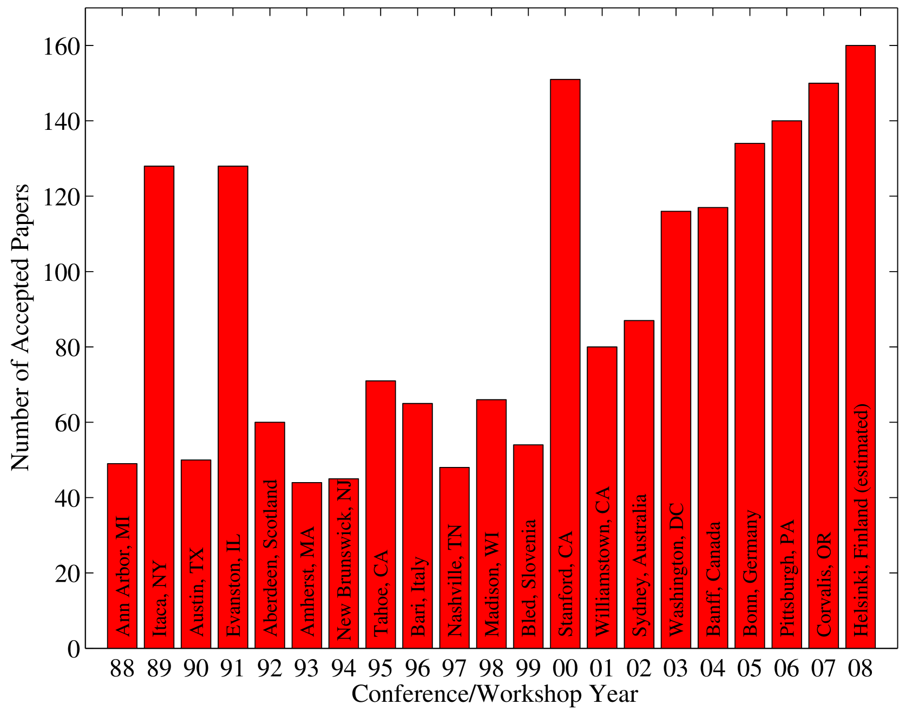

# 利用可微分Topk实现模型参数的灵活缩放，这一技术为模型优化提供了新的维度，使得模型在保持性能的同时，能够更加适应不同的计算资源和应用场景。

发布时间：2024年05月12日

`LLM理论

这篇论文探讨了可微分模型缩放（DMS）技术在优化网络架构中的应用，特别是在大型语言模型（LLM）和视觉任务中的应用。它提出了一种新的方法来提高网络的效率和性能，超越了现有的神经架构搜索（NAS）方法。虽然这项技术可以应用于LLM的实际应用中，但论文的核心贡献在于理论层面的创新，即DMS技术的提出和验证，因此更适合归类为LLM理论。` `计算机视觉`

> Differentiable Model Scaling using Differentiable Topk

# 摘要

> 随着大型语言模型开启智能新时代，网络扩展成为研究热点。然而，手工设计的网络架构往往不尽人意。尽管神经架构搜索（NAS）试图自动化设计，但其搜索效率低下。本研究提出的可微分模型缩放（DMS）技术，能够高效地优化网络的宽度和深度，且易于实施。我们在视觉和语言任务中，以及在CNN和Transformer等架构上验证了DMS的效果。结果显示，DMS不仅找到了更优的网络结构，还超越了现有的NAS方法。在ImageNet图像分类上，DMS分别提升了EfficientNet-B0和Deit-Tiny的准确率1.4%和0.6%，并超越了ZiCo方法，搜索时间仅需0.4 GPU天。在COCO目标检测上，DMS提升了Yolo-v8-n的平均精度2.0%。在语言模型方面，修剪后的Llama-7B在保持更低困惑度的同时，提高了零-shot分类准确率。我们计划在未来公开我们的代码。

> Over the past few years, as large language models have ushered in an era of intelligence emergence, there has been an intensified focus on scaling networks. Currently, many network architectures are designed manually, often resulting in sub-optimal configurations. Although Neural Architecture Search (NAS) methods have been proposed to automate this process, they suffer from low search efficiency. This study introduces Differentiable Model Scaling (DMS), increasing the efficiency for searching optimal width and depth in networks. DMS can model both width and depth in a direct and fully differentiable way, making it easy to optimize. We have evaluated our DMS across diverse tasks, ranging from vision tasks to NLP tasks and various network architectures, including CNNs and Transformers. Results consistently indicate that our DMS can find improved structures and outperforms state-of-the-art NAS methods. Specifically, for image classification on ImageNet, our DMS improves the top-1 accuracy of EfficientNet-B0 and Deit-Tiny by 1.4% and 0.6%, respectively, and outperforms the state-of-the-art zero-shot NAS method, ZiCo, by 1.3% while requiring only 0.4 GPU days for searching. For object detection on COCO, DMS improves the mAP of Yolo-v8-n by 2.0%. For language modeling, our pruned Llama-7B outperforms the prior method with lower perplexity and higher zero-shot classification accuracy. We will release our code in the future.

[Arxiv](https://arxiv.org/abs/2405.07194)