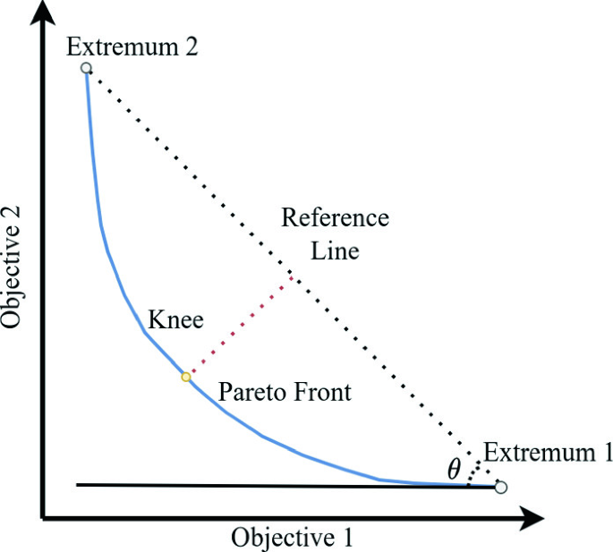
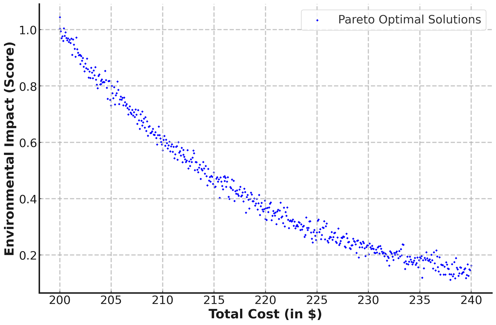

# 借助大型语言模型辅助推理，优化决策更上一层楼：神经网络视角下的探索

发布时间：2024年05月12日

`LLM应用

这篇论文探讨了大型语言模型（LLM）在辅助推理和提升决策过程中的应用，特别是在大型多目标优化领域中与生成式AI和进化算法的结合。它强调了LLM在揭示关键决策变量和阐明上下文权衡方面的能力，以及其在适应不同利益相关者需求和偏好方面的适应性。因此，这篇论文属于LLM应用的范畴，因为它关注的是LLM在实际问题解决和决策支持中的应用，而不是LLM的理论研究或Agent的设计与实现。` `人工智能` `优化算法`

> Enhancing Decision-Making in Optimization through LLM-Assisted Inference: A Neural Networks Perspective

# 摘要

> 本文深入探讨了生成式AI与进化算法在大型多目标优化领域的完美融合，特别关注大型语言模型如何通过LLM辅助推理，自动化并提升决策过程。我们的研究揭示了LLM在揭示进化优化方案的关键决策变量和阐明上下文权衡方面的强大效能。针对大规模复杂优化问题的挑战，我们的方法强调了LLMs的适应性，使其能够提供精妙的解释，并与不同利益相关者的专业知识和偏好相协调。实证研究证实了LLM辅助推理在实际决策中的实用性和影响力。

> This paper explores the seamless integration of Generative AI (GenAI) and Evolutionary Algorithms (EAs) within the domain of large-scale multi-objective optimization. Focusing on the transformative role of Large Language Models (LLMs), our study investigates the potential of LLM-Assisted Inference to automate and enhance decision-making processes. Specifically, we highlight its effectiveness in illuminating key decision variables in evolutionarily optimized solutions while articulating contextual trade-offs. Tailored to address the challenges inherent in inferring complex multi-objective optimization solutions at scale, our approach emphasizes the adaptive nature of LLMs, allowing them to provide nuanced explanations and align their language with diverse stakeholder expertise levels and domain preferences. Empirical studies underscore the practical applicability and impact of LLM-Assisted Inference in real-world decision-making scenarios.

[Arxiv](https://arxiv.org/abs/2405.07212)