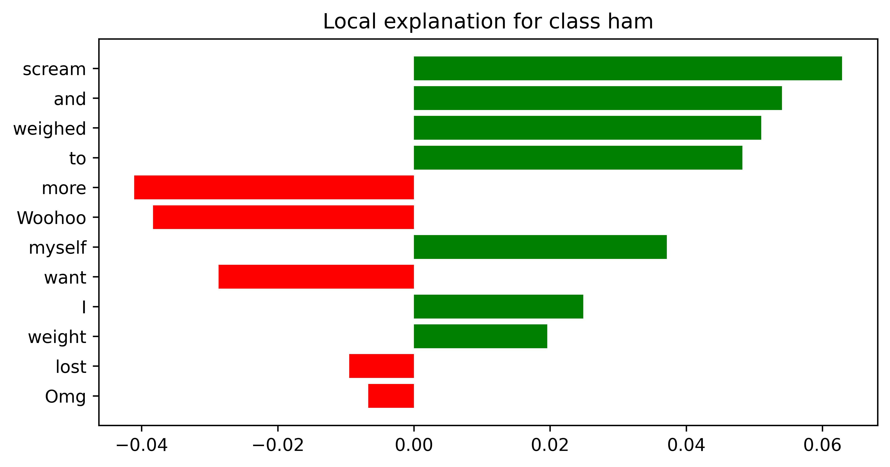

# 可解释性检测器：探究基于Transformer的语言模型在短信垃圾邮件检测中的应用，并结合可解释性分析，以揭示模型决策的内在机制。

发布时间：2024年05月12日

`LLM应用

这篇论文探讨了如何利用大型语言模型（LLMs），特别是经过优化和微调的基于变压器的模型（如BERT变体模型RoBERTa），来检测和打击垃圾短信。研究集中在SMS数据的处理、预处理技术、文本增强技术以及模型微调上，以提高垃圾短信检测的准确率。此外，论文还涉及了可解释人工智能（XAI）技术的应用，以提高模型的透明度。这些内容表明，该论文属于LLM在实际应用中的一个具体案例，即在网络安全领域中处理垃圾短信问题，因此归类为LLM应用。` `网络安全` `通信

解释：该论文主要讨论了使用优化和微调的巨型语言模型（LLMs）来检测和打击垃圾短信的问题` `这是一个与网络安全紧密相关的话题。同时` `由于垃圾短信是通过短消息服务（SMS）传播的` `因此这也涉及到通信行业。`

> ExplainableDetector: Exploring Transformer-based Language Modeling Approach for SMS Spam Detection with Explainability Analysis

# 摘要

> 短消息服务（SMS）曾是一种便捷且经济的沟通方式，如今却沦为垃圾短信的温床。随着智能手机的普及和互联网的连接，垃圾短信已成为普遍的威胁。垃圾邮件发送者看中了SMS在移动通信中的重要性，导致垃圾短信数量激增。SMS数据的无序性给垃圾短信检测带来了挑战，使得在网络安全领域有效打击垃圾短信攻击变得更为复杂。本研究采用经过优化和微调的基于变压器的巨型语言模型（LLMs）来应对这一挑战。我们利用一个标准的SMS垃圾邮件数据集，并通过预处理技术净化数据，同时采用文本增强技术解决类别不平衡问题。实验结果显示，我们微调的BERT变体模型RoBERTa达到了99.84%的高准确率。我们还运用可解释人工智能（XAI）技术，通过正负系数分数揭示模型在文本垃圾短信检测中的透明度。同时，我们对比了传统机器学习模型与基于变压器的模型的性能，展示了LLMs在处理网络安全领域复杂文本垃圾邮件数据方面的潜力。

> SMS, or short messaging service, is a widely used and cost-effective communication medium that has sadly turned into a haven for unwanted messages, commonly known as SMS spam. With the rapid adoption of smartphones and Internet connectivity, SMS spam has emerged as a prevalent threat. Spammers have taken notice of the significance of SMS for mobile phone users. Consequently, with the emergence of new cybersecurity threats, the number of SMS spam has expanded significantly in recent years. The unstructured format of SMS data creates significant challenges for SMS spam detection, making it more difficult to successfully fight spam attacks in the cybersecurity domain. In this work, we employ optimized and fine-tuned transformer-based Large Language Models (LLMs) to solve the problem of spam message detection. We use a benchmark SMS spam dataset for this spam detection and utilize several preprocessing techniques to get clean and noise-free data and solve the class imbalance problem using the text augmentation technique. The overall experiment showed that our optimized fine-tuned BERT (Bidirectional Encoder Representations from Transformers) variant model RoBERTa obtained high accuracy with 99.84\%. We also work with Explainable Artificial Intelligence (XAI) techniques to calculate the positive and negative coefficient scores which explore and explain the fine-tuned model transparency in this text-based spam SMS detection task. In addition, traditional Machine Learning (ML) models were also examined to compare their performance with the transformer-based models. This analysis describes how LLMs can make a good impact on complex textual-based spam data in the cybersecurity field.

[Arxiv](https://arxiv.org/abs/2405.08026)