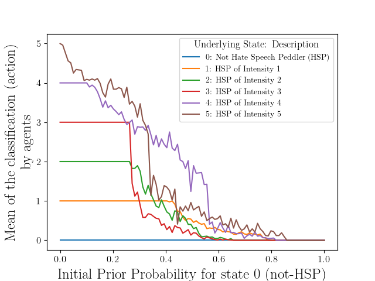
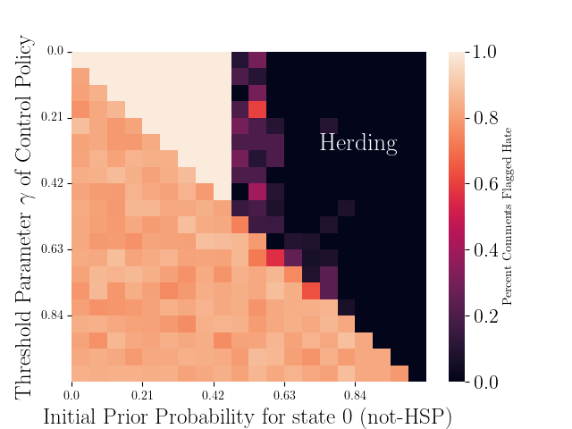

# 利用大型语言模型，采用贝叶斯社会学习策略，精准识别网络平台上的仇恨言论传播者，为决策者提供有力支持。

发布时间：2024年05月12日

`Agent

这篇论文探讨了自主代理在高维观测空间中进行序列检测的贝叶斯社会学习问题，并特别关注了当观测值为文本时，代理如何借助大型语言模型（LLM）来获取低维私人观测。论文中提出的代理通过贝叶斯学习采取行动，并旨在最小化预期成本，同时保持对后续代理的可见性。此外，论文还研究了社会学习中的趋同行为和停止时间模型，以及它们在实际应用中的表现，如在线平台上识别仇恨言论传播者。这些内容与“Agent”分类下的研究主题相符，因为它们主要关注的是自主代理的行为、学习和决策过程。` `社会学习` `网络安全`

> Identifying Hate Speech Peddlers in Online Platforms. A Bayesian Social Learning Approach for Large Language Model Driven Decision-Makers

# 摘要

> 本文探讨了自主代理在高维且分析成本高昂的观测空间中进行序列检测的贝叶斯社会学习问题。当观测值为文本时，贝叶斯代理借助大型语言模型（LLM）获取低维私人观测。这些代理通过贝叶斯学习采取行动，旨在最小化预期成本，并对后续代理可见。我们证明了这些代理在有限时间内会趋同于公共信念，并采取一致行动，忽略私人观测。我们提出了社会学习中快速趋同的停止时间模型，巧妙平衡了隐私与趋同。我们还揭示了停止时间问题的最优策略具有阈值特性。通过自主贝叶斯检测器在在线平台上识别仇恨言论传播者的案例，我们展示了框架的实际应用。在真实世界的仇恨言论数据集上，我们数值验证了研究成果，并揭示了当公共先验强烈时，自主代理的趋同行为及其对用户的错误分类。此外，我们还数值分析了阈值政策对趋同延迟的影响。

> This paper studies the problem of autonomous agents performing Bayesian social learning for sequential detection when the observations of the state belong to a high-dimensional space and are expensive to analyze. Specifically, when the observations are textual, the Bayesian agent can use a large language model (LLM) as a map to get a low-dimensional private observation. The agent performs Bayesian learning and takes an action that minimizes the expected cost and is visible to subsequent agents. We prove that a sequence of such Bayesian agents herd in finite time to the public belief and take the same action disregarding the private observations. We propose a stopping time formulation for quickest time herding in social learning and optimally balance privacy and herding. Structural results are shown on the threshold nature of the optimal policy to the stopping time problem. We illustrate the application of our framework when autonomous Bayesian detectors aim to sequentially identify if a user is a hate speech peddler on an online platform by parsing text observations using an LLM. We numerically validate our results on real-world hate speech datasets. We show that autonomous Bayesian agents designed to flag hate speech peddlers in online platforms herd and misclassify the users when the public prior is strong. We also numerically show the effect of a threshold policy in delaying herding.

[Arxiv](https://arxiv.org/abs/2405.07417)