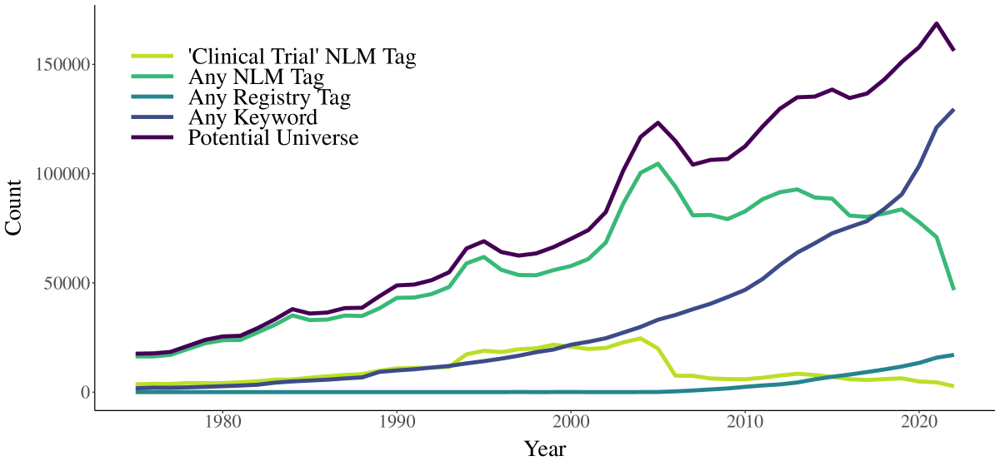
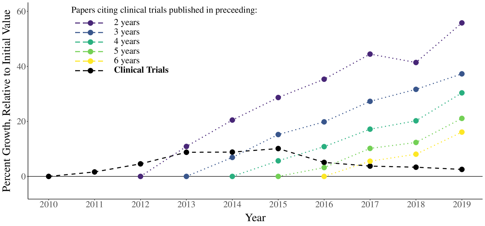

# 医学研究：衡量生产力的标尺

发布时间：2024年05月12日

`LLM应用

这篇论文摘要讨论了使用经过微调的开源大型语言模型来分析医学领域的研究趋势，特别是临床试验的数量和效率。这种方法属于应用大型语言模型（LLM）来解决实际问题，即医学研究的投资和效率分析，因此归类为LLM应用。它并不涉及代理（Agent）、检索增强生成（RAG）或LLM的理论研究，因此不属于其他三个分类。` `医学研究` `临床试验`

> Medical Research as a Productivity Indicator

# 摘要

> 各个领域的研究数量激增，但产出并未同步增长，特别是在医学领域，这表明研究正转向低资本、低效率的方向。我们利用精调的开源大型语言模型，创新性地编制了资本密集、高效率的医学投资——临床试验的普查。数据显示，自2010年起，临床试验的数量停滞不前，而其他临床研究的数量却大幅攀升。临床试验内部的生产力差异显著，且这种差异的分布长期保持稳定。

> Across fields, the quantity of research has increased substantially, without an attendant increase in output. We argue that, in medicine, this indicator of declining productivity reflects a compositional shift toward low-capital, low-productivity research. Using a fine-tuned, open-source large language model, we construct a novel census of capital-intensive, high-productivity medical investment -- clinical trials. Since 2010, the annual quantity of clinical trials has been constant. By contrast, the quantity of other forms of clinical research has increased substantially. Within clinical trials, there is substantial heterogeneity in productivity. The distribution of this heterogeneity is stable over time.

[Arxiv](https://arxiv.org/abs/2405.08030)