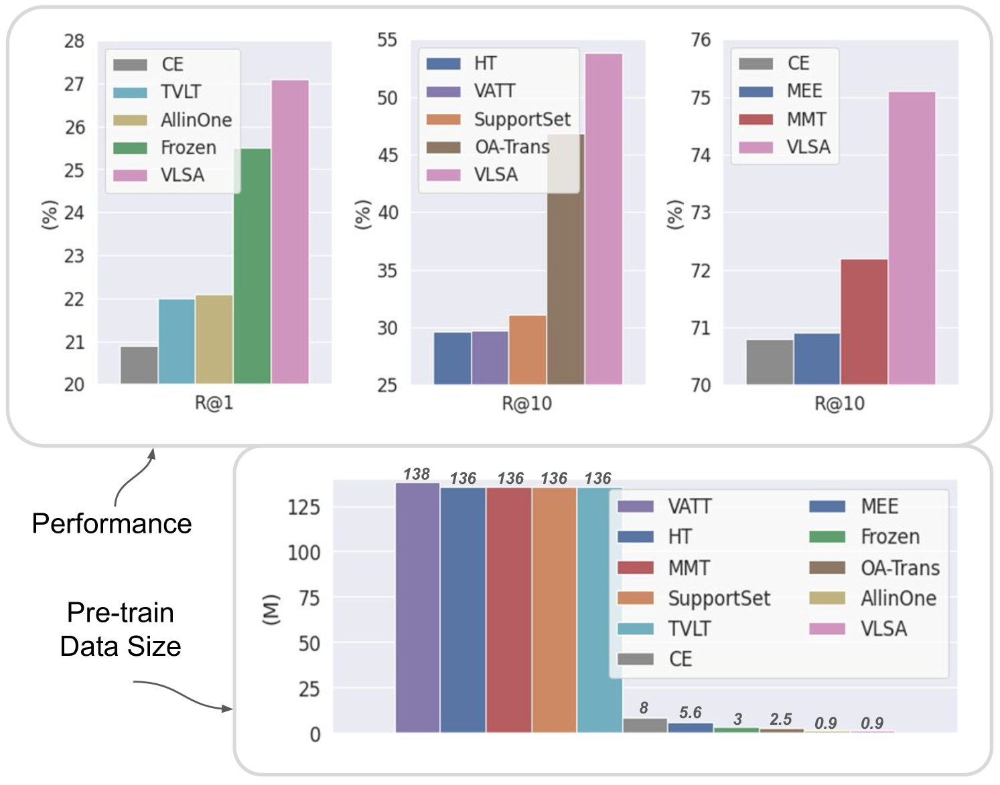

# 同步音频下的视频与语言一体化预训练

发布时间：2024年05月12日

`RAG

理由：这篇论文介绍了一种新的视频-语言预训练框架VLSA，它结合了音频、视频和文本三种模态的信息进行自监督学习，以提取多模态表示。这种方法涉及到了多模态融合和预训练技术，与RAG（Retrieval-Augmented Generation）模型中的多模态信息处理和生成任务有相似之处。虽然它不是直接讨论Agent或LLM理论，但其研究内容与RAG模型中的信息检索和生成过程相关，因此将其归类为RAG。` `多媒体处理` `跨模态学习`

> Unified Video-Language Pre-training with Synchronized Audio

# 摘要

> 视频-语言预训练旨在通过自监督学习从海量数据中提取视觉和文本特征，是一个既典型又充满挑战的领域。现有方法或关注图像与文本的对应，或利用视频帧的时序关系，但鲜有研究深入挖掘音频与视觉、文本间的自然同步。为此，我们提出了VLSA框架，一种结合同步音频的视频-语言预训练方法，能在统一的自我监督变压器中学习三模态表示。VLSA不仅联合处理视频、文本和音频的局部与全局特征，还通过局部补丁掩码建模和全局音频匹配，分别提取模态特异性和音频引导的特征。实验证明，仅用0.9M数据预训练的VLSA模型在跨模态检索任务上超越了现有技术，定性分析也展示了VLSA在捕捉精细视觉-文本关联方面的显著优势。

> Video-language pre-training is a typical and challenging problem that aims at learning visual and textual representations from large-scale data in a self-supervised way. Existing pre-training approaches either captured the correspondence of image-text pairs or utilized temporal ordering of frames. However, they do not explicitly explore the natural synchronization between audio and the other two modalities. In this work, we propose an enhanced framework for Video-Language pre-training with Synchronized Audio, termed as VLSA, that can learn tri-modal representations in a unified self-supervised transformer. Specifically, our VLSA jointly aggregates embeddings of local patches and global tokens for video, text, and audio. Furthermore, we utilize local-patch masked modeling to learn modality-aware features, and leverage global audio matching to capture audio-guided features for video and text. We conduct extensive experiments on retrieval across text, video, and audio. Our simple model pre-trained on only 0.9M data achieves improving results against state-of-the-art baselines. In addition, qualitative visualizations vividly showcase the superiority of our VLSA in learning discriminative visual-textual representations.

[Arxiv](https://arxiv.org/abs/2405.07202)