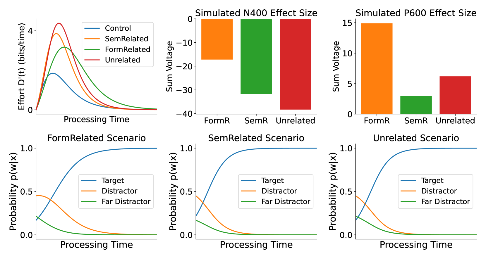

# 浅层与深层语言理解的信息理论模型

发布时间：2024年05月13日

`LLM理论

这篇论文探讨了语言理解的理论模型，并将其与认知和神经特征相联系，这属于大型语言模型（LLM）的理论研究范畴。它通过信息理论构建模型，并使用脑电图信号和阅读时间等实验数据来验证模型，这表明研究的重点在于理解语言处理的理论基础，而不是特定应用或代理（Agent）的设计，也不是检索增强生成（RAG）技术的应用。因此，它最适合归类为LLM理论。` `心理语言学` `认知科学`

> An information-theoretic model of shallow and deep language comprehension

# 摘要

> 心理语言学研究广泛探讨了在线语言理解可以是浅层或“足够好”的观点，即在时间和计算资源限制下，人们可能形成合理但不完全准确的理解。然而，这一观点尚未与资源受限计算的正式理论相结合。本研究运用信息理论构建了一个语言理解模型，该模型在准确性与处理深度之间寻求最佳平衡，以从输入中提取的信息位来量化，随处理时间增长，并将其与脑电图信号和阅读时间相联系。我们通过分析花园路径句子的阅读时间和脑电图实验中的N400、P600及双相ERP效应来验证这一理论。我们的模型通过量化语言处理从浅层到深层的时间进程，为解释语言理解的认知和神经特征提供了一个统一框架。

> A large body of work in psycholinguistics has focused on the idea that online language comprehension can be shallow or `good enough': given constraints on time or available computation, comprehenders may form interpretations of their input that are plausible but inaccurate. However, this idea has not yet been linked with formal theories of computation under resource constraints. Here we use information theory to formulate a model of language comprehension as an optimal trade-off between accuracy and processing depth, formalized as bits of information extracted from the input, which increases with processing time. The model provides a measure of processing effort as the change in processing depth, which we link to EEG signals and reading times. We validate our theory against a large-scale dataset of garden path sentence reading times, and EEG experiments featuring N400, P600 and biphasic ERP effects. By quantifying the timecourse of language processing as it proceeds from shallow to deep, our model provides a unified framework to explain behavioral and neural signatures of language comprehension.

[Arxiv](https://arxiv.org/abs/2405.08223)