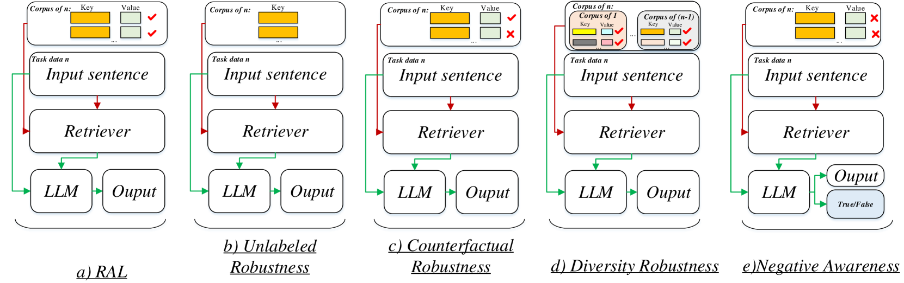

# 生物医学 NLP 中检索增强 LLM 的基准测试：应用、鲁棒性与自我认知在生物医学自然语言处理领域，检索增强的大型语言模型（LLM）正逐渐成为研究的热点。这些模型通过结合检索机制，能够更有效地处理和理解复杂的生物医学信息。本文将探讨这些模型在实际应用中的表现，以及它们在面对不同数据集和任务时的鲁棒性。此外，我们还将研究这些模型如何通过自我意识机制来评估和优化其性能，从而在生物医学 NLP 领域中发挥更大的作用。

发布时间：2024年05月13日

`RAG

这篇论文主要探讨了检索增强型LLM（RAL）在生物医学自然语言处理（NLP）任务中的应用和影响，特别是关注了RAL在处理未标记、反事实、多样性和负面知识方面的鲁棒性。它通过一个评估框架和在多个数据集上的实验来评估RAL的性能，旨在揭示RAL在生物医学NLP领域的潜力。因此，这篇论文更符合RAG分类，因为它专注于检索增强型生成（Retrieval-Augmented Generation）模型的应用和评估。` `生物医学`

> Benchmarking Retrieval-Augmented Large Language Models in Biomedical NLP: Application, Robustness, and Self-Awareness

# 摘要

> 大型语言模型（LLM）在生物医学NLP领域表现出色，但它们对演示的选择非常敏感。检索增强型LLM（RAL）通过检索数据库信息来解决幻觉问题，但其在生物医学任务中的影响尚未得到充分评估。RAL的输出受到未标记、反事实或多样性知识的影响，这些在生物医学领域尚未深入研究。本文系统地探讨了RAL在五个关键生物医学任务中的作用，并分析了其在未标记、反事实、多样性和负面意识方面的鲁棒性。我们提出了一个评估框架，并在四个测试平台上评估了三个代表性LLM与三个检索器在九个数据集上的表现，以揭示RAL在生物医学NLP领域的真正潜力。

> Large language models (LLM) have demonstrated remarkable capabilities in various biomedical natural language processing (NLP) tasks, leveraging the demonstration within the input context to adapt to new tasks. However, LLM is sensitive to the selection of demonstrations. To address the hallucination issue inherent in LLM, retrieval-augmented LLM (RAL) offers a solution by retrieving pertinent information from an established database. Nonetheless, existing research work lacks rigorous evaluation of the impact of retrieval-augmented large language models on different biomedical NLP tasks. This deficiency makes it challenging to ascertain the capabilities of RAL within the biomedical domain. Moreover, the outputs from RAL are affected by retrieving the unlabeled, counterfactual, or diverse knowledge that is not well studied in the biomedical domain. However, such knowledge is common in the real world. Finally, exploring the self-awareness ability is also crucial for the RAL system. So, in this paper, we systematically investigate the impact of RALs on 5 different biomedical tasks (triple extraction, link prediction, classification, question answering, and natural language inference). We analyze the performance of RALs in four fundamental abilities, including unlabeled robustness, counterfactual robustness, diverse robustness, and negative awareness. To this end, we proposed an evaluation framework to assess the RALs' performance on different biomedical NLP tasks and establish four different testbeds based on the aforementioned fundamental abilities. Then, we evaluate 3 representative LLMs with 3 different retrievers on 5 tasks over 9 datasets.

[Arxiv](https://arxiv.org/abs/2405.08151)