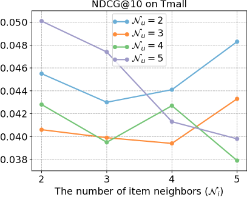

# 动态巨型语言模型：大型语言模型与动态图推荐之交融

发布时间：2024年05月13日

`LLM应用

这篇论文介绍了一个名为DynLLM的框架，它利用大型语言模型（LLMs）来解决动态图推荐问题。该框架通过生成多维用户画像来丰富用户与物品之间的潜在联系，并采用蒸馏注意力机制来精炼这些画像嵌入，以适应动态图推荐任务中的时间演化数据。这种方法旨在提高推荐系统的性能，特别是在处理动态和复杂的数据结构时。因此，这篇论文属于LLM应用类别，因为它展示了LLMs在推荐系统领域的实际应用和潜在改进。` `电子商务` `推荐系统`

> DynLLM: When Large Language Models Meet Dynamic Graph Recommendation

# 摘要

> 去年，大型语言模型（LLMs）因其潜在的推荐系统应用而备受瞩目，有望缓解数据稀疏性的难题。尽管在用户-物品图增强方面取得了显著进展，但现有方法在处理动态图推荐任务时仍显不足，该任务涉及复杂的结构和时间图动态，以及处理时间演化数据的挑战。为此，我们提出了DynLLM框架，旨在利用LLMs解决动态图推荐问题。DynLLM通过LLMs生成基于历史购买记录文本特征的多维用户画像，包括人群细分、个人兴趣、偏好类别和品牌偏好，从而丰富用户与物品间的潜在联系。为了将这些多维画像与时间图嵌入相结合，我们采用LLMs生成相应的画像嵌入，并通过蒸馏注意力机制精炼这些嵌入，以减少噪声干扰，同时评估并调整每个蒸馏画像的相关性，确保与连续时间动态图（CTDGs）的时间图嵌入无缝融合。在两个真实电子商务数据集上的实验结果表明，DynLLM在众多顶尖基线方法中表现卓越。

> Last year has witnessed the considerable interest of Large Language Models (LLMs) for their potential applications in recommender systems, which may mitigate the persistent issue of data sparsity. Though large efforts have been made for user-item graph augmentation with better graph-based recommendation performance, they may fail to deal with the dynamic graph recommendation task, which involves both structural and temporal graph dynamics with inherent complexity in processing time-evolving data. To bridge this gap, in this paper, we propose a novel framework, called DynLLM, to deal with the dynamic graph recommendation task with LLMs. Specifically, DynLLM harnesses the power of LLMs to generate multi-faceted user profiles based on the rich textual features of historical purchase records, including crowd segments, personal interests, preferred categories, and favored brands, which in turn supplement and enrich the underlying relationships between users and items. Along this line, to fuse the multi-faceted profiles with temporal graph embedding, we engage LLMs to derive corresponding profile embeddings, and further employ a distilled attention mechanism to refine the LLM-generated profile embeddings for alleviating noisy signals, while also assessing and adjusting the relevance of each distilled facet embedding for seamless integration with temporal graph embedding from continuous time dynamic graphs (CTDGs). Extensive experiments on two real e-commerce datasets have validated the superior improvements of DynLLM over a wide range of state-of-the-art baseline methods.

[Arxiv](https://arxiv.org/abs/2405.07580)