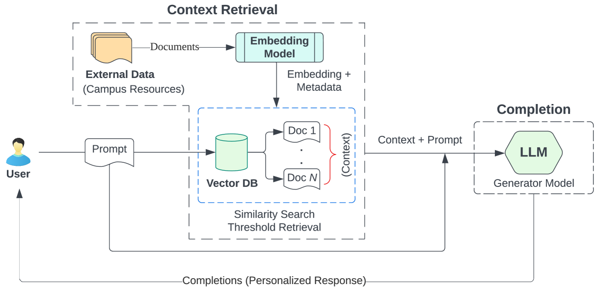
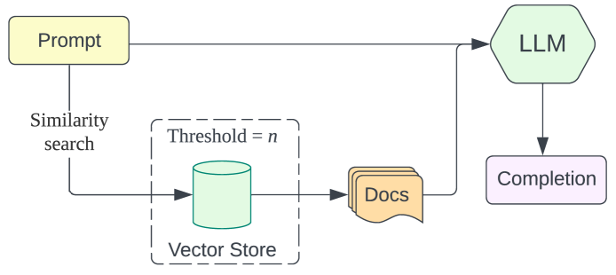
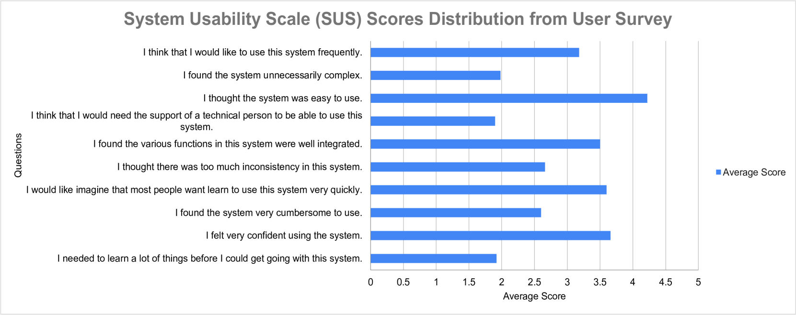

# 打造智慧之桥：构建一款洞悉大学资源的智能聊天机器人，将疑问转化为深刻解答。

发布时间：2024年05月13日

`Agent

这篇论文介绍了一个基于大型语言模型（LLM）的聊天机器人系统BARKPLUG V.2，它通过检索增强生成（RAG）管道来提升学术环境中的用户体验和信息获取。该系统被设计为一个Agent，用于提供校园资源信息，并通过RAG管道进行特定领域的问答。它展示了在特定应用场景中LLM的实际应用，即作为一个智能Agent来辅助用户获取信息。因此，这篇论文属于Agent分类。` `聊天机器人`

> From Questions to Insightful Answers: Building an Informed Chatbot for University Resources

# 摘要

> 本文介绍了BARKPLUG V.2，一款基于LLM的聊天机器人系统，通过RAG管道提升学术环境中的用户体验和信息获取。该系统旨在以互动方式提供校园资源信息，如学术部门、项目、设施和学生服务。它利用大学数据，通过RAG管道进行特定领域问答。我们以密西西比州立大学为例，通过RAGAS等框架定量评估其回答的准确性和相关性，并通过SUS调查评估其可用性。BARKPLUG V.2在定量性能上表现卓越，平均RAGAS得分0.96，用户体验得到可用性评估的验证。

> This paper presents BARKPLUG V.2, a Large Language Model (LLM)-based chatbot system built using Retrieval Augmented Generation (RAG) pipelines to enhance the user experience and access to information within academic settings.The objective of BARKPLUG V.2 is to provide information to users about various campus resources, including academic departments, programs, campus facilities, and student resources at a university setting in an interactive fashion. Our system leverages university data as an external data corpus and ingests it into our RAG pipelines for domain-specific question-answering tasks. We evaluate the effectiveness of our system in generating accurate and pertinent responses for Mississippi State University, as a case study, using quantitative measures, employing frameworks such as Retrieval Augmented Generation Assessment(RAGAS). Furthermore, we evaluate the usability of this system via subjective satisfaction surveys using the System Usability Scale (SUS). Our system demonstrates impressive quantitative performance, with a mean RAGAS score of 0.96, and experience, as validated by usability assessments.

[Arxiv](https://arxiv.org/abs/2405.08120)