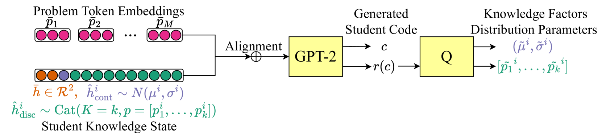
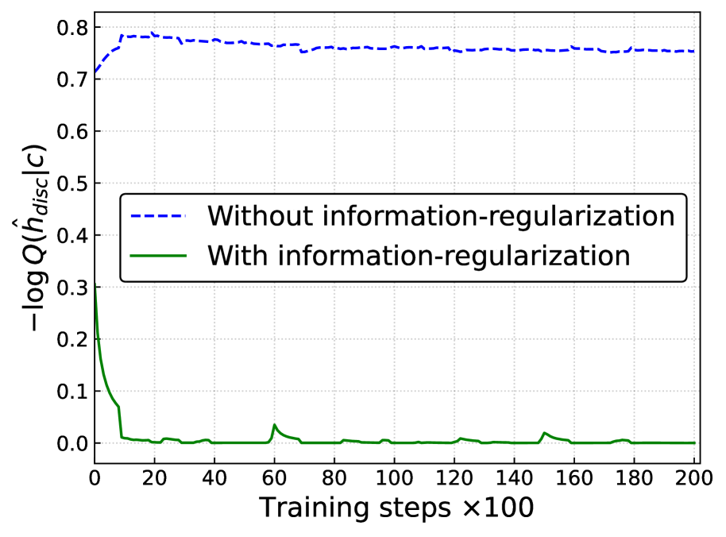

# 揭示编程作业中学生潜在知识的内在表征

发布时间：2024年05月13日

`LLM应用

这篇论文探讨了生成式大型语言模型在教育领域的应用，特别是在预测学生开放式回答和解释学生知识表示方面。它提出了一个名为InfoOIRT的模型，旨在提高学生知识状态的可解释性，并通过生成学生编写的代码来应对开放式编程问题。这种方法通过最大化潜在知识状态与学生代码之间的互信息来学习解耦表示，包括语法风格、编程技能掌握和代码结构等。因此，这篇论文属于LLM应用类别，因为它关注的是大型语言模型在特定应用场景（教育）中的实际应用和效果。` `人工智能`

> Interpreting Latent Student Knowledge Representations in Programming Assignments

# 摘要

> 在教育人工智能的最新进展中，生成式大型语言模型被用于预测学生的开放式回答，超越了仅判断正确性的范畴。然而，这些模型的黑盒特性使得学生知识表示的解释性受到限制。本文首次探索了如何解释这些潜在的学生知识表示，提出了InfoOIRT模型，它鼓励学生知识状态的可解释性，并能生成学生编写的代码以应对开放式编程问题。通过最大化潜在知识状态与学生代码之间的互信息，InfoOIRT学习了包括语法风格、编程技能掌握和代码结构在内的解耦表示。实验证明，InfoOIRT不仅能准确生成学生代码，还能提供可解释的学生知识表示。

> Recent advances in artificial intelligence for education leverage generative large language models, including using them to predict open-ended student responses rather than their correctness only. However, the black-box nature of these models limits the interpretability of the learned student knowledge representations. In this paper, we conduct a first exploration into interpreting latent student knowledge representations by presenting InfoOIRT, an Information regularized Open-ended Item Response Theory model, which encourages the latent student knowledge states to be interpretable while being able to generate student-written code for open-ended programming questions. InfoOIRT maximizes the mutual information between a fixed subset of latent knowledge states enforced with simple prior distributions and generated student code, which encourages the model to learn disentangled representations of salient syntactic and semantic code features including syntactic styles, mastery of programming skills, and code structures. Through experiments on a real-world programming education dataset, we show that InfoOIRT can both accurately generate student code and lead to interpretable student knowledge representations.

[Arxiv](https://arxiv.org/abs/2405.08213)