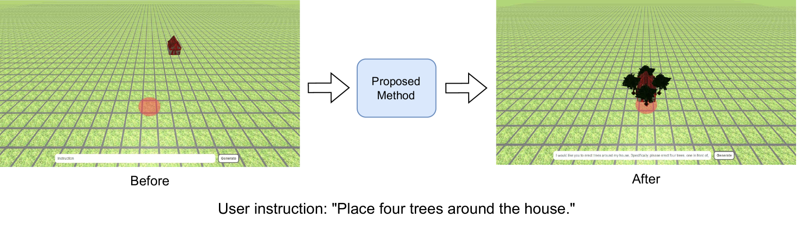
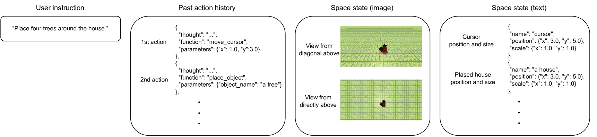
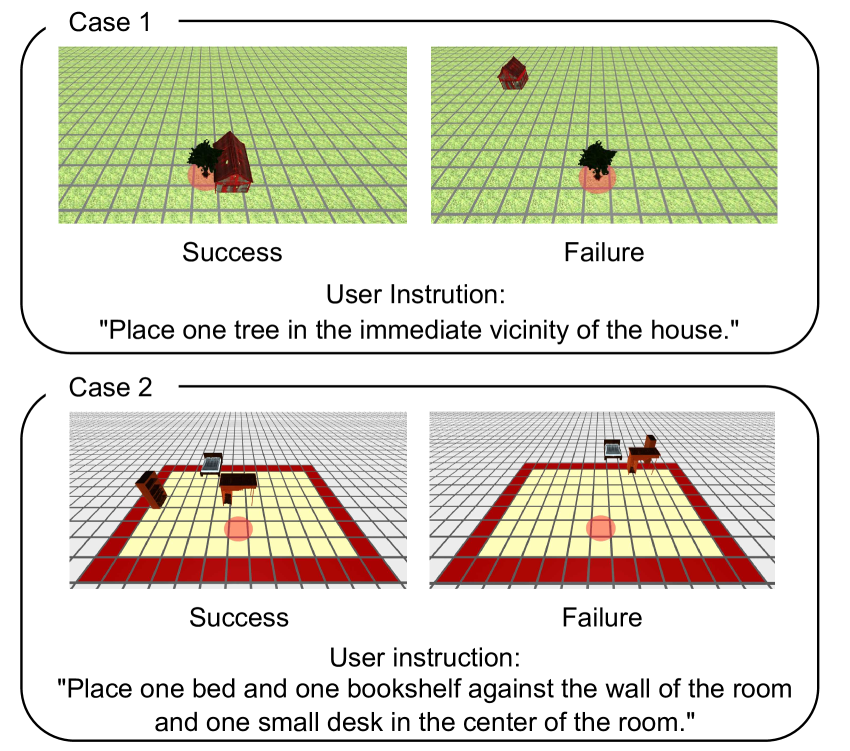

# 大型语言模型赋能的布局生成智能体

发布时间：2024年05月13日

`Agent

这篇论文介绍了一种基于GPT-4V模型的创新系统，该系统通过代理在虚拟空间中智能布置对象，以精确响应用户指令。这里的“代理”指的是能够自主执行任务的智能系统或程序，它们可以根据用户的指令在虚拟空间中进行操作。因此，这篇论文属于Agent分类，因为它主要讨论了如何使用智能代理来实现个性化3D虚拟空间的自动化布局生成。` `虚拟现实` `3D建模`

> Layout Generation Agents with Large Language Models

# 摘要

> 随着对个性化3D虚拟空间的需求日益增长，创建这些空间的高效方法变得至关重要。尽管已有研究尝试自动化布局生成，但它们往往忽略了生成过程中的宝贵信息。本研究引入了一种基于GPT-4V模型的创新系统，该系统通过代理在虚拟空间中智能布置对象，以精确响应用户指令。实验证明，这种方法不仅高效，而且能够准确反映用户的创意。通过深入分析，我们还揭示了哪些关键因素能够提升生成行为的性能。

> In recent years, there has been an increasing demand for customizable 3D virtual spaces. Due to the significant human effort required to create these virtual spaces, there is a need for efficiency in virtual space creation. While existing studies have proposed methods for automatically generating layouts such as floor plans and furniture arrangements, these methods only generate text indicating the layout structure based on user instructions, without utilizing the information obtained during the generation process. In this study, we propose an agent-driven layout generation system using the GPT-4V multimodal large language model and validate its effectiveness. Specifically, the language model manipulates agents to sequentially place objects in the virtual space, thus generating layouts that reflect user instructions. Experimental results confirm that our proposed method can generate virtual spaces reflecting user instructions with a high success rate. Additionally, we successfully identified elements contributing to the improvement in behavior generation performance through ablation study.

[Arxiv](https://arxiv.org/abs/2405.08037)