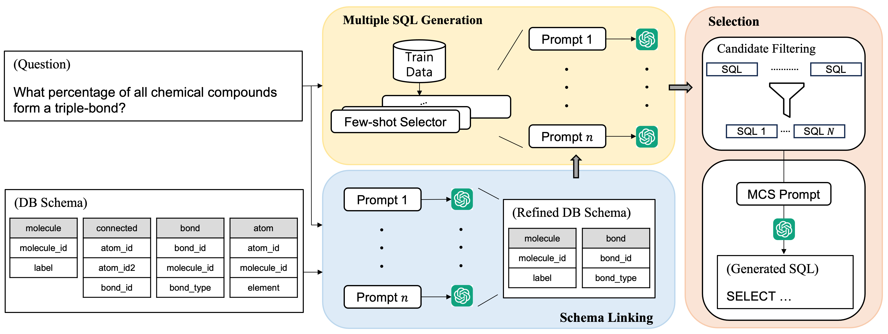
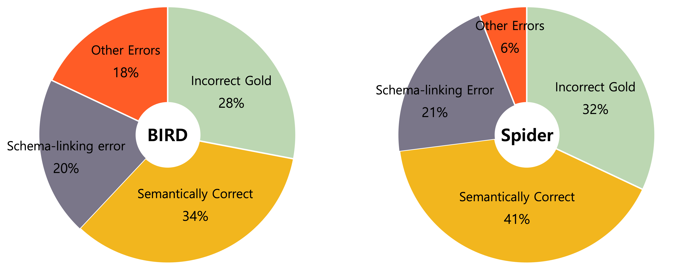

# MCS-SQL：借助多重提示与选择题机制，精妙演绎文本至SQL的生成艺术

发布时间：2024年05月13日

`LLM应用

这篇论文探讨了大型语言模型（LLMs）在文本到SQL任务中的应用，特别是在面对复杂模式和查询时的性能提升。它提出了一种基于上下文学习（ICL）的创新策略，通过多提示探索和整合结果来提高准确率。这种方法在BIRD和Spider测试集上取得了显著的性能提升，因此属于LLM应用类别。` `数据库管理`

> MCS-SQL: Leveraging Multiple Prompts and Multiple-Choice Selection For Text-to-SQL Generation

# 摘要

> 大型语言模型（LLMs）的进步是基于上下文学习（ICL）的方法在文本到SQL任务中超越微调方法的关键。尽管如此，面对复杂模式和查询（如BIRD）的挑战，它们的表现仍不及人类专家。本研究深入探讨了LLMs对提示的敏感性，并提出了一种创新策略，通过多提示探索答案的广阔空间，并巧妙地整合结果。我们通过多提示的架构链接，精细地调整数据库架构。接着，我们依据这些精炼架构和多样提示，创造出多样的候选SQL查询。最后，我们依据置信度评分筛选这些候选查询，并通过多选机制，向LLM展示最优解。在BIRD和Spider的测试中，我们的方法分别实现了65.5%和89.6%的准确率，显著超越了以往的ICL方法，并在BIRD上以准确性和效率刷新了SOTA记录。

> Recent advancements in large language models (LLMs) have enabled in-context learning (ICL)-based methods that significantly outperform fine-tuning approaches for text-to-SQL tasks. However, their performance is still considerably lower than that of human experts on benchmarks that include complex schemas and queries, such as BIRD. This study considers the sensitivity of LLMs to the prompts and introduces a novel approach that leverages multiple prompts to explore a broader search space for possible answers and effectively aggregate them. Specifically, we robustly refine the database schema through schema linking using multiple prompts. Thereafter, we generate various candidate SQL queries based on the refined schema and diverse prompts. Finally, the candidate queries are filtered based on their confidence scores, and the optimal query is obtained through a multiple-choice selection that is presented to the LLM. When evaluated on the BIRD and Spider benchmarks, the proposed method achieved execution accuracies of 65.5\% and 89.6\%, respectively, significantly outperforming previous ICL-based methods. Moreover, we established a new SOTA performance on the BIRD in terms of both the accuracy and efficiency of the generated queries.

[Arxiv](https://arxiv.org/abs/2405.07467)