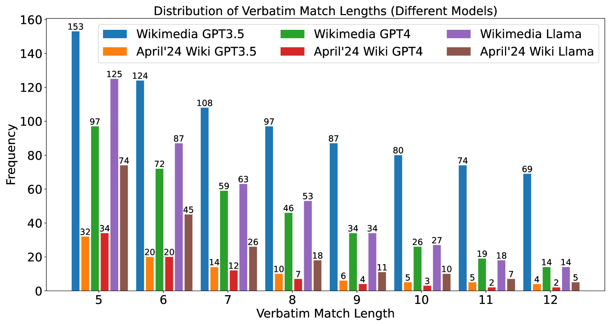
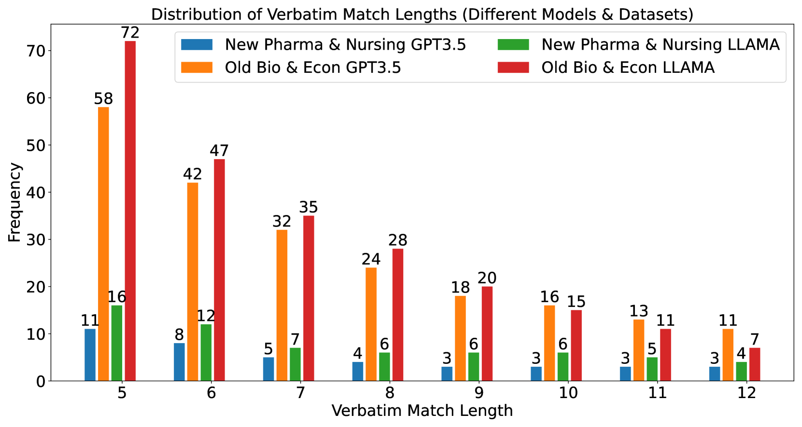
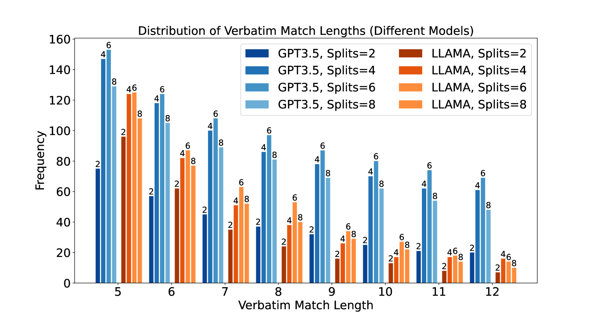
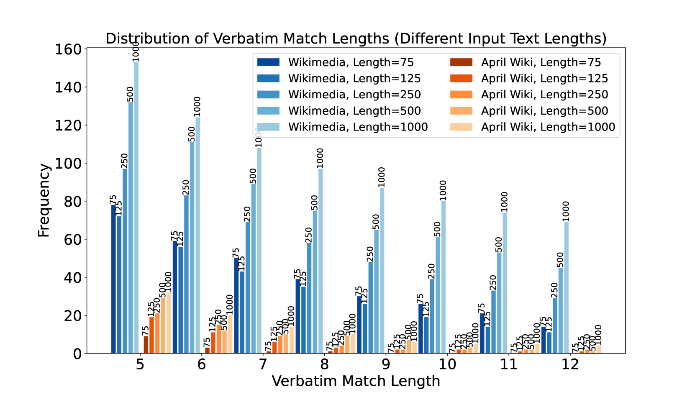

# 多示例复述（MSR）提示法

发布时间：2024年05月13日

`LLM应用

这篇论文介绍了一种名为多段复制（MSR）提示技术的新型黑盒成员推断攻击方法，用于检测大型语言模型（LLMs）中的逐字复制行为。这种方法通过分析模型在特定提示下的行为来揭示模型是否倾向于从其训练数据中逐字复制内容。由于这项工作关注的是LLMs在实际应用中的行为，特别是它们如何处理和复制训练数据中的文本，因此它属于LLM应用类别。这项研究不仅揭示了LLMs的一个潜在弱点，而且还强调了在设计和部署这些模型时需要考虑的安全和隐私问题。` `信息安全` `人工智能伦理`

> Many-Shot Regurgitation (MSR) Prompting

# 摘要

> 我们提出了多段复制（MSR）提示技术，这是一种新颖的黑盒成员推断攻击方法，用于检测大型语言模型（LLMs）中的逐字复制行为。MSR提示技术通过将输入文本分割成多个部分，并构建一个包含模拟用户与语言模型之间对话回合的提示，来诱导模型逐字复制内容。我们将其应用于维基百科和开放教育资源教科书等多种文本来源，这些来源提供高质量、实时更新的信息。我们为每个来源准备了两种数据集：一种是LLMs在训练期间可能接触到的数据集（$D_{\rm pre}$），另一种是模型训练截止日期后发布的数据集（$D_{\rm post}$）。我们使用最长公共子串算法来计算逐字匹配的频率，并运用统计方法如Cliff's delta、KS距离和Kruskal-Wallis H检验来分析$D_{\rm pre}$和$D_{\rm post}$之间逐字匹配分布的差异。研究发现，当LLMs被提示使用其训练数据集中的文本来进行逐字复制时，复制频率显著增加。例如，GPT-3.5处理维基百科文章时，我们发现$D_{\rm pre}$和$D_{\rm post}$的分布差异显著（Cliff's delta $= -0.984$，KS距离为$0.875$）。这些发现强烈表明，当输入文本源自其训练数据时，LLMs更倾向于逐字复制内容。

> We introduce Many-Shot Regurgitation (MSR) prompting, a new black-box membership inference attack framework for examining verbatim content reproduction in large language models (LLMs). MSR prompting involves dividing the input text into multiple segments and creating a single prompt that includes a series of faux conversation rounds between a user and a language model to elicit verbatim regurgitation. We apply MSR prompting to diverse text sources, including Wikipedia articles and open educational resources (OER) textbooks, which provide high-quality, factual content and are continuously updated over time. For each source, we curate two dataset types: one that LLMs were likely exposed to during training ($D_{\rm pre}$) and another consisting of documents published after the models' training cutoff dates ($D_{\rm post}$). To quantify the occurrence of verbatim matches, we employ the Longest Common Substring algorithm and count the frequency of matches at different length thresholds. We then use statistical measures such as Cliff's delta, Kolmogorov-Smirnov (KS) distance, and Kruskal-Wallis H test to determine whether the distribution of verbatim matches differs significantly between $D_{\rm pre}$ and $D_{\rm post}$. Our findings reveal a striking difference in the distribution of verbatim matches between $D_{\rm pre}$ and $D_{\rm post}$, with the frequency of verbatim reproduction being significantly higher when LLMs (e.g. GPT models and LLaMAs) are prompted with text from datasets they were likely trained on. For instance, when using GPT-3.5 on Wikipedia articles, we observe a substantial effect size (Cliff's delta $= -0.984$) and a large KS distance ($0.875$) between the distributions of $D_{\rm pre}$ and $D_{\rm post}$. Our results provide compelling evidence that LLMs are more prone to reproducing verbatim content when the input text is likely sourced from their training data.

[Arxiv](https://arxiv.org/abs/2405.08134)