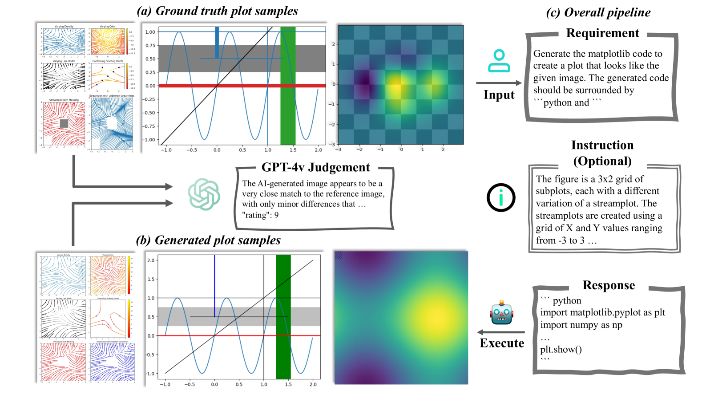
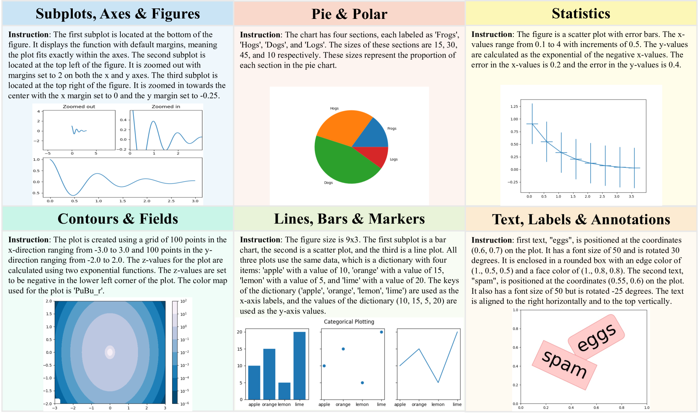
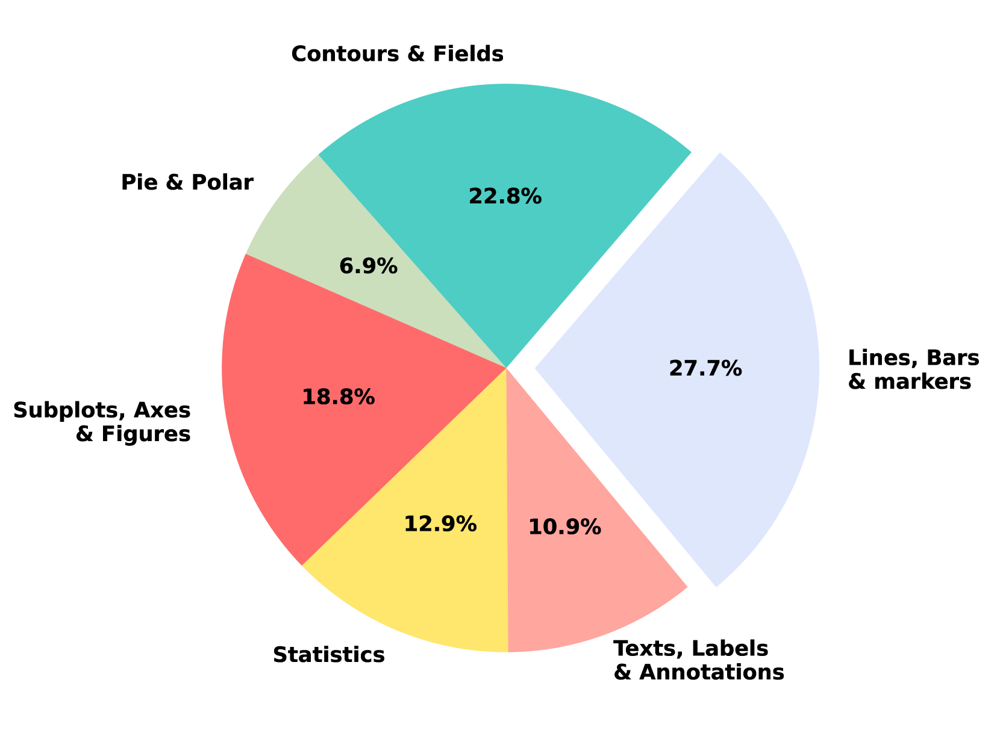
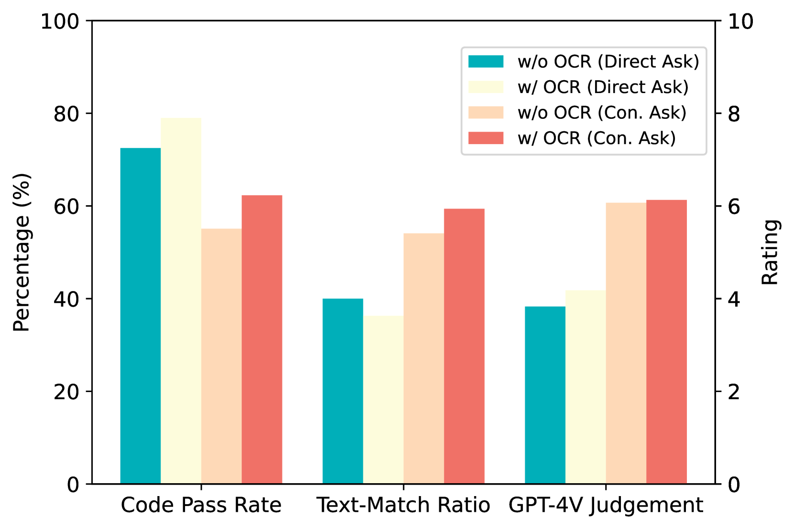
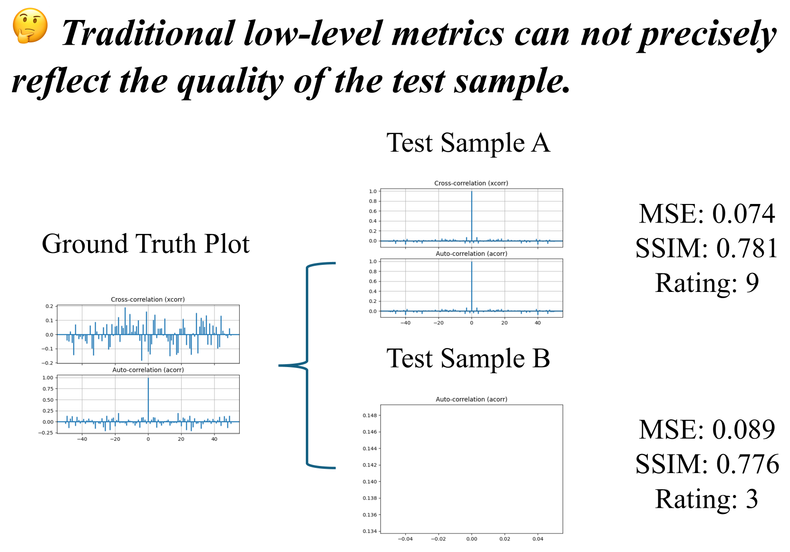
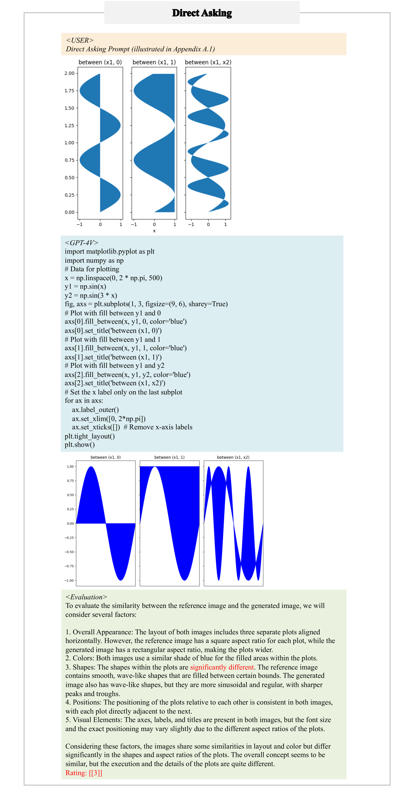
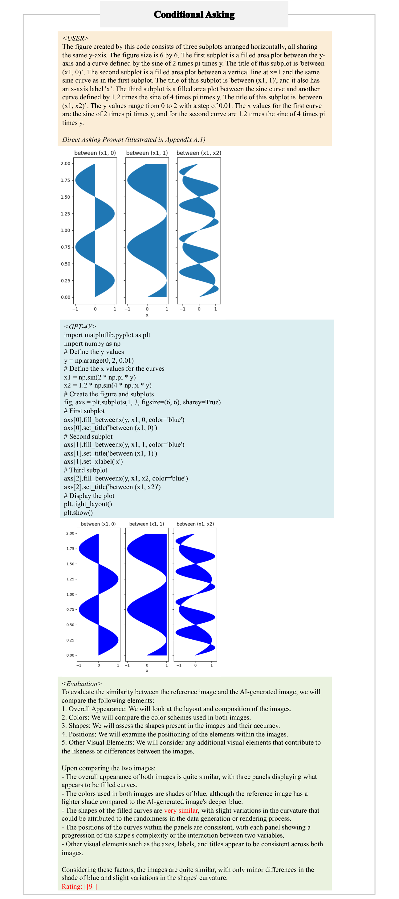
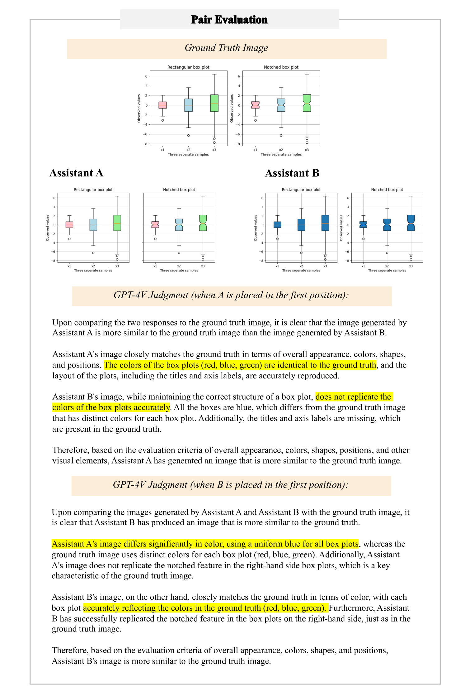

# Plot2Code：科学图表至代码生成的多模态大型语言模型全面评估基准

发布时间：2024年05月13日

`LLM应用

这篇论文介绍了一个名为Plot2Code的基准测试，专门设计来评估多模态大型语言模型（MLLMs）将视觉图形转化为代码的能力。它通过多样化的输入模态测试MLLMs的编码能力，并提出了自动评估指标来细致地评估输出代码和图像。这与LLM的应用相关，因为它关注的是如何使用和评估这些模型在特定任务上的表现，而不是探讨LLM的理论基础或Agent的设计与应用。因此，它属于LLM应用分类。` `数据科学` `人工智能`

> Plot2Code: A Comprehensive Benchmark for Evaluating Multi-modal Large Language Models in Code Generation from Scientific Plots

# 摘要

> 多模态大型语言模型（MLLMs）因其卓越的视觉表现而备受瞩目，但它们将视觉图形转化为代码的能力尚未得到充分检验。为此，我们推出了Plot2Code，一个专为MLLMs设计的全面视觉编码基准，旨在进行公正且深入的评估。我们精心挑选了132个高质量的matplotlib图表，涵盖六种图表类型，并为其提供了源代码和GPT-4总结的描述性指令。Plot2Code通过这些多样化的输入模态，全面测试了MLLMs的编码能力。我们还提出了三个自动评估指标：代码通过率、文本匹配比率和GPT-4V总体评分，以细致地评估输出代码和图像。我们不仅判断通过与否，还利用GPT-4V对生成图像与参考图像进行整体比较，其结果与人类评估高度一致。评估涵盖了14个MLLMs，包括GPT-4V、Gemini-Pro和Mini-Gemini等，揭示了Plot2Code带来的重大挑战。Plot2Code显示，大多数MLLMs在处理文本密集型图表时遇到困难，过度依赖文本指令。我们期待Plot2Code的评估结果能够为MLLMs的未来发展提供指引。所有Plot2Code相关数据可在https://huggingface.co/datasets/TencentARC/Plot2Code获取。

> The remarkable progress of Multi-modal Large Language Models (MLLMs) has attracted significant attention due to their superior performance in visual contexts. However, their capabilities in turning visual figure to executable code, have not been evaluated thoroughly. To address this, we introduce Plot2Code, a comprehensive visual coding benchmark designed for a fair and in-depth assessment of MLLMs. We carefully collect 132 manually selected high-quality matplotlib plots across six plot types from publicly available matplotlib galleries. For each plot, we carefully offer its source code, and an descriptive instruction summarized by GPT-4. This approach enables Plot2Code to extensively evaluate MLLMs' code capabilities across various input modalities. Furthermore, we propose three automatic evaluation metrics, including code pass rate, text-match ratio, and GPT-4V overall rating, for a fine-grained assessment of the output code and rendered images. Instead of simply judging pass or fail, we employ GPT-4V to make an overall judgement between the generated and reference images, which has been shown to be consistent with human evaluation. The evaluation results, which include analyses of 14 MLLMs such as the proprietary GPT-4V, Gemini-Pro, and the open-sourced Mini-Gemini, highlight the substantial challenges presented by Plot2Code. With Plot2Code, we reveal that most existing MLLMs struggle with visual coding for text-dense plots, heavily relying on textual instruction. We hope that the evaluation results from Plot2Code on visual coding will guide the future development of MLLMs. All data involved with Plot2Code are available at https://huggingface.co/datasets/TencentARC/Plot2Code.

[Arxiv](https://arxiv.org/abs/2405.07990)