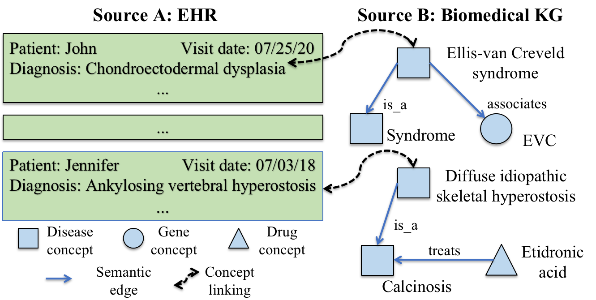
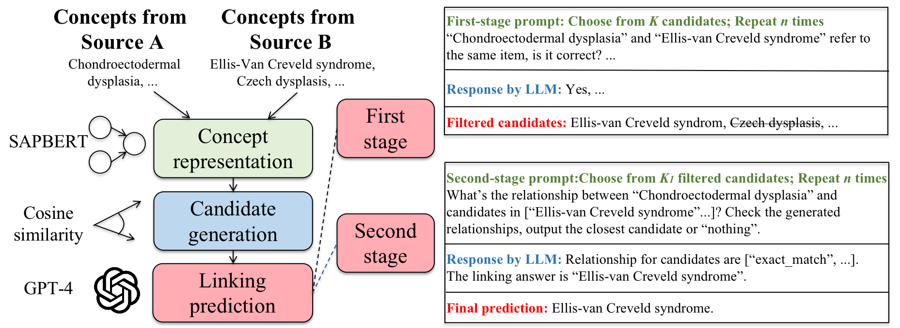
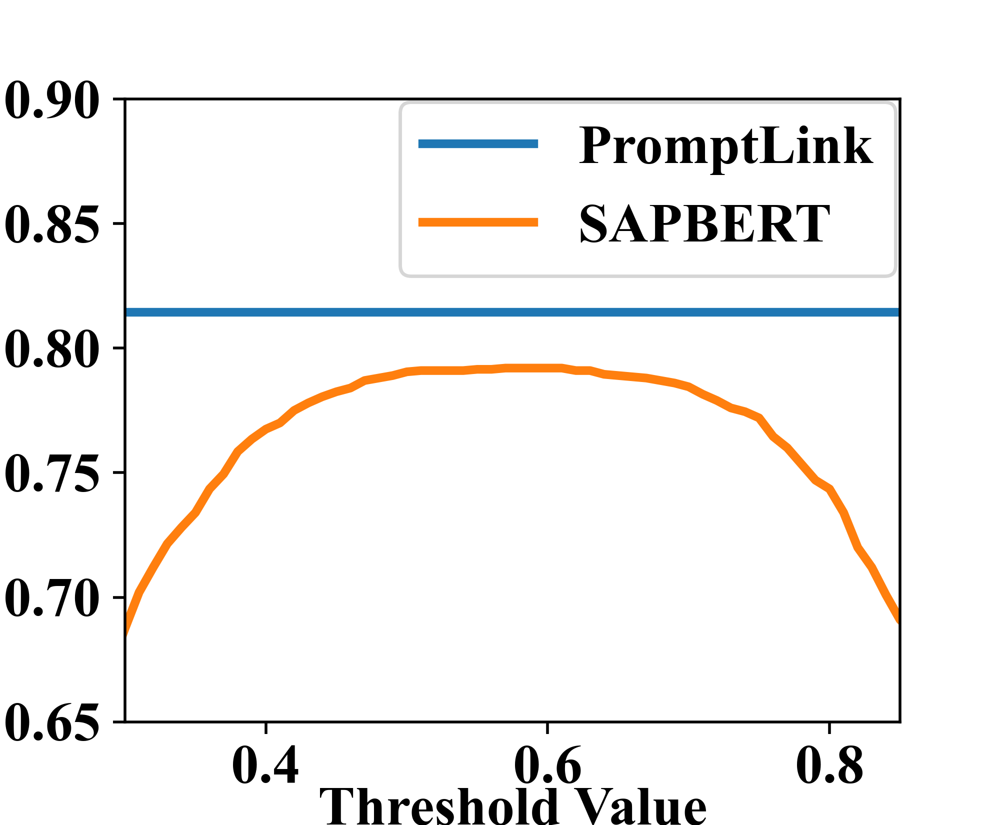

# PromptLink：借助大型语言模型实现跨源生物医学概念的精准链接

发布时间：2024年05月13日

`LLM应用

这篇论文介绍了一种名为PromptLink的创新框架，用于在多样数据源中对齐生物医学概念。该框架利用大型语言模型（LLMs）的强大能力，通过特定的预训练语言模型筛选候选概念，并采用两阶段提示机制引导LLM进行概念链接。这种方法不依赖额外知识、上下文或训练数据，适用于各种数据源，并且在链接电子健康记录（EHR）数据集与外部生物医学知识图谱的概念时表现出色。因此，它属于LLM应用类别，因为它展示了如何将LLMs应用于解决实际的生物医学NLP问题。` `生物医学` `电子健康记录`

> PromptLink: Leveraging Large Language Models for Cross-Source Biomedical Concept Linking

# 摘要

> 在多样数据源中对齐生物医学概念，为综合分析开辟了新途径，但命名惯例的差异使得这一过程颇具挑战。尽管已有基于字符串匹配、手工词典和机器学习的方法，但它们受限于先验知识的匮乏，难以广泛应用。大型语言模型（LLMs）凭借其深厚的知识储备和零-shot预测能力，在生物医学NLP领域大放异彩，但高昂成本、短上下文和预测不稳定性仍是其软肋。为此，我们推出了PromptLink，一种创新的生物医学概念链接框架，巧妙地利用了LLMs。它首先通过生物医学专用的预训练语言模型，筛选出适合LLM上下文窗口的候选概念，随后通过两阶段提示机制，引导LLM利用其内在的生物医学知识进行概念链接，并通过自我反思提升预测的可靠性。实证研究表明，PromptLink在链接两个EHR数据集与外部生物医学知识图谱的概念时表现出色。更重要的是，PromptLink不依赖额外知识、上下文或训练数据，适用于各种数据源，其源代码已公开于https://github.com/constantjxyz/PromptLink。

> Linking (aligning) biomedical concepts across diverse data sources enables various integrative analyses, but it is challenging due to the discrepancies in concept naming conventions. Various strategies have been developed to overcome this challenge, such as those based on string-matching rules, manually crafted thesauri, and machine learning models. However, these methods are constrained by limited prior biomedical knowledge and can hardly generalize beyond the limited amounts of rules, thesauri, or training samples. Recently, large language models (LLMs) have exhibited impressive results in diverse biomedical NLP tasks due to their unprecedentedly rich prior knowledge and strong zero-shot prediction abilities. However, LLMs suffer from issues including high costs, limited context length, and unreliable predictions. In this research, we propose PromptLink, a novel biomedical concept linking framework that leverages LLMs. It first employs a biomedical-specialized pre-trained language model to generate candidate concepts that can fit in the LLM context windows. Then it utilizes an LLM to link concepts through two-stage prompts, where the first-stage prompt aims to elicit the biomedical prior knowledge from the LLM for the concept linking task and the second-stage prompt enforces the LLM to reflect on its own predictions to further enhance their reliability. Empirical results on the concept linking task between two EHR datasets and an external biomedical KG demonstrate the effectiveness of PromptLink. Furthermore, PromptLink is a generic framework without reliance on additional prior knowledge, context, or training data, making it well-suited for concept linking across various types of data sources. The source code is available at https://github.com/constantjxyz/PromptLink.

[Arxiv](https://arxiv.org/abs/2405.07500)