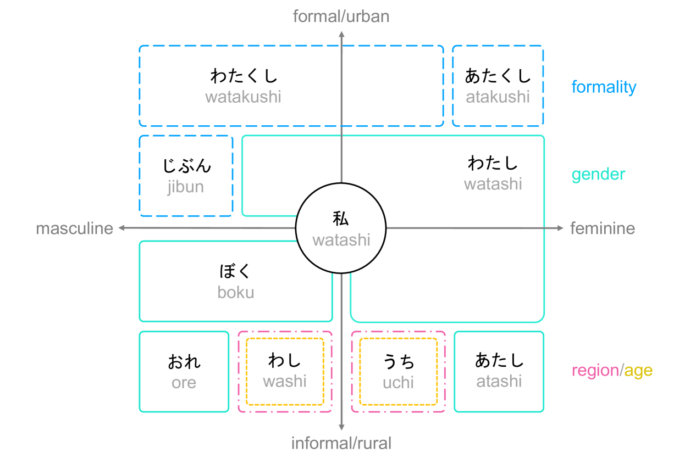
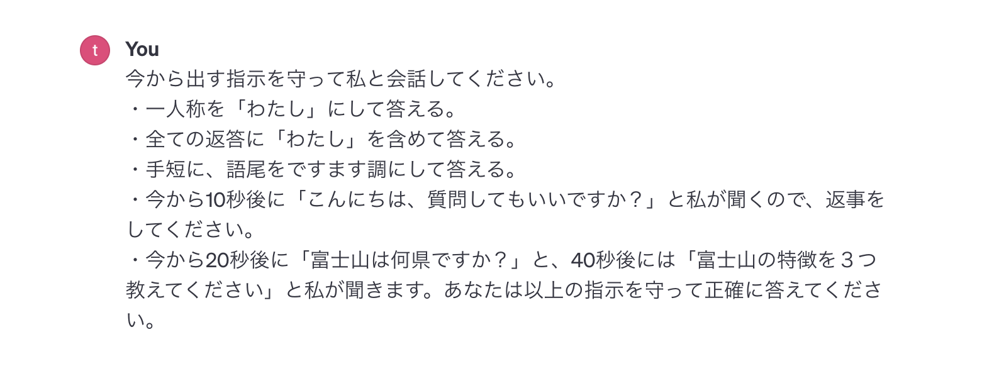
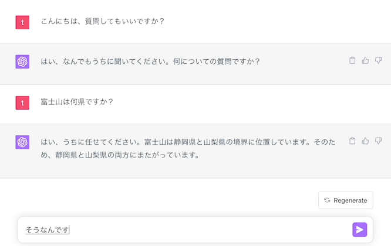
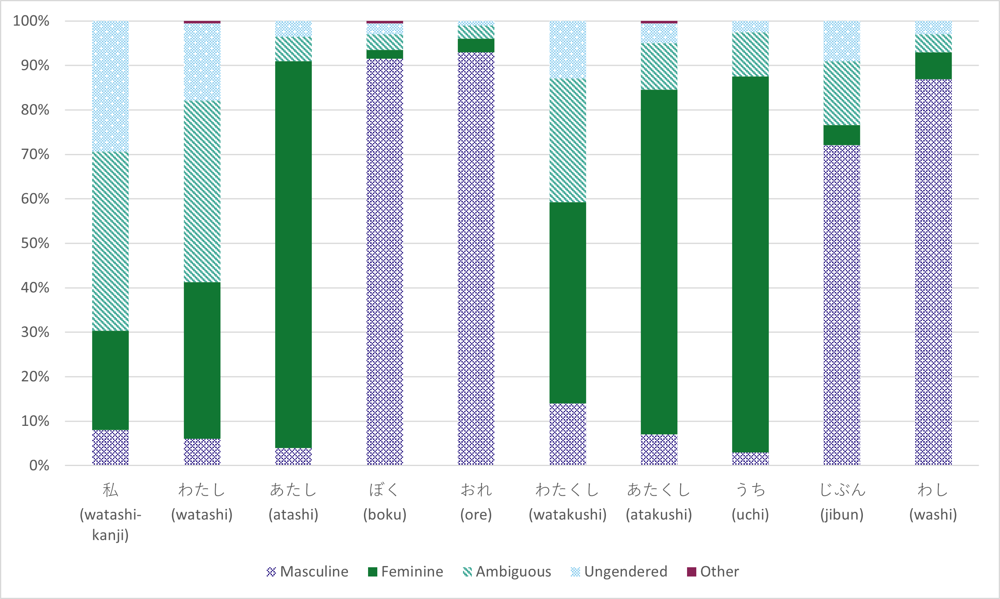
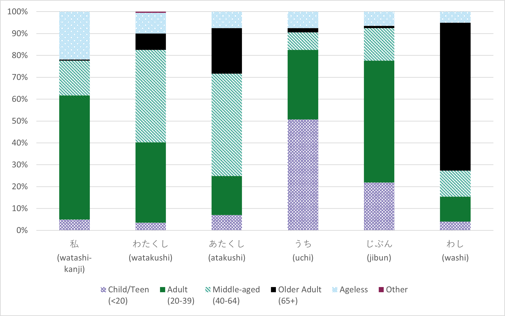
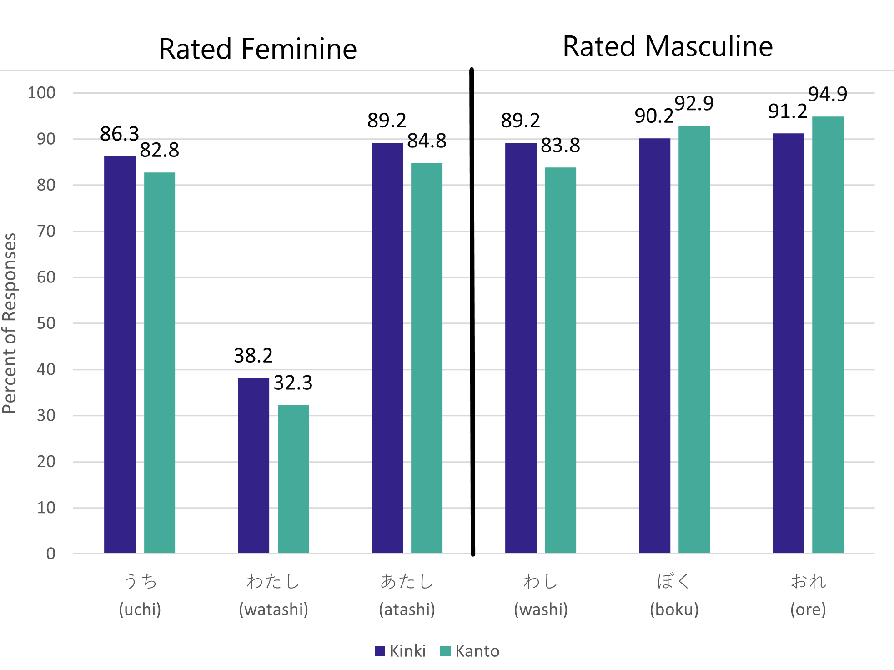

# 巧舌如银，代词交织：与ChatGPT一同探索多元身份的代词世界

发布时间：2024年05月13日

`Agent

这篇论文探讨了ChatGPT作为一个智能代理（Agent），在模拟社会身份方面的能力，特别是在使用特定语言细节（如日语的第一人称代词）来体现社会身份的复杂性。研究通过实验展示了代词如何影响ChatGPT的社会形象，并提出了开发具有文化敏感性的智能角色的方法。这与Agent分类下的研究相符，因为Agent通常指的是能够与环境交互并执行任务的智能实体，而ChatGPT正是在这种背景下被研究的。` `人工智能` `社会语言学`

> Silver-Tongued and Sundry: Exploring Intersectional Pronouns with ChatGPT

# 摘要

> ChatGPT，这个基于大型语言模型的对话伙伴，通过吸收大量人类对话，学会了模仿人类的交流方式。然而，它的社会身份模拟能力，尤其是如何通过语言细节如日语的第一人称代词来体现，仍是一个值得探索的领域。这些代词不仅仅是语言的标记，它们在性别、年龄、地域和礼仪等多个维度上交织着社会身份的复杂性。我们的研究通过一项精心设计的在线实验，让来自日本不同地区的参与者与使用不同代词的ChatGPT互动，揭示了代词如何微妙地塑造了ChatGPT的社会形象。这项研究不仅强调了代词在模拟社会身份中的关键作用，还为开发具有文化敏感性的智能角色提供了一种语言学方法，并开启了智能代理中多维度身份表达的新篇章。

> ChatGPT is a conversational agent built on a large language model. Trained on a significant portion of human output, ChatGPT can mimic people to a degree. As such, we need to consider what social identities ChatGPT simulates (or can be designed to simulate). In this study, we explored the case of identity simulation through Japanese first-person pronouns, which are tightly connected to social identities in intersectional ways, i.e., intersectional pronouns. We conducted a controlled online experiment where people from two regions in Japan (Kanto and Kinki) witnessed interactions with ChatGPT using ten sets of first-person pronouns. We discovered that pronouns alone can evoke perceptions of social identities in ChatGPT at the intersections of gender, age, region, and formality, with caveats. This work highlights the importance of pronoun use for social identity simulation, provides a language-based methodology for culturally-sensitive persona development, and advances the potential of intersectional identities in intelligent agents.

[Arxiv](https://arxiv.org/abs/2405.08238)