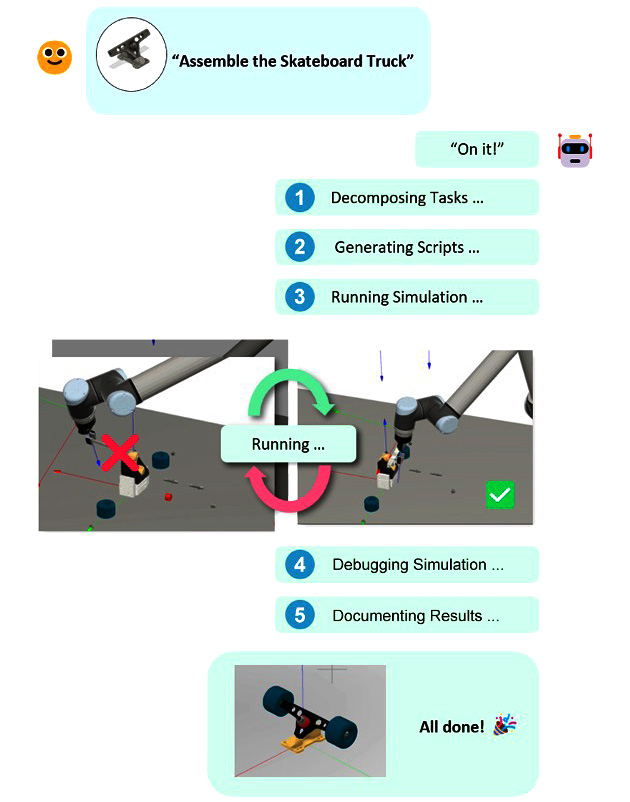
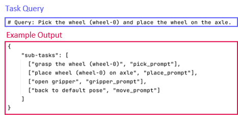
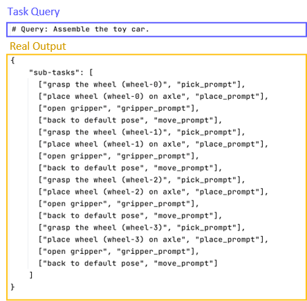
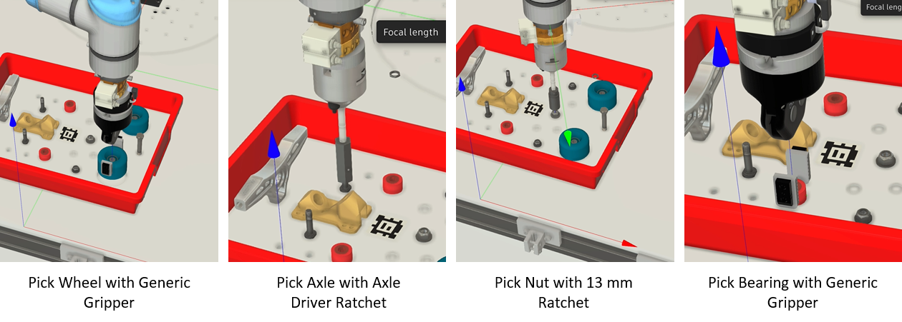
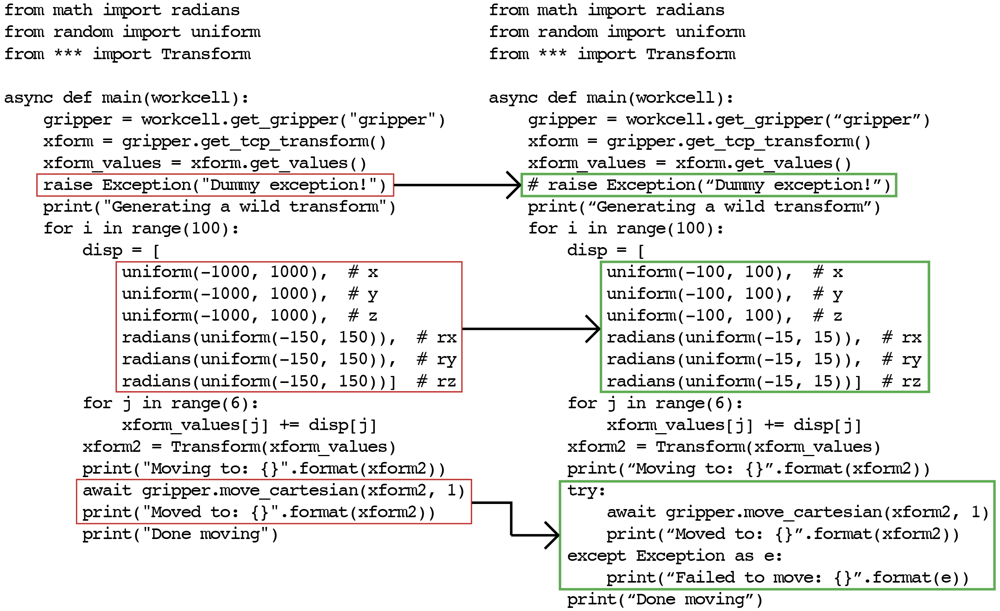
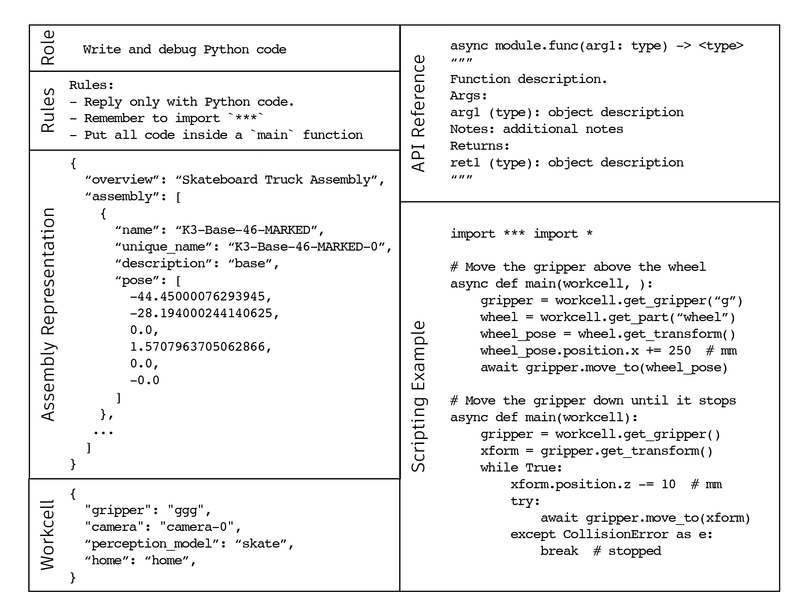
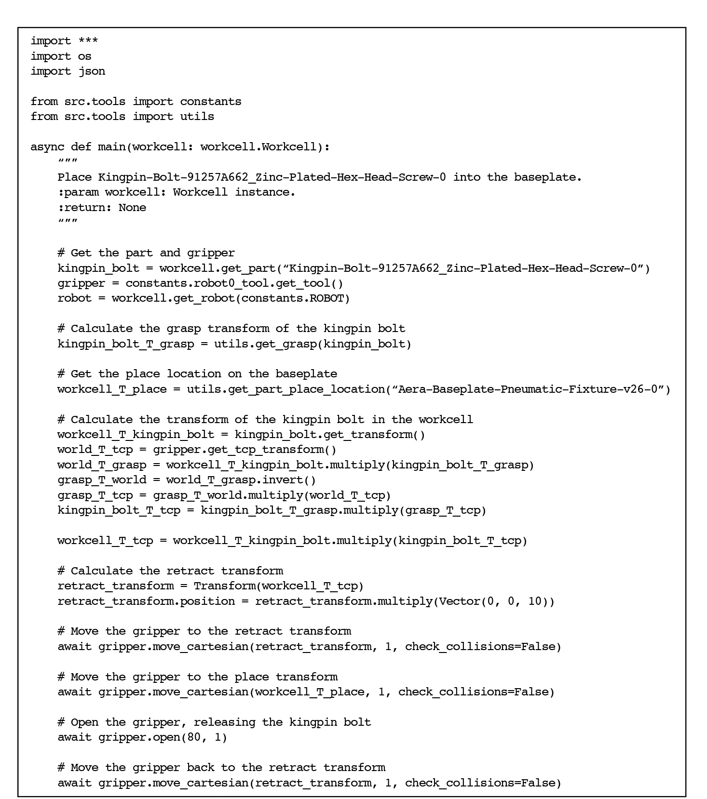

# 借助ChatGPT，探索机器人装配编程的自动化之路

发布时间：2024年05月13日

`Agent

这篇论文探讨了如何利用大型语言模型（如ChatGPT）来自动化编程适应性装配机器人的过程。它提出了一种方法，通过理解自然语言、泛化任务示例及编码的能力，将这些能力应用于制造业的实际挑战。论文介绍了一个创新系统，该系统能够将复杂装配任务分解，生成机器人控制代码，并在模拟环境中执行和调试。这表明该论文关注的是如何构建一个能够理解和执行复杂任务的智能代理（Agent），因此将其分类为Agent。` `制造业` `机器人技术`

> Toward Automated Programming for Robotic Assembly Using ChatGPT

# 摘要

> 尽管技术进步，编程适应性装配机器人的过程依旧繁琐，需要跨领域的专业知识，且往往产生特定任务的僵化代码。本文探讨了如ChatGPT这样的大型语言模型（LLMs）在自动化这一过程中的潜力，利用其理解自然语言、泛化任务示例及编码的能力。我们提出了一种方法，将这些能力应用于制造业的实际挑战。我们介绍了一个创新系统，它利用ChatGPT将复杂装配任务分解，生成机器人控制代码，并在模拟环境中执行和调试，以避免碰撞等错误。我们详细阐述了系统架构和任务分解策略，并展示了该系统如何在实际项目中自主编程机器人完成多样装配任务。

> Despite significant technological advancements, the process of programming robots for adaptive assembly remains labor-intensive, demanding expertise in multiple domains and often resulting in task-specific, inflexible code. This work explores the potential of Large Language Models (LLMs), like ChatGPT, to automate this process, leveraging their ability to understand natural language instructions, generalize examples to new tasks, and write code. In this paper, we suggest how these abilities can be harnessed and applied to real-world challenges in the manufacturing industry. We present a novel system that uses ChatGPT to automate the process of programming robots for adaptive assembly by decomposing complex tasks into simpler subtasks, generating robot control code, executing the code in a simulated workcell, and debugging syntax and control errors, such as collisions. We outline the architecture of this system and strategies for task decomposition and code generation. Finally, we demonstrate how our system can autonomously program robots for various assembly tasks in a real-world project.

[Arxiv](https://arxiv.org/abs/2405.08216)